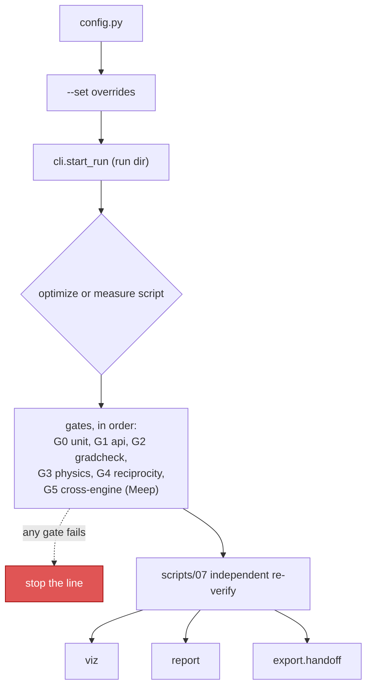
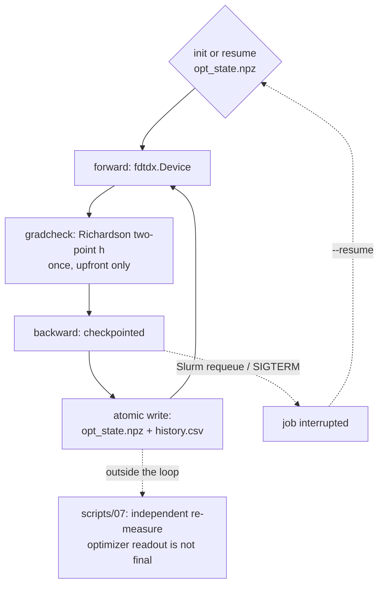

# invdx — photonic inverse-design toolbox

A fast GPU FDTD engine cross-validated against an independent reference
engine, behind one config-driven, validation-gated workflow.

[](LICENSE)
[](pyproject.toml)

## Table of contents

- [I want to…](#i-want-to)
- [What is invdx](#what-is-invdx)
- [Quickstart](#quickstart)
- [Workflow](#workflow)
- [Validation gates](#validation-gates--all-six-real-zero-skips)
- [Measured performance doctrine](#measured-performance-doctrine-turing-class-gpus)
- [Hard-won guardrails](#hard-won-guardrails-encoded-in-enginesconventionspy)
- [Inverse design](#inverse-design-the-grating-coupler-driver)
- [Problems](#problems-srcinvdxproblems)
- [Scripts](#scripts)
- [Honest record](#honest-record)
- [Reporting and export](#reporting-and-export)
- [Engine licenses](#engine-licenses)
- [Citing](#citing)
- [Current limits](#current-limits)
- [Docs](#docs)

## What is invdx

invdx combines a fast GPU engine with an independent, authoritative
cross-validation engine behind one config-driven, validation-gated
methodology layer. Three layers, each with one job: unmodified pinned
engines ([FDTDX](https://github.com/ymahlau/fdtdx) for design, Meep as the
cross-validation anchor, reached only through a subprocess bridge); a
methodology layer that is this project's own identity (run-directory
provenance, a six-gate validation framework, fabrication-robustness
utilities, explicit cross-engine convention alignment); and a small,
self-written 2D FDTD kept deliberately independent of both, used to learn —
and independently check — the physics. Full architecture and environment
details: [`docs/env.md`](docs/env.md).

## I want to…

Every entry has a minutes-scale version first. Nothing here assumes you already
know the project's vocabulary; the "read more" column is where the terms get
explained.

| I want to… | try it in minutes | the real run | read more |
|---|---|---|---|
| **inverse-design a grating coupler** | `make coupler-opt-smoke` (~10 min, GPU) | `make coupler-opt` (~13 h) | [docs/optimize.md](docs/optimize.md) |
| **check a finished design against the second engine** | `make verify RUN=runs/<dir>` | add `--corners --s11` | [Inverse design](#inverse-design-the-grating-coupler-driver) |
| **see how a design survives fabrication error** | `make tolerance RUN=runs/<dir>` | `LAMS=1.27,1.35,9` for spectra | [docs/tolerance.md](docs/tolerance.md) |
| **hand a design to another solver** | `make handoff RUN=runs/<dir>` (seconds) | — | [Reporting and export](#reporting-and-export) |
| **reproduce a literature benchmark** | `make phc-bend` (~2 min, CPU) | — | [docs/phc-bend-walkthrough.md](docs/phc-bend-walkthrough.md) |
| **learn where the adjoint gradient comes from** | `python scripts/09_toy_adjoint.py` (CPU) | — | [tutorials/](tutorials/) |
| **know the environment is intact** | `make check` (~10 s) | `make gates` (~3 min) | [docs/env.md](docs/env.md) |

`make help` lists every target. `make runs` tells you which run directories can
be fed to the `RUN=` entries above — `runs/` also holds gate runs, benchmarks
and interrupted jobs, and the names do not distinguish them.

## Quickstart

```bash
uv sync --extra gpu --extra dev
make test       # pure-python unit tests (~10 s)
make phc-bend   # standard PhC-waveguide benchmark, toy engine, CPU (~2 min)
make gates      # all six validation gates (~3 min) — prerequisites below
```

The first three lines need nothing beyond that `uv sync`, and are the quickest
green light that a fresh clone is intact. `make gates` is the line with
prerequisites outside the Python environment: G0 is pure Python, G1–G4 need a
GPU that JAX can see, and G5 alone needs Meep — which
[`docs/env.md`](docs/env.md) builds from source with spack, hours on a cold
cache the first time. The gate runner has no skip path on purpose (a skipped
gate reads like a passing one), so a clone without Meep gets a red G5 rather
than a quiet pass. Until Meep is built, run the gates that can pass:

```bash
uv run python scripts/00_check.py --through reciprocity   # G0–G4, no Meep
```

Every script runs through `cli.start_run`: each invocation writes
`runs/<timestamp>-<name>[-tag]/` with `config.json` (including any `--set`
overrides), `cmdline.txt` and `env.txt`, so any figure is reconstructible
months later. Unknown `--set` keys are rejected, not ignored.

## Workflow



Long jobs are launched detached (SSH-disconnect safe):
`setsid nohup <cmd> > runs/<log> 2>&1 &`.

## Validation gates — all six real, zero skips

`make check` (G0 only) / `make gates` (all). Ordering is load-bearing — each
gate assumes everything before it. Runner: `gates/runner.py`; machine-readable
`gates_report.json` per run.

| # | gate | what it pins down |
|---|---|---|
| G0 | unit | pure-math invariants (63 tests: overlaps, filters, toy physics, geometries, design-vector round-trips, checkpoint/resume) |
| G1 | api | released-fdtdx API surface, GPU visible, meep bridge ping |
| G2 | gradcheck | fdtdx value_and_grad vs finite differences, on a toy cell **and on the real grating_coupler design path**; filter chain rule |
| G3 | physics | vacuum flux conservation |
| G4 | reciprocity | forward vs reciprocal CE on the `grating_coupler` problem — the gate class that catches normalization errors, including a factor-2 CE bug it caught here |
| G5 | cross-engine | fdtdx vs Meep transmission after convention alignment |

Treat gate failures as stop-the-line events.

## Measured performance doctrine (Turing-class GPUs)

The performance work here follows a simple discipline: measure before
believing, microbenchmark before surgery, and record dead ends so nobody
re-walks them. Upstream engines are excellent physics codes; these notes are
about fitting them to one particular box, so treat every number below as a
worked example of the method, not as a setting to copy.

- Meep MPI rank counts: **fewer beats more** — FDTD is memory-bandwidth
  bound. Measured: 16-core Zen4 peaks at np=8 (np=16 is
  26-35% slower, np=32/SMT is 4x slower); dual-socket Xeon peaks at np=16
  with NUMA binding (np=64/full SMT is 5x slower). Sweep YOUR machine with
  `scripts/12_cpu_tuning.py` before trusting any default.
- GPU sharing is a measured dead end for fdtdx (CUDA MPS: -58% aggregate;
  plain time-slicing: zero gain — one sim ~80% saturates a card at 0.5M
  cells). Batch small sims with jax.vmap inside one process instead.
- Cross-node domain decomposition over 1GbE is disqualified by arithmetic
  (halo exchange ~64 ms/step vs 5-15 ms/step compute); ship whole
  independent jobs to the other node instead (~1.5 s protocol overhead).

## Hard-won guardrails (encoded in `engines/conventions.py`)

1. Meep DFT fields / |alpha|² / fluxes omit the physical ½ power factor —
   any self-written overlap must bridge conventions explicitly (skipping the
   bridge costs a factor 2 in CE; the reciprocity gate is what catches it).
2. `meep.adjoint` multi-frequency gradients arrive as `(Nx, nf)` — `sum(axis=1)`.
3. Simulation resolution must be ≥ design-grid density, or adjoint gradients
   are systematically small (measured: 5–8% low at res 40, exact at res 80).
4. Meep's `decay_by` default (1e-11) is ~3.4× slower than 1e-6 at equal
   accuracy — the worker always passes it explicitly.
5. Config is the single source of truth; scripts never hardcode numbers.
6. Cross-engine comparisons of resonant structures compare **spectral
   ridges, never single-wavelength values**: engines discretize the same
   nominal geometry into different effective linewidths (crisp cell fill vs
   subpixel averaging, up to half a cell per edge). A grating's coupling ridge
   moves faster in peak wavelength than the edge error itself, so two engines
   can read tens of dB apart at one fixed wavelength while their ridge peaks
   agree.

## Inverse design (the grating-coupler driver)

A single `fdtdx.Device` over the design window (one voxel per design pixel,
conic filter → tanh projection) plus a jnp twin of the CE chain lets one
backward pass reach all 500 design variables — the differentiable
counterpart to the run-length-encoded, non-differentiable `profile_teeth`
route used for measurement.

```bash
uv run python scripts/15_grating_coupler_optimize.py --tag opt --gradcheck  # ~13 h, 1 GPU
uv run python scripts/15_grating_coupler_optimize.py --resume runs/<dir>    # after a kill
sbatch -p <partition> -t 14:00:00 slurm/grating_coupler_opt.sbatch          # requeue-safe
```



Implementation details, the gradcheck story, and checkpoint/resume semantics:
[`docs/optimize.md`](docs/optimize.md).

## Problems (`src/invdx/problems/`)

- **`grating_coupler`** — a fiber-to-chip grating coupler on the fdtdx engine, with
  design-rule limits for a 193 nm DUV SOI platform. Quasi-2D and full-3D CE
  measurement chains (fiber-side and waveguide-side excitation, analytic slab
  TE0 target, directional overlaps, dense CE(λ) spectra from single runs);
  the 2D coupling ridge is cross-validated against the Meep reference engine,
  and the 3D chain against its own quasi-2D reduction in the wide-waveguide
  limit; dual-GPU task parallelism for the two independent runs of a 3D
  measurement (bit-identical to running them in sequence); inverse design in
  `scripts/15` (see above). Scripts 03–05, 07, 15.
- **`phc_bend`** — a standard benchmark in the photonic-crystal waveguide
  literature, the 90° bend in a square-lattice rod array (a=1 µm, R=0.225a,
  ε=10), in the spirit of Mekis et al.'s high-transmission PhC bend (Phys.
  Rev. Lett. 77, 3787, 1996): Γ-X stopband 0.27–0.41 covering the target gap
  0.29–0.41, in-gap bend transmission T≈0.85–1.1, the textbook point-defect
  conclusion reproduced (horizontal/vertical ≫ slant) — on the toy engine,
  cross-checked against Meep. Hands-on tutorial:
  `docs/phc-bend-walkthrough.md`. Script 06.

## Scripts

| script | purpose |
|---|---|
| `00_check.py` | gate runner (`--only`, `--through`) |
| `01_smoke_fdtdx.py` | tiny forward fdtdx sim through config/cli/runio |
| `02_smoke_meep_bridge.py` | meep-env subprocess round-trip |
| `03_grating_coupler_baseline.py` | `grating_coupler` cross-engine acceptance baselines (θ=10 ridge, θ=0 suppression) |
| `04_grating_coupler_3d.py` | single-GPU 3D `grating_coupler` validation |
| `05_grating_coupler_3d_dual.py` | dual-GPU task-parallel 3D (empty/grating on separate cards) |
| `06_phc_bend.py` | PhC bend benchmark, stage by stage (`--stage eps\|gap\|bend\|meep\|compare\|defect`) |
| `07_grating_coupler_verify_design.py` | independent-engine verification of a grating_coupler design run (linewidth + CE spectrum + CD corners) |
| `15_grating_coupler_optimize.py` | `grating_coupler` inverse design: adjoint optimization of the grating profile (`--gradcheck`, `--resume`) |
| `16_tolerance_report.py` | design-for-tolerance report on a finished optimization run: per-voxel sensitivity map + three-corner (eta_e/eta_i/eta_d) robust-design evaluation (`--lams` for a corner CE spectrum) |
| `17_generate_dataset.py` | batch forward-simulation dataset generation (`--kind uniform-grating\|random-rho`, npz shards + manifest, resumable) |
| `18_checkpoint_sweep.py` | checkpoint count C vs wall-clock time and memory (`sweep.csv` + `results.json`, linear bytes/cell fit, defaults reproduce the memory anchor of the optimization recipe) |
| `19_reversible_sweep.py` | the same measurement for the reversible-autodiff recorder: reconstruction interval K and recorder storage dtype vs time and memory peak, with the acceptance bands fixed before the sweep runs and a `--negative-control` that must fail on the checkpointed path; `sweep.csv` columns mirror script 18 |
| `20_eval_2d_forward.py` | forward-only CE of a frozen 2D design at a chosen grid — no optimizer, no gradient: rebuilds the scene from the design run's own `config.json` (`--set` overrides only the field under test, e.g. a coarser `spacing_um`) |
| `21_extrude_1d_design.py` | freeze a 1D design onto the 2D design grid for script 20: exact area-weighted binary resample to a coarser pixel plus uniform extrusion along the waveguide width, with a provenance sidecar recording the resampling rule and how far the round trip disagrees |

(08–14 are the toy-engine lessons and the performance benchmarks; `make help`
lists the Makefile targets that wrap the common invocations.)

## Honest record

Simulation tooling makes it easy to quietly re-run until a number looks
good, then report only that run — selective reporting is the easiest way a
simulation project can mislead itself and everyone reading it. Two files
exist to make that harder here:
[`docs/journal.md`](docs/journal.md) is an append-only working log where
every reported number cites the run, commit, or report file it came from;
[`docs/RETRACTIONS.md`](docs/RETRACTIONS.md) is where a conclusion this
project published and later found wrong gets written down in place, rather
than silently edited away. Treat both as part of the results, not as
bookkeeping.

## Reporting and export

- `python -m invdx.viz <run-dir> [--pdf]` — renders every known figure from a
  run's JSON/npy snapshots (CE spectra with CD corners, band-gap and bend
  transmission, optimization traces, permittivity maps). Figures are DERIVED
  artifacts: always re-renderable from the run dir alone. `--pdf` adds
  vector output for LaTeX.
- `python -m invdx.report <run-dir> [...]` — machine-generated Markdown table
  of the reportable numbers (peak CE, 3 dB bandwidth, linewidth vs rule, corner
  peaks, S11/reciprocity); several run dirs at once give one combined
  comparison table.
- `grating_coupler.bandwidth_3db` — interpolated 3 dB bandwidth with an honest
  "clipped by sampled range = lower bound" note; wired into script 07
  together with optional `--s11` (waveguide-side back-reflection +
  reciprocity check on the final design).
- `python -m invdx.export.handoff <run-dir> [--out <dir>]` — packages a run's
  design and results into a tool-neutral bundle (rasterized permittivity
  grid, design vector, CE spectrum, manifest with units/axes/checksums) for
  cross-checking with any external solver, independent of invdx.

## Engine licenses

invdx itself is MIT. fdtdx is MIT (one vendored subclass, attributed in
`engines/fdtdx_fixes.py`). Meep is GPL-2.0+ and is never linked or vendored:
it runs as a separate program in its own environment via the subprocess
bridge, so invdx carries no GPL obligations. RSoft FullWAVE is commercial
and out-of-repo entirely — invdx only emits exchange files for it.

## Citing

If this toolbox is useful, cite it via [`CITATION.cff`](CITATION.cff) (or
GitHub's "Cite this repository" button). The engines have their own
citations: FDTDX (Mahlau et al., JOSS 2026) and Meep (Oskooi et al.,
Computer Physics Communications 2010) — cite them directly for the physics
engines themselves; see Engine licenses above for how each is used here.

## Current limits

Written down so nobody has to discover them the hard way:

- No field-map export from fdtdx runs: the pipeline keeps spectra and derived
  quantities, not |E|² snapshots of the coupling region.
- No lithography/process-prediction step. Manufacturability is handled as
  linewidth limits and geometry-corner evaluation, not as a predicted
  post-fabrication pattern.
- Design rules are entered by hand in config; there is no importer for a
  foundry's machine-readable rule deck.
- One photonic-crystal benchmark ships with the repo — enough to validate the
  toy engine against the literature, not a benchmark library.
- The `toy/` engine is 2D and uses a first-order Mur absorbing boundary rather
  than a PML, so edge reflections set its noise floor. It exists to learn from
  and to cross-check with, not to design with.

## Docs

Full index, grouped by tutorials / environment / method notes / honest
record: [`docs/README.md`](docs/README.md).
