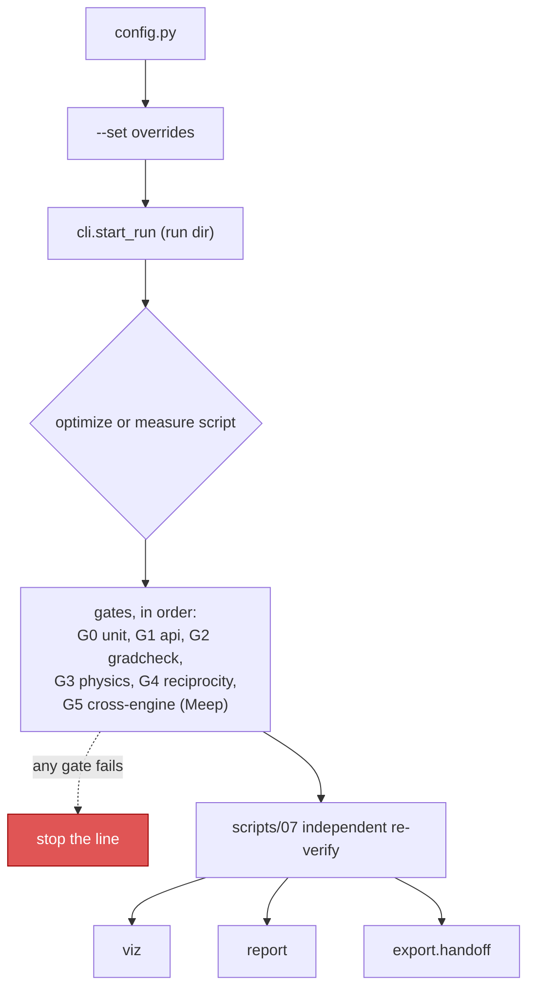
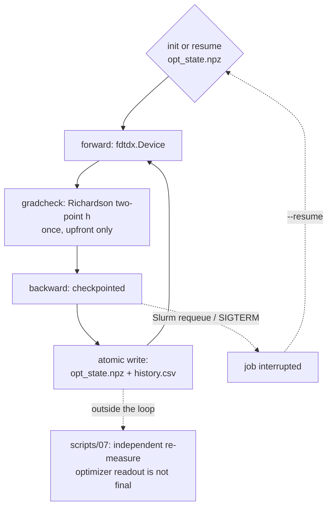

> **English** · [繁體中文](README.zh-TW.md)

# invdx — photonic inverse-design toolbox

A fast GPU FDTD engine cross-validated against an independent reference
engine, behind one config-driven, validation-gated workflow.

[](LICENSE)
[](pyproject.toml)

## Table of contents

- [I want to…](#i-want-to)
- [What is invdx](#what-is-invdx)
- [What fits this toolbox](#what-fits-this-toolbox)
- [Quickstart](#quickstart)
- [Workflow](#workflow)
- [Validation gates](#validation-gates--all-six-real-zero-skips)
- [Measured performance doctrine](#measured-performance-doctrine-turing-class-gpus)
- [Hard-won guardrails](#hard-won-guardrails-encoded-in-enginesconventionspy)
- [Inverse design](#inverse-design-the-grating-coupler-driver)
- [Problems](#problems-srcinvdxproblems)
- [Scripts](#scripts)
- [Honest record](#honest-record)
- [Reporting and export](#reporting-and-export)
- [Engine licenses](#engine-licenses)
- [Citing](#citing)
- [Current limits](#current-limits)
- [Docs](#docs)

## What is invdx

invdx combines a fast GPU engine with an independent, authoritative
cross-validation engine behind one config-driven, validation-gated
methodology layer. Three layers, each with one job: unmodified pinned
engines ([FDTDX](https://github.com/ymahlau/fdtdx) for design, Meep as the
cross-validation anchor, reached only through a subprocess bridge); a
methodology layer that is this project's own identity (run-directory
provenance, a six-gate validation framework, fabrication-robustness
utilities, explicit cross-engine convention alignment); and a small,
self-written 2D FDTD kept deliberately independent of both, used to learn —
and independently check — the physics. Full architecture and environment
details: [`docs/env.md`](docs/env.md).

## What fits this toolbox

The two problems that ship here are examples, not the boundary. Three things
decide whether your device fits: the physics the engines implement, how many
grid cells your device needs, and the shape the optimizer asks for. Here is
each one directly, as a class you can test your own device against rather
than as a list of devices. (This section is about which *problems* are
expressible at all; [Current limits](#current-limits) is the separate list of
conveniences that are missing from problems which do fit.)

**The physics, which is the same for all three engines.** fdtdx on the GPU,
Meep through the bridge and the self-written `toy/` engine are all
**time-domain FDTD on a uniform Cartesian Yee grid**, and every adapter in
`engines/` hands each object a single real scalar permittivity
(`fdtdx.Material(permittivity=…)`, `mp.Medium(index=…)`, a real `eps` array).
That fixes the class of problem:

- **Linear, passive, non-magnetic dielectrics**, with a permittivity that is
  real and constant over the simulated band. No dispersion model, no complex
  index, no anisotropy tensor, no nonlinear or carrier term is wired into any
  adapter here — whatever the upstream engines can do, invdx does not reach it.
- **Static in time as well as flat in frequency.** "Constant over the
  simulated band" above is a claim about *frequency*; this bullet is the
  separate claim about *time*. Every adapter fixes each object's permittivity
  once, before the run, and none of them accepts ε as a function of t. So a
  medium whose index is **prescribed** to change during the simulation —
  an acousto-optic grating, a travelling-wave ε(x, t), a spatiotemporally
  modulated non-reciprocal isolator or circulator — is outside this toolbox,
  and it is outside for a reason of its own: nothing about it needs a driving
  field to be solved for, so the exclusion of modulators further down (whose ε
  *responds* to a voltage, a carrier density or a temperature this repo does
  not solve for) does not cover it. Prescribed or self-consistent, time-varying
  ε is not expressible here.
- **Broadband from one run.** Sources are pulses, monitors are DFT/phasor
  planes, so a whole spectrum comes out of a single simulation. Wavelength
  dependence is therefore cheap; a high-Q resonance is expensive in *simulated
  time*, not in extra runs. Price that honestly before committing to a
  high-Q device: run length is a constant you set (`sim_time_s`), and the
  released fdtdx has no adaptive stop, so nothing tells you the field had not
  finished ringing down — the convergence check is yours to run, by
  lengthening the run and watching the number move.
- **One uniform spacing per run** (`spacing_um` on the fdtdx side,
  `resolution` on the Meep side). No conformal, graded or adaptive mesh. A
  feature thinner than a cell becomes a snapped feature, and
  `assert_design_grid_snaps` refuses the configurations where that snapping
  would pass unnoticed.
- **Ratios, not absolute amplitudes.** Every FDTD number reported here is the
  device run divided by a normalization run that differs only in the device
  under test — CE against the fiber-side input, bend transmission against the
  straight waveguide, slab transmission against the empty cell. That is a
  constraint on the *normalization*, not on the flavour of the figure of
  merit: a focal-spot intensity, an extinction ratio or a mode-overlap
  efficiency all qualify, provided you can write down the run you divide by.
  What you cannot get out of one run is an absolute number in physical units.
  Two things sit outside the rule rather than breaking it: geometry numbers
  (linewidth against a design rule) are read off the design and involve no run
  at all, and a problem that uses no engine reports a closed form —
  `tests/fixture_problems/tmm_stack.py` gets its transmittance from a product
  of 2×2 matrices and is a fully gated problem all the same.
  One join to make before you plan around the focal-spot case, because the
  next question lands in the seam between this bullet and
  [Current limits](#current-limits): the FOM works because the detector arrays
  are read *inside the graph*, which is a different question from what a
  finished run leaves on disk. Optimizing focal-spot intensity is supported
  today; the |E|² picture of the result is a second, explicitly requested
  forward run (`make verify RUN=… --field`), not a by-product of the
  optimization. Both statements are true at once, and neither blocks the
  other.
- **Ports are overlaps against a mode you can write down.** The shipped
  targets are an analytic asymmetric-slab TE0 profile and a Gaussian fiber
  mode (`modes.py`, `grating_coupler.slab_te0_neff`). There is no numerical
  mode solver in the measurement chain, so a port whose mode has no closed
  form has to bring its own. Read "has to bring its own" literally, and do not
  round it up to "impossible": the missing piece is a **bridge task, not an
  engine capability**. MPB and Meep's own eigenmode solver compute these
  profiles perfectly well outside this repo, and the port overlap only ever
  needs the (E, H) arrays sampled on the monitor plane — nothing in the
  measurement chain inspects where they came from. What is absent is the code
  that calls a solver for you and aligns its conventions with
  `engines/conventions.py`; that is work someone can do, not a ceiling.

**Dimensionality, and which dimensions a second engine can vouch for — two
different questions.** The engines are not interchangeable here:

| engine | dimensions it measures in |
|---|---|
| fdtdx (design engine, GPU) | quasi-2D and full 3D — **never true 2D**: fdtdx is a 3D solver, and the thinnest scene this repo builds still has a real y axis of `n_y_cells` cells (`GratingCouplerConfig.n_y_cells`: minimum 2, **default 4**, periodic boundaries, no design freedom on that axis) |
| Meep, through the subprocess bridge | 2D only — every measurement task the bridge exposes (`slab_transmission`, `vacuum_flux`, `phc_bend`) builds a 2D cell; the one 3D task, `benchmark`, has no detectors and measures field-update rate rather than physics |
| self-written `toy/` | 2D TM only (Ez, Hx, Hy) |

So **a 3D device can be designed and measured here, and cannot be
cross-checked here.** G5 puts fdtdx against Meep on normal-incidence slab
transmission, and the coupler's published cross-engine agreement is the 2D
quasi-2D coupling ridge measured against Meep's true 2D; the 3D chain's only
independent check in this repo is its own
quasi-2D reduction in the wide-waveguide limit, which is a within-engine
consistency check, not a second implementation. 3D is supported, not
corroborated — and if what draws you to this toolbox is the second engine,
that guarantee currently stops at 2D.

Be precise about *why* it stops there, because the honest version is smaller
than it sounds: this is a **wiring gap, not a physics one**. Meep simulates 3D
perfectly well; what this repo lacks is a 3D measurement task in the
subprocess bridge — `engines/meep_worker.py` exposes `slab_transmission`,
`vacuum_flux` and `phc_bend`, all 2D, plus a detector-less `benchmark`.
Adding a 3D cross-check means writing one more worker task and the matching
convention alignment, not acquiring capability neither engine has. So the
correct reading of "3D cannot be cross-checked here" is *nobody has connected
it yet*, and a reader deciding whether to adopt this toolbox should price it
as a piece of work rather than as a physical impossibility.

**How much device fits on the card, in cells.** For most 3D projects this,
not the physics, is the deciding constraint, and it does not care what the
device is called: it counts Yee cells, the simulation volume divided by the
grid spacing along every axis. There is one GPU per run — multi-GPU here
means two independent runs on two cards, never one run split across them, and
cross-node domain decomposition was ruled out by measurement rather than left
undone
(see [Measured performance doctrine](#measured-performance-doctrine-turing-class-gpus)).
So the budget is one card, and the measured model for the fdtdx adjoint path
is linear in cell count:

```
peak ≈ (372.18 + 268.0329 · C) bytes per Yee cell     (Turing-class GPU)
```

where C is the checkpoint count (the gradient-rematerialization kind). **GB
means 1e9 bytes everywhere in this section**, which is how the anchors were
measured; it is not GiB. Saying so is not pedantry here — mislabelling exactly
this unit is what produced the retracted model below, and a reader comparing
against `nvidia-smi` (which reports MiB) is 7.4% off if they assume otherwise.
Both coefficients are measured, not estimated: the slope is confirmed across
two GPU generations, a compile-time XLA memory analysis and a leaf-channel
byte count of what fdtdx actually stores; the earlier `370 + 291·C` is
retracted — that derivation and the anchors it rests on (C=10/20/28 →
5.93/11.25/15.42 GB at 1.944M cells) are in
[`docs/RETRACTIONS.md`](docs/RETRACTIONS.md). Nameplate memory is not all
spendable: on the same 24 GB card C=28 ran and C=40 OOMed. By the model above
those are **15.3 GB** and **21.6 GB** at that scene's 1.944M cells; the C=28
run was *measured* at 15.4 GB, and every number in this section is quoted from
the model rather than from that observation, so that one paragraph does not
mix a retracted fit's anchor with the current one. (The 0.7% spread between
them moves no conclusion here — it is called out because the anchor and the
model are different kinds of claim, not because the gap matters.) The examples
below therefore budget **16 GB**, and you should budget your own card the same
conservative way. Multiply by your own cell count — but count the third axis
first:

**There is no true 2D on the fdtdx path, so a "2D" device costs several times
what the textbook count says.** fdtdx is a 3D solver. The thinnest thing this
repo builds is *quasi-2D*: a real y axis of `n_y_cells` cells — **default 4**
in `GratingCouplerConfig`, whose comment says "must be > 1" — with periodic y
boundaries and no design freedom on that axis. Two cautions about that pair of
numbers, because this bullet's multiplier is built on them. The lower bound is
a comment, not an assertion: nothing in `src/` enforces it, and the reason it
gives (the released `GaussianPlaneSource` flattening the transverse amplitude)
belongs to a source this repo replaced with its own `GaussianBeamSource`, so
whether 1 is really impossible is untested here. And 4 is one shipped config's
choice, not a property of the path — if you write your own scene builder you
pick your own thin axis, and nothing in this repo tells you what to pick. Every cell of it is a Yee cell the allocator pays for. The
anchors above already reflect this: the 1.944M-cell scene they were measured on
is `nx × 4 × nz`, not `nx × nz`. If you arrive with 2D intuition and multiply
only two in-plane extents, you will underestimate your own device by exactly
`n_y_cells`, and the examples below are given at both ends of that 2–4 range so
the underestimate has nowhere to hide. (Genuinely 2D engines do exist here —
the Meep bridge and `toy/` — but both are CPU-side, where this model does not
apply; see the paragraph after the bullets.)

- **16 GB at C=10 is ≈5.2M cells** — in full 3D, a 3.5 µm cube at 20 nm
  spacing. In quasi-2D at the same spacing that is a **32 µm square at
  `n_y_cells=2`, or 23 µm at the default 4** — not the 46 µm that a true-2D
  count promises. Halving the spacing costs 8× the cells in 3D and 4× in
  quasi-2D, so the grid usually decides before the device does.
- **A 100 × 100 × 2 µm metalens aperture at 20 nm is 2.5e9 cells**, and its
  C=0 term alone is ≈0.93 TB: nearly 60× the budget above before a single
  checkpoint, so this is not a "wait for a bigger card" case. (This one is
  already full 3D — all three extents are physical, so there is no thin-axis
  factor left to add.) The same arithmetic covers any metasurface simulated
  whole. Its **unit cell**, a few µm across, fits with room to spare. That is
  the split to apply to any aperture-scale or non-periodic optic: the periodic
  cell is in, the whole aperture is out, and what you give up along with the
  aperture is exactly the aperiodic part of the design.
- **A 100 × 100 µm "2D" bend does not fit at 20 nm — not even the forward
  measurement.** In plane it is 5000 × 5000 = 25M cells, but on this path that
  is multiplied by the thin axis: **50M cells at `n_y_cells=2`, 100M at the
  default 4.** The C=0 forward run alone is then **18.6 GB or 37.2 GB**, over
  the 16 GB budget at both ends — and the cheaper end is already past the
  15.3 GB the model puts on the largest run known to survive on a 24 GB card
  (measured at 15.4 GB; the two are the model and the observation, and this
  section keeps them apart).
  Inverse design is further out again: C=2 costs 45–91 GB and C=10 costs
  153–305 GB. (An earlier version of this bullet counted 25M cells, quoted
  ≈9.3 GB and concluded the forward measurement fits. That count dropped
  `n_y_cells`; the conclusion was wrong in the direction that matters, and
  9.3 GB is in fact the 40 nm, `n_y_cells=4` figure below.)

  **What survives is the grid and the thin axis, not a bigger card.** At
  **40 nm** the same aperture is 12.5M / 25M cells, and three things come back
  at once: the forward measurement fits easily (**4.7 GB at `n_y_cells=2`,
  9.3 GB at 4**); the checkpoint budget inside 16 GB is **C ≈ 3 at
  `n_y_cells=2`, and at the default 4 a single checkpoint is already 16.0 GB —
  0.03% over this section's own 16 GB budget, i.e. not a checkpoint you can
  count on** — thin, but at `n_y_cells=2` it is the difference
  between no inverse design and a short checkpointed one, and it is the first
  thing to spend `n_y_cells=4 → 2` on, since halving the cell count there
  removes no design freedom; and if you want a real C=10 design budget at
  40 nm, the affordable aperture is a **65 µm square at `n_y_cells=2`, 46 µm
  at 4**. Coarsening is not free and should not be assumed: 40 nm gives ~9
  cells per wavelength inside the silicon at λ = 1.31 µm against ~19 at 20 nm
  (the shipped coupler's band and index — rescale by your own λ/n, which is
  what actually sets the floor), so re-measure the frozen design at the
  coarser grid rather than trusting it —
  `scripts/20_eval_2d_forward.py` exists to do exactly that. So large-area
  *measurement* and large-area *inverse design* are two different
  affordability questions, and both are answered by the grid and `n_y_cells`
  before they are answered by the device.

This is a memory ceiling, and a different number from the throughput
saturation quoted in the performance doctrine ("one sim ~80% saturates a card
at 0.5M cells"), which says a small run already fills the SMs — not that
0.5M cells is a limit. Meep runs on the CPU through the bridge, and `toy/`
runs on the CPU too; for both the ceiling is host RAM (and rank count, for
Meep) instead, and the model above does not apply to either. That is also
where the only true 2D in this repo lives: a large-area 2D *forward* study
that will not fit on the GPU may still be affordable on the CPU — at CPU
speed, and only for a measurement the bridge already exposes. Its task list is
fixed and holds three (`slab_transmission`, `vacuum_flux`, `phc_bend`), none of
which measures an arbitrary bend, so this route costs a new worker task in
`engines/meep_worker.py` before it costs CPU hours — and it returns numbers,
not gradients. `toy/` is the other CPU option, at its Mur-boundary accuracy
floor.

**What inverse design adds on top.** [`optimize.py`](src/invdx/optimize.py)
is Adam on a latent vector confined to `[0, 1]` and asks for exactly one
thing: `vg_fn(p, beta) -> (loss, dloss/dp)` with `loss = -FOM`. It imports no
engine and no problem module, so any parameterization that can produce that
pair is optimizable. Three consequences worth stating before you plan a
project:

- the figure of merit must be **differentiable end to end through the
  solver** — on the fdtdx path, a jnp expression over detector arrays. A FOM
  that is only computable by post-processing a finished run gives you forward
  measurement and no gradient.
- the design variables must be **continuous and real**, and the map from them
  into the permittivity grid must be differentiable. That is the whole
  requirement, and it is deliberately weaker than "a density field" — this
  section used to say the design "must be a field", which contradicts the
  sentence above it and wrongly rules out the most common parameterization in
  this very problem class. **A 20-tooth-width vector for an apodized grating
  is a perfectly good `p`**: 20 numbers, not a field. What it owes you is the
  differentiable half — tooth edges written as a smooth (level-set or
  sigmoid) rasterization, so that ∂ε/∂width exists. The shipped
  `profile_teeth` is a hard run-length threshold and is there for export and
  re-measurement, not for gradients, so a geometric parameterization has to
  bring its own smooth rasterizer; the gradient check in
  `richardson_fd.py` is how you find out whether it did. What is genuinely
  excluded is a **discrete** choice — an integer number of teeth, a material
  picked from a catalogue, a topology switched by an `if` — because no
  gradient exists to hand back.
- the shipped Device path is the field-shaped instance of that rule, not the
  rule itself: a density ρ ∈ [0, 1] on a uniform pixel grid — a line
  (`design_device`) or a plane (`design_device_2d`) — extruded through one
  fixed layer thickness and mapped onto two materials by conic filter → tanh
  projection. Multiple wavelengths are aggregated by softmin and a penalty
  term is supported (`w_s11`). Use it when you want free-form topology; write
  your own `vg_fn` when your device is better described by a handful of
  geometric numbers.

**Fits today, nobody has written it yet.** Any passive linear component that
fits on the card and whose figure of merit is a ratio of two FDTD runs:
splitters and MMIs, waveguide crossings, tapers and bends, mode converters,
wavelength (de)multiplexers, resonant filters such as ring-coupled add/drop
stages, metasurface **unit cells** rather than whole apertures, and apodized
gratings under either parameterization — the shipped density field, or a short
vector of tooth widths with a smooth rasterizer of your own, per the bullet
above. Two entries carry a cost worth pricing before you start: a high-Q
resonance is paid for in simulated time (and in the convergence check you run
yourself), and a port whose mode is not the shipped analytic TE0 or Gaussian
has to bring its own mode profile. Each needs a scene builder and a
measurement function — the work
[`docs/new-problem.md`](docs/new-problem.md) walks through — and inherits the
gate framework by declaring one `ProblemSpec`. A problem need not use an
engine at all: `tests/fixture_problems/tmm_stack.py` is a complete gated
problem with no engine and no GPU.

**Does not fit without new engine work**, because the physics is outside the
list above: dispersive or lossy materials — **metals at optical frequencies
included**, so plasmonic waveguides and antennas are out, since a metal needs
the Drude/Lorentz response that is precisely the missing dispersion model and
cannot be faked with one real scalar permittivity; nonlinear optics (harmonic
generation, four-wave mixing, any χ⁽²⁾/χ⁽³⁾ process); **media whose ε is
prescribed to vary in time**, per the ε(t) bullet at the top — acousto-optic
devices and spatiotemporally modulated non-reciprocal isolators live here, not
in the modulator clause that follows; gain and active devices (lasers,
detectors, and modulators of every kind — electro-optic, carrier-based and
thermo-optic alike, since each works by changing a material property in
response to a voltage, a carrier density or a temperature, none of which this
repo solves for); magneto-optic or anisotropic media (including magneto-optic isolators);
any thermal or electrical co-simulation; and anything needing a non-Cartesian
mesh.

**Eigenproblems are a partial no, and the distinction matters** because it is
the shape several photonic-crystal questions arrive in. There is no
band-structure or eigenmode solver here, so a band diagram — ω(k) along the
Brillouin-zone path, mode profiles, group velocities — is not something this
repo computes, and the same gap is why ports need an analytic mode. What it
does compute is the **gap itself**, by transmitting through a finite slab and
reading the stopband off T(f): that is how `phc_bend` locates the Γ-X
stopband at 0.27–0.41. Gap edges yes, band diagram no — and, as with the port
modes above, "no" here means *no task in this repo calls one*, not that the
band diagram is unobtainable: MPB computes it, and nothing stops a band
diagram computed there from informing a design measured here.

## I want to…

Every entry has a minutes-scale version first. Nothing here assumes you already
know the project's vocabulary; the "read more" column is where the terms get
explained.

| I want to… | try it in minutes | the real run | read more |
|---|---|---|---|
| **inverse-design a grating coupler** | `make coupler-opt-smoke` (~10 min, GPU) | `make coupler-opt` (~13 h) | [docs/optimize.md](docs/optimize.md) |
| **check a finished design against the second engine** | `make verify RUN=runs/<dir>` | add `--corners --s11` | [Inverse design](#inverse-design-the-grating-coupler-driver) |
| **see how a design survives fabrication error** | `make tolerance RUN=runs/<dir>` | `LAMS=1.27,1.35,9` for spectra | [docs/tolerance.md](docs/tolerance.md) |
| **hand a design to another solver** | `make handoff RUN=runs/<dir>` (seconds) | — | [Reporting and export](#reporting-and-export) |
| **reproduce a literature benchmark** | `make phc-bend` (~2 min, CPU) | — | [docs/phc-bend-walkthrough.md](docs/phc-bend-walkthrough.md) |
| **learn where the adjoint gradient comes from** | `python scripts/09_toy_adjoint.py` (CPU) | — | [tutorials/](tutorials/) |
| **know the environment is intact** | `make check` (a few minutes, CPU) | `make gates` (longer, needs a GPU) | [docs/env.md](docs/env.md) |
| **simulate my own device, not the bundled one** | copy `problems/phc_bend.py` (the smaller of the two) | — | [docs/new-problem.md](docs/new-problem.md) |

`make help` lists every target. `make runs` tells you which run directories can
be fed to the `RUN=` entries above — `runs/` also holds gate runs, benchmarks
and interrupted jobs, and the names do not distinguish them.

## Quickstart

```bash
bash scripts/bootstrap.sh   # install layer L1 (uv/jax/fdtdx) and verify it
make test       # pure-python unit tests (a few minutes, CPU)
make phc-bend   # standard PhC-waveguide benchmark, toy engine, CPU (~2 min)
make gates      # all six validation gates — prerequisites below
```

`scripts/bootstrap.sh` is idempotent, checks that the GPU driver is new
enough for the pinned CUDA wheels before installing anything, and imports out
of the finished environment rather than assuming a successful install is a
working one. `--cpu-only` skips the GPU extra; `--dry-run` checks without
installing. What it checks and why is in
[`docs/env.md`](docs/env.md#the-uv-layer-l1-in-detail).

The first three lines need nothing beyond that bootstrap, and are the quickest
green light that a fresh clone is intact. `make gates` is the line with
prerequisites outside the Python environment: G0 is pure Python, G1–G4 need a
GPU that JAX can see, and G5 alone needs Meep — which
[`docs/env.md`](docs/env.md) builds from source with spack, hours on a cold
cache the first time. The gate runner has no skip path on purpose (a skipped
gate reads like a passing one), so a clone without Meep gets a red G5 rather
than a quiet pass. Until Meep is built, run the gates that can pass:

```bash
uv run python scripts/00_check.py --through reciprocity   # G0–G4, no Meep
```

Every script runs through `cli.start_run`: each invocation writes
`runs/<timestamp>-<name>[-tag]/` with `config.json` (including any `--set`
overrides), `cmdline.txt` and `env.txt`, so any figure is reconstructible
months later. Unknown `--set` keys are rejected, not ignored.

## Workflow



Long jobs are launched detached (SSH-disconnect safe):
`setsid nohup <cmd> > runs/<log> 2>&1 &`.

## Validation gates — all six real, zero skips

`make check` (G0 only) / `make gates` (all). Ordering is load-bearing — each
gate assumes everything before it. Runner: `gates/runner.py`; machine-readable
`gates_report.json` per run.

| # | gate | what it pins down |
|---|---|---|
| G0 | unit | pure-math invariants (overlaps, filters, toy physics, geometries, design-vector round-trips, checkpoint/resume) — the whole `tests/` suite, so a test file dropped there joins the gate |
| G1 | api | released-fdtdx API surface, GPU visible, meep bridge ping |
| G2 | gradcheck | fdtdx value_and_grad vs finite differences, on a toy cell **and on the real grating_coupler design path**; filter chain rule |
| G3 | physics | vacuum flux conservation |
| G4 | reciprocity | forward vs reciprocal CE on the `grating_coupler` problem — the gate class that catches normalization errors, including a factor-2 CE bug it caught here |
| G5 | cross-engine | fdtdx vs Meep transmission after convention alignment |

Treat gate failures as stop-the-line events.

A word on the name. In the verification-and-validation sense these six are all
*verification* -- they ask whether the code solves the equations it claims to
solve, against analytic solutions, invariants, finite differences and a second
implementation. None of them is *validation*, which would mean comparing
against a measured device. A simulation-only project does not have that, and
the cross-engine gate is the closest available substitute rather than a
replacement. Grid-convergence work (calculation verification) lives in the
per-design chain, not here, because it is a property of a solution rather than
of the code.

## Measured performance doctrine (Turing-class GPUs)

The performance work here follows a simple discipline: measure before
believing, microbenchmark before surgery, and record dead ends so nobody
re-walks them. Upstream engines are excellent physics codes; these notes are
about fitting them to one particular box, so treat every number below as a
worked example of the method, not as a setting to copy.

- Meep MPI rank counts: **fewer beats more** — FDTD is memory-bandwidth
  bound. Measured: 16-core Zen4 peaks at np=8 (np=16 is
  26-35% slower, np=32/SMT is 4x slower); dual-socket Xeon peaks at np=16
  with NUMA binding (np=64/full SMT is 5x slower). Sweep YOUR machine with
  `scripts/12_cpu_tuning.py` before trusting any default.
- GPU sharing is a measured dead end for fdtdx (CUDA MPS: -58% aggregate;
  plain time-slicing: zero gain — one sim ~80% saturates a card at 0.5M
  cells). Batch small sims with jax.vmap inside one process instead.
- Cross-node domain decomposition over 1GbE is disqualified by arithmetic
  (halo exchange ~64 ms/step vs 5-15 ms/step compute); ship whole
  independent jobs to the other node instead (~1.5 s protocol overhead).

## Hard-won guardrails (encoded in `engines/conventions.py`)

1. Meep DFT fields / |alpha|² / fluxes omit the physical ½ power factor —
   any self-written overlap must bridge conventions explicitly (skipping the
   bridge costs a factor 2 in CE; the reciprocity gate is what catches it).
2. `meep.adjoint` multi-frequency gradients arrive as `(Nx, nf)` — `sum(axis=1)`.
3. Simulation resolution must be ≥ design-grid density, or adjoint gradients
   are systematically small (measured: 5–8% low at res 40, exact at res 80).
4. Meep's `decay_by` default (1e-11) is ~3.4× slower than 1e-6 at equal
   accuracy — the worker always passes it explicitly.
5. Config is the single source of truth; scripts never hardcode numbers.
6. Cross-engine comparisons of resonant structures compare **spectral
   ridges, never single-wavelength values**: engines discretize the same
   nominal geometry into different effective linewidths (crisp cell fill vs
   subpixel averaging, up to half a cell per edge). A grating's coupling ridge
   moves faster in peak wavelength than the edge error itself, so two engines
   can read tens of dB apart at one fixed wavelength while their ridge peaks
   agree.

## Inverse design (the grating-coupler driver)

A single `fdtdx.Device` over the design window (one voxel per design pixel,
conic filter → tanh projection) plus a jnp twin of the CE chain lets one
backward pass reach every design variable at once — the differentiable
counterpart to the run-length-encoded, non-differentiable `profile_teeth`
route used for measurement.

```bash
uv run python scripts/15_grating_coupler_optimize.py --tag opt --gradcheck  # ~13 h, 1 GPU
uv run python scripts/15_grating_coupler_optimize.py --resume runs/<dir>    # after a kill
sbatch -p <partition> -t 14:00:00 slurm/grating_coupler_opt.sbatch          # requeue-safe
```



Implementation details, the gradcheck story, and checkpoint/resume semantics:
[`docs/optimize.md`](docs/optimize.md).

## Problems (`src/invdx/problems/`)

- **`grating_coupler`** — a fiber-to-chip grating coupler on the fdtdx engine, with
  design-rule limits for a 193 nm DUV SOI platform. Quasi-2D and full-3D CE
  measurement chains (fiber-side and waveguide-side excitation, analytic slab
  TE0 target, directional overlaps, dense CE(λ) spectra from single runs);
  the 2D coupling ridge is cross-validated against the Meep reference engine,
  and the 3D chain against its own quasi-2D reduction in the wide-waveguide
  limit; dual-GPU task parallelism for the two independent runs of a 3D
  measurement (bit-identical to running them in sequence); inverse design in
  `scripts/15` (see above). Scripts 03–05, 07, 15.
- **`phc_bend`** — a standard benchmark in the photonic-crystal waveguide
  literature, the 90° bend in a square-lattice rod array (a=1 µm, R=0.225a,
  ε=10), in the spirit of Mekis et al.'s high-transmission PhC bend (Phys.
  Rev. Lett. 77, 3787, 1996): Γ-X stopband 0.27–0.41 covering the target gap
  0.29–0.41, in-gap bend transmission T≈0.85–1.1, the textbook point-defect
  conclusion reproduced (horizontal/vertical ≫ slant) — on the toy engine,
  cross-checked against Meep. Hands-on tutorial:
  `docs/phc-bend-walkthrough.md`. Script 06.

Adding a third is [`docs/new-problem.md`](docs/new-problem.md): what a problem
module has to provide, which of these two to copy from (`phc_bend` is the
smaller), how to look at the geometry before paying for a simulation, and the
convention contracts that give a wrong answer quietly rather than raising.
The required contract is deliberately small — a config subclass and a
`PROBLEM = ProblemSpec(...)` declaration — because across these two problems
the intersection of module-level names is empty, and a larger "contract"
would be one neither of them implements. What the declaration does buy is the
two gates that measure a concrete problem (G2 Part C gradcheck, G4
reciprocity): a new problem inherits them by supplying a case, and a problem
for which a gate has nothing to check must say so, with its reason, rather
than losing the coverage silently. The declaration carries no name of its
own: `problems.load` names a problem after what it was asked for — the
registry key, or the last segment of a dotted module path — so writing your
own problem never requires knowing what anyone else's is called. Two things
follow the name into the gate report. `load` stamps the import path it
resolved and the gates write it as `details["problem_module"]`, so a report
says which module produced its numbers and not merely what that module was
called — and a problem module does not supply either field, because a subject
that fills in its own identity has not been identified. Four things enforce
that: the gate stamps both from the loaded spec; a case carrying a copy of
either is refused, naming the key; the two identity fields on the spec, the
two identity values a gate stamps, and every `details` key at any depth must
be exactly `str` and nothing `str`-like, because a subclass answers the `==`
and the `in` asked about it on its own behalf; and the runner re-derives
both from what `--problem` asked for — from the request, not from the spec
the gate read them off — and compares before the report is written. The one
other source of truth is a declaration, not a loophole: a gate that always
measures one particular problem says so as `MEASURES_PROBLEM = '<name>'` in
the gate module, and the runner resolves that name from the request side
too, rather than reading it off the loaded problem.

A gate whose result disagrees with whichever of the two applies fails, on
any status. A gate that reports no provenance **at all** fails as well, with
two stated exceptions: its module may declare
`MEASURES_PROBLEM = NoProblem("…")` — how G0/G1/G3/G5 say they measure no
problem — and a result that is already a
`[FAIL]` is let through, because a gate that broke before it loaded anything
has a real diagnosis in it and replacing that with a bookkeeping complaint
would hide the actual cause. That polarity is deliberate: an author who
writes nothing gets a loud complaint naming both fixes, because "did not
know the rule" is the failure this layer is for, and it must not also be the
way to switch the layer off.

The opt-out costs a sentence, and that is deliberate too. It used to be the
bare `MEASURES_PROBLEM = False`, which was correct in each of those four
modules and stayed correct-*looking* wherever it was pasted: an audit copied
G3's declaration into a gate that measured a coupler, and the gate reported
two coupling efficiencies with no identity and printed `[ok]`. `False` says
nothing about the module it is written in, so nothing about it can be wrong
in a new one. A reason can be — "G3 checks flux conservation in an EMPTY
cell" is visibly false next to a `CE_fwd_dB`. Note the size of that claim,
because it is the same boundary as the paragraph below: this makes a copied
opt-out **readable** as wrong, in review. It does not prevent the copy, and a
check running in this process could not. What it does enforce is that `False`
itself is now refused, with the replacement spelled out. And a request
that would take a *registered* problem's name — a module declaring
`name="grating_coupler"`, or one that is simply a file called
`grating_coupler.py` somewhere else — is refused, because that name is the key
the numbers are filed under in `gates_report.json`. A problem with a name of
its own is untouched by either rule.

**What that does and does not buy, because the difference decides how you
should read someone else's report.** These rules are record-keeping, not a
security boundary. Loading a problem imports it, and an imported module runs
in this process: it can reach into `invdx.gates` directly, replace the
runner's own functions, or write `gates_report.json` without running a
simulation at all. A module that is *trying* to lie can produce a report
byte-identical to an honest one — an audit of this repo did exactly that, with
a pure-CPU stand-in and a `time.sleep` standing in for a 91-second GPU run —
and no check running inside the same process can tell you otherwise. So the
short answer to "if a problem module deliberately lies, is this report still
evidence?" is **no, and nothing here makes it so.** What these rules do catch
is the accident and the shortcut: a problem that forgets to declare a gate, a
copied module that kept the name it was copied from, a file renamed into a
registered problem's spelling, a case that files its own numbers under the
gate's key, a gate that reports numbers with no provenance at all. Those
happen without anyone intending them, they are what quietly turns a green
report into a meaningless one, and every one of them now fails loudly
instead.

Two limits on that list, because the difference decides which parts of a
report a check stands behind. The runner's own backstop covers **the two
identity keys only** — they are the only fields whose true value it can
work out independently, from the request. For everything a gate measures
itself (`CE_fwd_dB`, `grad_max`, …) there is no second source, so the
collision refusal is the only thing standing there, and it stands only where
the gate routes the problem's dict through `runner.gate_details` /
`merge_problem_dict`. A gate that instead builds `details` as a literal and
spreads the problem's dict over its own measured numbers still has its
identity keys checked by the runner and its numbers silently replaced — which
is exactly the bug G4 shipped with, minus the half that is now caught. The
fix for the other half is a rule for gate authors, in `gates/__init__.py`,
not a mechanism. The provenance fields exist so that a reader who wants to
check has a module path to go and read: they are a pointer to the evidence,
not the evidence.

## Scripts

| script | purpose |
|---|---|
| `bootstrap.sh` | install and verify layer L1 (uv/jax/fdtdx); `--cpu-only`, `--dry-run`. Counterpart of `spack/bootstrap.sh` for L2 |
| `00_check.py` | gate runner (`--only`, `--through`) |
| `01_smoke_fdtdx.py` | tiny forward fdtdx sim through config/cli/runio |
| `02_smoke_meep_bridge.py` | meep-env subprocess round-trip |
| `03_grating_coupler_baseline.py` | `grating_coupler` cross-engine acceptance baselines (θ=10 ridge, θ=0 suppression) |
| `04_grating_coupler_3d.py` | single-GPU 3D `grating_coupler` validation |
| `05_grating_coupler_3d_dual.py` | dual-GPU task-parallel 3D (empty/grating on separate cards) |
| `06_phc_bend.py` | PhC bend benchmark, stage by stage (`--stage eps\|gap\|bend\|meep\|compare\|defect`) |
| `07_grating_coupler_verify_design.py` | independent-engine verification of a grating_coupler design run (linewidth + CE spectrum + CD corners) |
| `15_grating_coupler_optimize.py` | `grating_coupler` inverse design: adjoint optimization of the grating profile (`--gradcheck`, `--resume`) |
| `16_tolerance_report.py` | design-for-tolerance report on a finished optimization run: per-voxel sensitivity map + three-corner (eta_e/eta_i/eta_d) robust-design evaluation (`--lams` for a corner CE spectrum) |
| `17_generate_dataset.py` | batch forward-simulation dataset generation (`--kind uniform-grating\|random-rho`, npz shards + manifest, resumable) |
| `18_checkpoint_sweep.py` | checkpoint count C vs wall-clock time and memory (`sweep.csv` + `results.json`, linear bytes/cell fit, defaults reproduce the memory anchor of the optimization recipe) |
| `19_reversible_sweep.py` | the same measurement for the reversible-autodiff recorder: reconstruction interval K and recorder storage dtype vs time and memory peak, with the acceptance bands fixed before the sweep runs and a `--negative-control` that must fail on the checkpointed path; `sweep.csv` columns mirror script 18 |
| `20_eval_2d_forward.py` | forward-only CE of a frozen 2D design at a chosen grid — no optimizer, no gradient: rebuilds the scene from the design run's own `config.json` (`--set` overrides only the field under test, e.g. a coarser `spacing_um`) |
| `21_extrude_1d_design.py` | freeze a 1D design onto the 2D design grid for script 20: exact area-weighted binary resample to a coarser pixel plus uniform extrusion along the waveguide width, with a provenance sidecar recording the resampling rule and how far the round trip disagrees |

(08–14 are the toy-engine lessons and the performance benchmarks; `make help`
lists the Makefile targets that wrap the common invocations.)

## Honest record

Simulation tooling makes it easy to quietly re-run until a number looks
good, then report only that run — selective reporting is the easiest way a
simulation project can mislead itself and everyone reading it. Two files
exist to make that harder here:
[`docs/journal.md`](docs/journal.md) is an append-only working log where
every reported number cites the run, commit, or report file it came from;
[`docs/RETRACTIONS.md`](docs/RETRACTIONS.md) is where a conclusion this
project published and later found wrong gets written down in place, rather
than silently edited away. Treat both as part of the results, not as
bookkeeping.

## Reporting and export

- `python -m invdx.viz <run-dir> [--pdf]` — renders every known figure from a
  run's JSON/npy snapshots (CE spectra with CD corners, band-gap and bend
  transmission, optimization traces, permittivity maps). Figures are DERIVED
  artifacts: always re-renderable from the run dir alone. `--pdf` adds
  vector output for LaTeX.
- `python -m invdx.report <run-dir> [...]` — machine-generated Markdown table
  of the reportable numbers (peak CE, 3 dB bandwidth, linewidth vs rule, corner
  peaks, S11/reciprocity); several run dirs at once give one combined
  comparison table.
- `grating_coupler.bandwidth_3db` — interpolated 3 dB bandwidth with an honest
  "clipped by sampled range = lower bound" note; wired into script 07
  together with optional `--s11` (waveguide-side back-reflection +
  reciprocity check on the final design).
- `python -m invdx.export.handoff <run-dir> [--out <dir>]` — packages a run's
  design and results into a tool-neutral bundle (rasterized permittivity
  grid, design vector, CE spectrum, manifest with units/axes/checksums) for
  cross-checking with any external solver, independent of invdx.

## Engine licenses

invdx itself is MIT. fdtdx is MIT (one vendored subclass, attributed in
`engines/fdtdx_fixes.py`). Meep is GPL-2.0+ and is never linked or vendored:
it runs as a separate program in its own environment via the subprocess
bridge, so invdx carries no GPL obligations. RSoft FullWAVE is commercial
and out-of-repo entirely — invdx only emits exchange files for it.

Three packages in the Python dependency tree are copyleft rather than
permissive: `tidy3d` (LGPL-2.1-or-later, arriving through fdtdx) and
`certifi` and `tqdm` (both MPL-2.0, file-level weak copyleft). All three are
used unmodified and none is redistributed here, so their obligations stay
with their own files. Note the asymmetry with Meep, though: tidy3d runs
*in the same process*, so what keeps it separable is the weakness of its
license rather than an architectural boundary.
[`docs/dependencies.md`](docs/dependencies.md) has the full inventory —
every dependency with its steward, license, and supply-chain state.

## Citing

If this toolbox is useful, cite it via [`CITATION.cff`](CITATION.cff) (or
GitHub's "Cite this repository" button). The engines have their own
citations: FDTDX (Mahlau et al., JOSS 2026) and Meep (Oskooi et al.,
Computer Physics Communications 2010) — cite them directly for the physics
engines themselves; see Engine licenses above for how each is used here.

## Current limits

Written down so nobody has to discover them the hard way:

- A field map is a second run, not an output of the first. An optimization or
  measurement run's bundle keeps spectra and derived quantities, and
  `export.handoff` carries permittivity, design vector and spectrum — none of
  them field arrays. To get |E|² of the coupling region you ask for it
  explicitly (`make verify RUN=… --field`, or `--field-3d`), which
  re-simulates the frozen design and writes `field_coupler.npz` /
  `field_3d_*.npz` plus PNGs. So field maps exist here; what does not exist is
  getting one for free out of a run you have already paid for. (This is the
  limit the focal-spot FOM note in
  [What fits this toolbox](#what-fits-this-toolbox) points at.)
- No lithography/process-prediction step. Manufacturability is handled as
  linewidth limits and geometry-corner evaluation, not as a predicted
  post-fabrication pattern.
- Design rules are entered by hand in config; there is no importer for a
  foundry's machine-readable rule deck.
- One photonic-crystal benchmark ships with the repo — enough to validate the
  toy engine against the literature, not a benchmark library.
- The `toy/` engine uses a first-order Mur absorbing boundary rather than a
  PML, so edge reflections set its noise floor. It exists to learn from and to
  cross-check with, not to design with. (Which dimensions each engine can
  measure in is a scope question, not a limit — see
  [What fits this toolbox](#what-fits-this-toolbox).)

## Docs

Full index, grouped by tutorials / environment / method notes / honest
record: [`docs/README.md`](docs/README.md).

Every page in this repository is bilingual, this one included: each English
page has a Traditional Chinese twin beside it as `X.zh-TW.md` and the two link
to each other — the PhC-bend walkthrough is
[`docs/phc-bend-walkthrough.zh-TW.md`](docs/phc-bend-walkthrough.zh-TW.md), the
two `toy/`-engine lessons are
[`tutorials/01-jax-port/README.zh-TW.md`](tutorials/01-jax-port/README.zh-TW.md)
and
[`tutorials/02-first-adjoint/README.zh-TW.md`](tutorials/02-first-adjoint/README.zh-TW.md),
and the index is [`docs/README.zh-TW.md`](docs/README.zh-TW.md).
`make bilingual` checks that a pair has not drifted apart — matching code
blocks, links, heading levels and cross-references, with the counts it checked.
It does not check prose. Only a reader does that.
