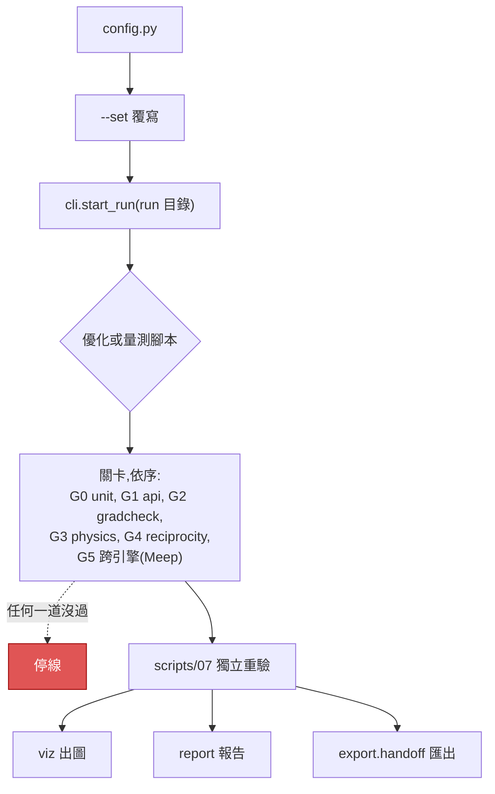
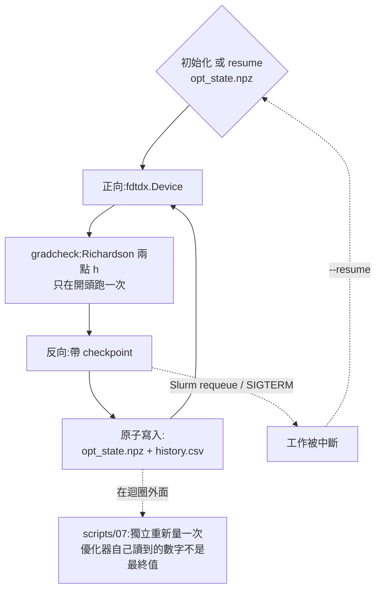

> [English](README.md) · **繁體中文**

# invdx —— 光子逆向設計工具箱

一支跑得快的 GPU FDTD 引擎,拿一支獨立的參考引擎去對驗(cross-validated,
單向:參考引擎驗它,不是兩支互驗);兩者都收在同一套
「設定檔說了算、驗收關卡把關」的工作流程底下。

[](LICENSE)
[](pyproject.toml)

## 目錄

- [我想要…](#我想要)
- [invdx 是什麼](#invdx-是什麼)
- [這個工具箱裝得下什麼](#這個工具箱裝得下什麼)
- [快速上手](#快速上手)
- [工作流程](#工作流程)
- [驗收關卡](#驗收關卡六道全部真跑零跳過)
- [實測得到的效能守則](#實測得到的效能守則turing-世代-gpu)
- [踩出來的護欄](#踩出來的護欄寫在-enginesconventionspy-裡)
- [逆向設計](#逆向設計grating-coupler-那支-driver)
- [problem](#problem-srcinvdxproblems)
- [腳本一覽](#腳本一覽)
- [誠實紀錄](#誠實紀錄)
- [報告與匯出](#報告與匯出)
- [引擎授權](#引擎授權)
- [引用](#引用)
- [目前的限制](#目前的限制)
- [文件](#文件)

## invdx 是什麼

invdx 把一支快的 GPU 引擎、一支獨立而且權威的對驗引擎,收進同一層
「設定檔驅動、驗收關卡把關」的方法層裡。三層,每層只做一件事:**不改動、
版本釘死的引擎**([FDTDX](https://github.com/ymahlau/fdtdx) 負責設計,Meep
當對驗錨點,而且只透過 subprocess bridge 呼叫);**方法層**,那才是這個專案
自己的身分(run 目錄的出處紀錄、六道關卡的驗收框架、製程容差工具、跨引擎
慣例對齊的明文處理);以及一支**自己寫的二維 FDTD**,刻意和前兩者都不相干,
用來學物理、也用來獨立核對物理。完整架構與環境細節見
[`docs/env.md`](docs/env.md)。

> **先認幾個詞(本地化補強,只在中文側)。** 這張表英文側沒有,也不必回填:
> 英文讀者在原詞上不會卡住,中文讀者會。詞的裁定來源是 `docs/glossary.md`,
> 不是這張表;這裡只是把裁定過的寫法就地擺給你看。

| 詞 | 這是什麼 |
|---|---|
| FDTD(finite-difference time-domain) | 時域有限差分。把馬克士威方程式直接在時間軸上一步一步推,一次跑就拿到一整段頻譜 |
| problem | invdx 裡一個完整的題目定義(幾何＋量測＋驗收),住在 `src/invdx/problems/`。本文一律不譯 |
| driver | 這裡指「把整條優化迴圈串起來跑的主程式」,**不是**裝置驅動程式(device driver)。GPU 那種 driver 另外會標明 |
| run / run 目錄 | 一次執行,以及它落地的那個 `runs/<時間戳>-<名稱>/` 目錄 |
| gate(關卡) | 驗收關卡,代號 G0–G5。中文補述一律寫「關卡」,「門檻」留給數值意義的 threshold |
| CE(coupling efficiency) | 耦合效率,本專案要最大化的那個量;log 與欄位名寫 CE |
| FOM(figure of merit) | 優化要最大化的目標量,在光柵耦合器這題就是 CE。**不譯成「品質因子」**——那個中文詞在光學裡已經被 Q factor 佔走 |
| adjoint(伴隨法) | 一次正向加一次反向就拿到全部設計參數的梯度。和線性代數的「伴隨矩陣」是兩回事 |
| gradcheck | 拿有限差分(finite difference, FD)去核對 adjoint 梯度算得對不對的那道檢查 |
| cell / voxel | **同一個東西**:網格的一格。本文講記憶體時寫 Yee cell(**cell 即 voxel**),因為記憶體模型的單位就是「每個 Yee cell 幾個 byte」。⚠️ Meep 語境裡那個指「整個計算區域」的 cell,本文一律改寫成「模擬場域(scene)」,免得和網格的一格撞在一起 |
| checkpoint | **兩個互不相干的意思**:(1) 梯度重算用的——反向傳播只留幾個時間點,其餘重算,拿時間換記憶體,本文的 C 就是它;(2) 斷點續跑用的——`opt_state.npz`。本文每次出現都會標明是哪一個 |
| C | 上面第 (1) 種 checkpoint 的個數。記憶體模型 `peak(C)` 裡的那個 C |
| θ | 光纖入射角(度);θ=0 就是完全垂直入射 |
| scene(模擬場域) | FDTD 模擬的整個計算區域。首次出現附 scene,之後中文寫「模擬場域」 |
| ridge(頻譜峰形) | CE 頻譜上那個峰的形狀。跨引擎比對比的是它,不是單一波長的值 |
| rasterize | 把設計畫到設計像素網格上。⚠️ **中文側一律保留 rasterize 不譯**——這份文件通篇在講光柵(grating),照字面譯出來的中文名一定和它撞在一起 |
| quasi-2D | 第三軸只有幾格、而且不給設計自由度的擺法:既不是真 2D,也不是完整 3D。本文一律寫 quasi-2D,不另取中文名 |
| L1 / L2 | 兩層環境。**L1** 是 uv 管的 Python 層(jax/fdtdx),**L2** 是 spack 從原始碼建的原生層(Meep/MPI/HDF5)。兩層各有自己的 `bootstrap.sh`;細節見 [`docs/env.md`](docs/env.md) |
| corner(製程 corner) | 製程變異的一組極端值(例如過蝕/標稱/蝕刻不足)。**中文側保留 corner 不譯**——譯成「角點」會撞上影像處理的 corner detection,譯成「三角點」會撞上大地測量 |
| latent(隱變數)向量 | 被限制在 `[0, 1]` 的那一份設計參數,優化器直接動的就是它。**不是**統計裡那個觀測不到的 latent variable |
| run-length | 「連續同值段的長度」。⚠️ 和上面那個「一次執行」的 run **完全不同字義**,只是英文同一個字 |
| 承重(load-bearing) | 很多東西掛在它上面,動它會連帶壞掉一串 |
| GB | **本文一律是 10⁹ bytes,不是 GiB**。`nvidia-smi` 報的是 MiB,兩者差 7.4% |

## 這個工具箱裝得下什麼

repo 裡附的兩個 problem 是**例子,不是邊界**。你的元件裝不裝得下,由三件事
決定:引擎實作了哪些物理、你的元件要多少格 cell、以及優化器要求你的設計長成
什麼形狀。下面把這三件事直接寫成**你可以拿自己的元件逐條去對的判準**,而不是
列一串做得到的元件清單。(這一節問的是**哪些 problem 根本表達得出來**;至於
已經表達得出來的 problem 還缺哪些方便功能,那是另一份清單,見
[目前的限制](#目前的限制)。)

**物理,三支引擎都一樣。** GPU 上的 fdtdx、透過 bridge 的 Meep、自己寫的
`toy/`,全部都是**均勻直角 Yee 網格上的時域 FDTD**;而且 `engines/` 裡每一支
adapter 交給每個物件的,都是**一個實數純量介電常數**
(`fdtdx.Material(permittivity=…)`、`mp.Medium(index=…)`、一個實數 `eps`
陣列)。這件事就把題目的類別釘死了:

- **線性、被動、非磁性的介電質**,介電常數在模擬頻段內是實數而且是常數。
  這裡的任何一支 adapter 都沒有接色散模型、沒有接複數折射率、沒有接
  非等向張量、沒有接非線性項或載子項——**上游引擎做得到什麼是一回事,
  invdx 有沒有伸手去拿是另一回事,而它沒有。**
- **不只頻率上是平的,時間上也是靜止的。** 上一條講的「在模擬頻段內是常數」
  是關於**頻率**的宣稱;這一條是另一個、關於**時間**的宣稱。每一支 adapter
  都在開跑之前把每個物件的介電常數定死一次,而且沒有一支接受 ε 是 t 的函數。
  所以一個折射率**被規定**在模擬過程中變化的介質——聲光光柵、行進波
  ε(x, t)、時空調變的非互易隔離器或環行器——不在這個工具箱裡;而且它不在
  的理由是它自己的:它根本不需要先解出某個驅動場,所以下面那條把調變器排除
  掉的規則(那類的 ε 是**回應**一個本 repo 不去解的電壓、載子濃度或溫度)
  **蓋不到它**。不管是被規定的還是自洽求解的,**隨時間變的 ε 在這裡表達
  不出來**。
- **一次 run 就拿到寬頻。** 光源是脈衝,監測面是 DFT/相量(phasor)面——記的是
  複數振幅,不是等相位面/波前——所以一次模擬就
  出一整段頻譜。也就是說,**波長相依性很便宜**;而高 Q 共振貴在**模擬時間**,
  不是貴在要多跑幾次。要押高 Q 元件之前先把這筆帳算誠實:模擬長度是你自己
  設的一個常數(`sim_time_s`),而**釋出版的 fdtdx 沒有自適應停止**,所以場
  還沒衰減乾淨(ring down)的時候,不會有任何東西告訴你——**收斂檢查得你自己跑**:
  把模擬拉長,看那個數字有沒有動。
- **一次 run 只有一個均勻格距**(fdtdx 側是 `spacing_um`,Meep 側是
  `resolution`)。沒有貼合網格、沒有漸變網格、沒有自適應網格。**比一格還細的
  特徵會被吸附到格點上**,而 `assert_design_grid_snaps` 會擋掉那些「吸附發生
  了卻不會被察覺」的設定。
- **報的是比值,不是絕對振幅。** 這裡每一個 FDTD 數字,都是「有元件那次 run」
  除以「只差在受測元件、其餘完全相同的正規化 run」——CE 除的是光纖側輸入、
  彎波導透射除的是直波導、平板透射除的是空的模擬場域(scene)。這是對
  **正規化**的限制,不是對 FOM 口味的限制:焦斑強度、消光比、模態重疊效率
  都算數,只要你寫得出你除的是哪一次 run。**一次 run 拿不到的,是帶物理單位
  的絕對數值。**有兩件事是落在規則外面,不是打破規則:幾何數字(線寬對設計
  規則)是從設計上直接讀的,根本沒有 run;而**完全不用引擎的 problem 報的是
  閉式解**——`tests/fixture_problems/tmm_stack.py` 的透射率是一連串 2×2 矩陣
  相乘算出來的,它照樣是一個完整過關的 problem。
  在你照焦斑那個例子去排計畫之前,先把一個接縫接起來,因為下一個問題正好掉在
  這一條和[目前的限制](#目前的限制)中間:那個 FOM 成立,是因為偵測器陣列是
  **在計算圖裡面**被讀走的,而「一次跑完的 run 在磁碟上留下什麼」是另一個
  問題。**今天就支援**優化焦斑強度;而結果的 |E|² 圖是**第二次、要另外明講的
  正向 run**(`make verify RUN=… --field`),不是優化的副產品。這兩句話同時
  為真,而且互相不擋。
- **端口是對「你寫得出來的模態」做重疊積分。** repo 附的目標模態有兩個:
  解析的非對稱平板 TE0 剖面,和高斯光纖模態(`modes.py`、
  `grating_coupler.slab_te0_neff`)。量測鏈裡**沒有數值模態求解器**,所以一個
  沒有閉式解的端口模態,得自己帶。「自己帶」請照字面讀,**不要往上進位成
  「做不到」**:缺的那一塊是**接線的工,不是引擎的能力**。MPB(MIT Photonic Bands,光子能帶與模態求解器)和 Meep 自己的
  eigenmode solver 在這個 repo 外面把這些剖面算得好好的,而端口重疊積分從頭到
  尾只需要監測面上取樣到的 (E, H) 陣列——量測鏈裡沒有任何一段會去追問它們
  是哪裡來的。缺的是「幫你去呼叫求解器、並且把它的慣例對齊
  `engines/conventions.py`」的那段程式碼;那是有人可以去做的工,不是天花板。

**維度,以及「哪些維度有第二支引擎背書」——這是兩個不同的問題。**
三支引擎在這件事上不能互換:

| 引擎 | 它能在幾維裡量 |
|---|---|
| fdtdx(設計引擎,GPU) | quasi-2D 與完整 3D——**從來沒有真正的 2D**:fdtdx 是 3D 求解器,而這個 repo 造得出來最薄的模擬場域,y 軸上仍然有貨真價實的 `n_y_cells` 格(`GratingCouplerConfig.n_y_cells`:最少 2、**預設 4**、週期邊界、那一軸沒有設計自由度) |
| Meep,透過 subprocess bridge | 只有 2D——bridge 對外開放的每一項量測工作(`slab_transmission`、`vacuum_flux`、`phc_bend`)建的都是 2D 模擬場域;唯一那個 3D 工作 `benchmark` 沒有偵測器,量的是場更新速率而不是物理 |
| 自己寫的 `toy/` | 只有 2D TM(Ez, Hx, Hy) |

所以:**3D 元件在這裡設計得出來、也量得出來,但在這裡對驗不了。** G5 拿 fdtdx
和 Meep 比正入射平板透射;而光柵耦合器已發表的跨引擎一致性,比的是
quasi-2D 的耦合頻譜峰形(ridge)對上 Meep 的真 2D。這個 repo 裡,3D 那條鏈唯一的
獨立檢查,是它自己在寬波導極限下退化成 quasi-2D——那是**同一支引擎內部的
自洽檢查,不是第二份實作**。**3D 是「支援」,不是「被佐證」**;如果吸引你來用
這個工具箱的正是那第二支引擎,那個保證目前**只到 2D 為止**。

要精確地講清楚**為什麼**只到這裡,因為誠實的版本比聽起來的小:這是**接線的
缺口,不是物理的缺口**。Meep 模擬 3D 模擬得好好的;這個 repo 缺的是
subprocess bridge 裡的一項 3D 量測工作——`engines/meep_worker.py` 對外開放的是
`slab_transmission`、`vacuum_flux`、`phc_bend`,全是 2D,外加一個沒有偵測器的
`benchmark`。要補上 3D 對驗,意思是**再寫一項 worker 工作和對應的慣例對齊**,
不是去取得哪一支引擎都沒有的能力。所以「3D 在這裡對驗不了」正確的讀法是
**還沒有人把它接起來**;正在決定要不要採用這個工具箱的讀者,應該把它當成
**一件工作**來估價,而不是當成物理上的不可能。

**顯示卡裝得下多少元件,以 cell 計。** 對多數 3D 專案來說,決定性的限制是
這一條而不是物理;而且它不管你的元件叫什麼名字:**它數的是 Yee cell**,也就是
模擬體積除以每一軸的格距。**一次 run 只吃一張 GPU**——這裡的「多 GPU」指的是
兩張卡上跑兩次互相獨立的 run,**從來不是**一次 run 切開跨兩張卡;而跨節點的
區域分解是**被量測否決**的,不是沒做(見
[實測得到的效能守則](#實測得到的效能守則turing-世代-gpu))。所以預算就是一張卡;
而 fdtdx adjoint 路徑實測出來的模型,對 cell 數是線性的:

```
peak ≈ (372.18 + 268.0329 · C) bytes per Yee cell     (Turing-class GPU)
```

其中 C 是 checkpoint 數(**梯度重算的那一種**)。**這一節裡的 GB 一律是
10⁹ bytes**,因為那些錨點就是這樣量的;**它不是 GiB**。在這裡把話講明不是
賣弄:**正是把這個單位標錯,產出了下面那個已被撤回的模型**;而一個拿
`nvidia-smi`(它報的是 MiB)去對照的讀者,只要假設錯邊就會差 7.4%。兩個係數
都是**量出來的**,不是估的:斜率經過兩個 GPU 世代、一次編譯期的 XLA 記憶體
分析,以及對 fdtdx 實際存了哪些 pytree 葉陣列逐項數 byte,三者交叉確認;
舊的 `370 + 291·C` **已經撤回**——那次推導,以及它所依據的錨點
(C=10/20/28 → 在 1.944M cell 下 5.93/11.25/15.42 GB)都寫在
[`docs/RETRACTIONS.md`](docs/RETRACTIONS.md) 裡。**標稱記憶體不等於全部花得
到**:同一張 24 GB 的卡上,C=28 跑得起來、C=40 就 OOM(記憶體爆掉)。照上面
那個模型,在那個模擬場域的 1.944M cell 下,這兩個是 **15.3 GB** 與
**21.6 GB**;而 C=28 那次 run **實測**是 15.4 GB。本節每一個數字都是從**模型**
引的,不是從那次觀測引的,好讓這一段不會把「已撤回的擬合所依據的錨點」和
「現行模型」混在一起。(兩者之間 0.7% 的差距在這裡不改變任何結論——會點出來,
是因為錨點和模型是兩種不同性質的宣稱,不是因為這個差距重要。)所以下面的
例子一律**用 16 GB 編預算**,你估自己那張卡的時候也該一樣保守。拿你自己的
cell 數去乘——但**先把第三軸數進去**:

**fdtdx 這條路上沒有真正的 2D,所以一個「2D」元件的花費是教科書數法(count)算出來的好幾倍。**
fdtdx 是 3D 求解器。這個 repo 造得出來最薄的東西是 *quasi-2D*:y 軸上有貨真
價實的 `n_y_cells` 格——`GratingCouplerConfig` 裡**預設是 4**,而它的註解寫
「must be > 1」——y 方向週期邊界,那一軸沒有設計自由度。關於這兩個數字有
**兩點要提醒**,因為這一條的倍率就架在它們身上。**那個下界是註解,不是
assertion**:`src/` 裡沒有任何東西去強制它,而且它給的理由(釋出版的
`GaussianPlaneSource` 會把橫向振幅壓平)屬於一支**已經被這個 repo 換成自製
`GaussianBeamSource`** 的光源,所以「1 到底是不是真的不行」在這裡**沒有被測
過**。而 4 只是**其中一份附帶設定的選擇**,不是這條路徑的性質——你要是自己
寫模擬場域的建構程式,薄軸幾格由你自己挑,而這個 repo 不會告訴你該挑幾格。
那一軸的每一格都是**記憶體配置器(allocator)要付錢的 Yee cell**。上面那些
錨點已經把這件事算進去了:量出它們的那個 1.944M cell 的模擬場域是
`nx × 4 × nz`,不是 `nx × nz`。你要是帶著 2D 直覺來、只乘了兩個面內尺寸,
你會**剛好低估 `n_y_cells` 倍**;所以下面的例子一律把 2–4 這個範圍的兩端
都列出來,讓這個低估無處可躲。(這個 repo 裡確實有真正 2D 的引擎——Meep
bridge 和 `toy/`——但兩者都在 CPU 側,上面那個模型對它們不適用;見這幾條
之後的那一段。)

- **16 GB 在 C=10 之下約是 5.2M cell** —— 完整 3D 的話,是 20 nm 格距下一個
  3.5 µm 的立方體。同樣格距下改成 quasi-2D,那是 **`n_y_cells=2` 時 32 µm
  見方,預設值 4 時 23 µm** ——**不是**用真 2D 的數法(count)數出來的那個
  46 µm。格距減半,
  3D 要 8 倍的 cell、quasi-2D 要 4 倍,所以**通常是網格先決定成敗,不是元件**。
- **一片 100 × 100 × 2 µm 的超穎透鏡(metalens)孔徑,20 nm 格距下是 2.5e9 個 cell**,
  光是 C=0 那一項就約 **0.93 TB**:還沒放進任何一個 checkpoint,就已經是上面
  預算的將近 60 倍,所以這**不是**「等一張更大的卡」就解決得了的。(這一個
  本來就是完整 3D——三個尺寸都是物理尺寸,沒有薄軸倍率可以再加。)同樣的
  算術適用於**任何整片一起模擬的超穎表面(metasurface)**。而它的**單位晶胞**——幾個 µm
  見方——裝得下,而且還有餘裕。這就是任何孔徑尺度或非週期光學元件要套的
  切法:**週期晶胞算在裡面,整片孔徑算在外面**;而你跟著孔徑一起放棄的,
  正好就是設計裡非週期的那一部分。
- **一個 100 × 100 µm 的「2D」彎波導,20 nm 下裝不下——連正向量測都裝不下。**
  面內是 5000 × 5000 = 25M 個 cell,但在這條路上還要乘上薄軸:
  **`n_y_cells=2` 時 50M,預設值 4 時 100M。**於是光是 C=0 的正向 run 就要
  **18.6 GB 或 37.2 GB**,兩端都超出 16 GB 的預算——而且**便宜的那一端已經
  超過 15.3 GB**,也就是模型算給「24 GB 卡上已知活得下來的最大一次 run」的
  值(實測是 15.4 GB;這兩個一個是模型、一個是觀測,本節把它們分開放)。
  逆向設計又更遠:C=2 要 45–91 GB,C=10 要 153–305 GB。(這一條的舊版本
  只數了 25M 個 cell、報了約 9.3 GB,並且下結論說正向量測裝得下。那次計數
  **漏掉了 `n_y_cells`**;結論錯在會出事的那個方向,而 9.3 GB 其實是下面
  40 nm、`n_y_cells=4` 的那個數字。)

  **救得回這件事的是網格和薄軸,不是更大的卡。** 換成 **40 nm**,同一片孔徑
  是 12.5M / 25M 個 cell,三件事同時回來:正向量測**輕鬆裝得下**
  (**`n_y_cells=2` 時 4.7 GB,4 時 9.3 GB**);16 GB 之內的 checkpoint 預算是
  **`n_y_cells=2` 時 C ≈ 3;而在預設值 4 之下,光一個 checkpoint 就已經是
  16.0 GB —— 比本節自己那 16 GB 的預算超出 0.03%,也就是說,那不是一個你
  靠得住的 checkpoint** ——這條預算很緊,但在 `n_y_cells=2` 之下,它是「完全
  不能做逆向設計」和「做得成一小段帶 checkpoint 的逆向設計」之間的差別;
  而 `n_y_cells=4 → 2` **省下來的那份記憶體,第一個就該花在它身上**——因為
  在那一軸把 cell 數砍半**不會拿走任何設計自由度**;至於你要是想在 40 nm 下有真正 C=10 的設計
  預算,負擔得起的孔徑是 **`n_y_cells=2` 時 65 µm 見方、4 時 46 µm**。
  **把網格放粗不是免費的,也不可以想當然**:40 nm 在 λ = 1.31 µm 下,矽裡
  每個波長只剩約 9 格,20 nm 則是約 19 格(這是 repo 附的那個耦合器的頻段和
  折射率——**請照你自己的 λ/n 重新換算**,真正定下界的是它);所以請
  **在比較粗的網格上把凍結的設計重新量一次**,不要直接相信它——
  `scripts/20_eval_2d_forward.py` 存在的目的就是做這件事。所以大面積的
  **量測**和大面積的**逆向設計**是兩個不同的負擔得起與否的問題,而且兩者都是
  先由網格和 `n_y_cells` 回答,才輪到元件本身。

這是一道**記憶體天花板**,和效能守則裡引的那個吞吐飽和數字
(「一次模擬在 0.5M cell 就把一張卡吃到約 80%」)是不同的東西:後者說的是
**一次小 run 就已經把 GPU 的計算單元(SM)塞滿**,不是說 0.5M cell 是上限。Meep 透過 bridge 跑
在 CPU 上,`toy/` 也跑在 CPU 上;這兩者的天花板改成是主機 RAM(Meep 還加上
rank 數),上面那個模型對它們都不適用。那裡也正是這個 repo 裡**唯一真正的
2D** 所在:一個大面積的 2D **正向**研究,在 GPU 上裝不下,在 CPU 上也許還
負擔得起——用 CPU 的速度,而且僅限於 bridge 已經開放的那些量測。它的工作
清單是**固定的**,而且只有三項(`slab_transmission`、`vacuum_flux`、
`phc_bend`),沒有一項量得了任意的彎波導,所以這條路在花掉 CPU 時數之前,
會先花掉「在 `engines/meep_worker.py` 裡新寫一項 worker 工作」;而且它回傳的
是數字,**不是梯度**。`toy/` 是另一個 CPU 選項,代價是它那個 Mur 邊界的
精度下限。

**逆向設計在上面之外還要求什麼。** [`optimize.py`](src/invdx/optimize.py) 是
一支跑在 latent 向量(被限制在 `[0, 1]` 的那份設計參數)上的 Adam,而且它只要求一件事:
`vg_fn(p, beta) -> (loss, dloss/dp)`,其中 `loss = -FOM`。它**不 import 任何
引擎、也不 import 任何 problem 模組**,所以任何生得出這一對的參數化方式都優化
得動。在你據此排一個專案之前,有三個後果值得先講明白:

- FOM 必須**從頭到尾、穿過求解器都可微分**——在 fdtdx 這條路上,就是一段
  寫在偵測器陣列上的 jnp 運算式。一個**只能靠事後處理一次跑完的 run** 才算得
  出來的 FOM,給你的是正向量測,**沒有梯度**。
- 設計變數必須是**連續的實數**,而且從它們映到介電常數網格的那個映射必須
  可微分。**要求就只有這樣**,而且它刻意比「必須是一個密度場」更弱——本節
  以前寫的是設計「必須是一個場」,那句話和它上面那一句自相矛盾,而且會錯誤地
  排除掉這個題目類別裡最常見的參數化方式。**一個變跡(apodized)光柵的 20 齒線寬向量,拿來當 `p`
  完全合格**:20 個數字,不是一個場。它欠你的是可微分的那一半——齒的邊界要
  用平滑的方式 rasterize(level-set 或 sigmoid),好讓 ∂ε/∂width 存在。repo 附的
  `profile_teeth` 是硬性的 run-length(連續同值段長,和上面那個「一次執行」的
  run 不同字義)門檻,它存在的目的是匯出與重新量測,
  **不是為了梯度**,所以幾何式的參數化得自己帶一支平滑的 rasterizer;而
  `richardson_fd.py` 裡的梯度檢查,就是你用來確認它到底有沒有帶對的東西。
  真正被排除掉的是**離散**的選擇——整數的齒數、從型錄裡挑一種材料、用一個
  `if` 切換拓樸——因為**根本沒有梯度可以還給你**。
- repo 附的 Device 路徑,是上面那條規則**長成場的那個特例,不是規則本身**:
  一個定義在均勻像素網格上、ρ ∈ [0, 1] 的密度——一條線(`design_device`)或
  一個平面(`design_device_2d`)——沿一層固定的厚度擠出,再經 conic filter →
  tanh projection 映到兩種材料上。多波長用 softmin 聚合,而且支援一個懲罰項
  (`w_s11`)。你要自由形貌的拓樸就用它;你的元件用少數幾個幾何數字描述得更
  好,就自己寫 `vg_fn`。

**今天就裝得下,只是還沒有人寫。** 任何被動線性元件,只要裝得進一張卡、而且
它的 FOM 是兩次 FDTD run 的比值:分光器與 MMI、波導交叉、錐狀轉接與彎波導、
模態轉換器、波長多工器與解多工器、共振式濾波器(例如環形耦合的 add/drop 級)、
超穎表面的**單位晶胞**(而不是整片孔徑),以及兩種參數化下的變跡(apodized)光柵——
repo 附的密度場,或是照上一條、由你自己帶平滑 rasterizer 的一小段齒寬向量。
其中有兩項的代價值得在動工前先估:**高 Q 共振是用模擬時間付帳的**(還要加上
你自己跑的收斂檢查),而**模態不是 repo 附的解析 TE0 或高斯的端口,得自己帶
模態剖面**。每一個都需要一支模擬場域建構程式和一個量測函式——
[`docs/new-problem.md`](docs/new-problem.md) 就是帶你走完這段工的文件——
然後靠宣告一個 `ProblemSpec` 把整套關卡框架繼承過來。**一個 problem 甚至可以
完全不用引擎**:`tests/fixture_problems/tmm_stack.py` 就是一個沒有引擎、沒有
GPU、卻完整過關的 problem。

**不動引擎就裝不下**,因為物理落在上面那份清單之外:有色散或有損耗的材料
——**包括光頻下的金屬**,所以電漿子波導和天線出局,因為金屬需要的正是那個
缺席的 Drude/Lorentz 色散模型,而它**沒辦法用一個實數純量介電常數假裝**;
非線性光學(諧波產生、四波混頻、任何 χ⁽²⁾/χ⁽³⁾ 過程);**ε 被規定隨時間變化
的介質**,照本節開頭那條 ε(t)——聲光元件和時空調變的非互易隔離器住在
**這一條**,不是住在後面那條調變器條款裡;增益與主動元件(雷射、偵測器,以及
**每一種**調變器——電光、載子式、熱光都算,因為它們的運作方式都是「讓某個
材料性質去回應一個電壓、一個載子濃度或一個溫度」,而這三樣東西本 repo 一個都不去
求解);磁光或非等向介質(含磁光隔離器);任何熱或電的協同模擬;以及任何
需要非直角網格的東西。

**本徵問題是「部分不行」,而且這個區分很要緊**,因為好幾個光子晶體的問題
就是長成這個形狀來的。這裡**沒有能帶結構求解器、也沒有 eigenmode solver**,
所以能帶圖——沿布里淵區路徑的 ω(k)、模態剖面、群速度——**不是**這個 repo
算得出來的東西;而端口之所以需要解析模態,缺的也正是同一塊。它**算得出來的
是能隙本身**:讓光透射過一塊有限厚度的板,再從 T(f) 上讀出阻帶——`phc_bend`
就是這樣定出 Γ-X 阻帶 0.27–0.41 的。**能隙邊緣可以,能帶圖不行**;而且和上面
的端口模態一樣,這裡的「不行」意思是**這個 repo 裡沒有任何一項工作去呼叫
它**,不是說能帶圖拿不到:MPB 算得出來,而且沒有任何東西擋著你「在那邊算能帶
圖、拿它來指導一個在這裡量的設計」。

## 我想要…

每一項都先給一個**幾分鐘就跑得完**的版本。這裡不預設你已經懂這個專案的行話;
「延伸閱讀」那一欄就是那些詞被解釋的地方。

| 我想要… | 幾分鐘的版本 | 真正的那次 run | 延伸閱讀 |
|---|---|---|---|
| **逆向設計一個光柵耦合器** | `make coupler-opt-smoke`(約 10 分鐘,要 GPU) | `make coupler-opt`(約 13 小時) | [docs/optimize.md](docs/optimize.md) |
| **拿第二支引擎核對一個做完的設計** | `make verify RUN=runs/<dir>` | 再加 `--corners --s11` | [逆向設計](#逆向設計grating-coupler-那支-driver) |
| **看一個設計扛不扛得住製程誤差** | `make tolerance RUN=runs/<dir>` | 要頻譜就加 `LAMS=1.27,1.35,9` | [docs/tolerance.md](docs/tolerance.md) |
| **把設計交給別的求解器** | `make handoff RUN=runs/<dir>`(數秒) | — | [報告與匯出](#報告與匯出) |
| **重現一個文獻基準** | `make phc-bend`(約 2 分鐘,CPU) | — | [docs/phc-bend-walkthrough.md](docs/phc-bend-walkthrough.md) |
| **搞懂 adjoint 梯度是從哪來的** | `python scripts/09_toy_adjoint.py`(CPU) | — | [tutorials/](tutorials/) |
| **確認環境沒壞** | `make check`(幾分鐘,CPU) | `make gates`(比較久,要 GPU) | [docs/env.md](docs/env.md) |
| **模擬我自己的元件,不是內附的那兩個** | 複製 `problems/phc_bend.py`(兩者裡比較小的那個) | — | [docs/new-problem.md](docs/new-problem.md) |

`make help` 會列出所有 Makefile target。`make runs` 會告訴你哪些 run 目錄可以
餵給上面那些 `RUN=`——`runs/` 裡同時也放著關卡的 run、效能基準和被中斷的
工作,而**光看名字分不出來**。

## 快速上手

```bash
bash scripts/bootstrap.sh   # 安裝 L1 層(uv/jax/fdtdx)並驗證
make test       # 純 Python 單元測試(幾分鐘,CPU)
make phc-bend   # 標準的光子晶體波導基準,toy 引擎,CPU(約 2 分鐘)
make gates      # 六道驗收關卡全跑 —— 前置條件見下
```

`scripts/bootstrap.sh` 是冪等的;它在裝任何東西之前會先確認 GPU driver
(這裡指顯示卡驅動程式)夠新、撐得住那些版本釘死的 CUDA wheel(預先編好的 Python 套件檔);而且它是
**從裝好的環境裡真的 import 一次**來驗證,不是假設「安裝成功」等於「能用」。
`--cpu-only` 會跳過 GPU 的 extra(`pyproject.toml` 宣告的一組選用相依);`--dry-run` 只檢查不安裝。它檢查什麼、為什麼
檢查,寫在 [`docs/env.md`](docs/env.md#the-uv-layer-l1-in-detail)。

前三行除了 bootstrap 之外不需要別的東西,而且是「一份新 clone 沒壞」最快的
綠燈。`make gates` 是那條有 Python 環境**之外**前置條件的:G0 是純 Python,
G1–G4 需要一張 JAX 看得到的 GPU,而 G5 單獨需要 Meep——那是
[`docs/env.md`](docs/env.md) 用 spack 從原始碼建的,冷快取的第一次要好幾小時。
關卡執行器**刻意沒有跳過的路徑**(一道被跳過的關卡,讀起來和一道通過的關卡
一模一樣),所以一份沒有 Meep 的 clone 拿到的是**紅色的 G5**,而不是安靜地
通過。在 Meep 建好之前,先跑那些跑得起來的關卡:

```bash
uv run python scripts/00_check.py --through reciprocity   # G0–G4,不需要 Meep
```

每一支腳本都經過 `cli.start_run`:每次呼叫都會寫出一個
`runs/<時間戳>-<名稱>[-tag]/`,裡面有 `config.json`(含任何 `--set` 覆寫)、
`cmdline.txt` 和 `env.txt`,所以任何一張圖在幾個月後都重建得回來。不認得的
`--set` 鍵會被**拒絕**,不是被忽略。

## 工作流程



長時間的工作要用 detach 的方式啟動(這樣 SSH 斷線不會把它殺掉):
`setsid nohup <cmd> > runs/<log> 2>&1 &`。

## 驗收關卡:六道全部真跑,零跳過

`make check`(只跑 G0)/ `make gates`(全跑)。**順序是承重的**(load-bearing:很多東西掛在它上面)——每一道關卡
都假設它前面的都成立。執行器是 `gates/runner.py`;每次 run 會產出一份機器可讀
的 `gates_report.json`。

| # | 關卡 | 它釘住的是什麼 |
|---|---|---|
| G0 | unit | 純數學的不變量(重疊積分、filter、toy 物理、幾何、設計向量的來回轉換、checkpoint 續跑)——**整個 `tests/` 套件**,所以往那裡丟一個測試檔就等於加進這道關卡 |
| G1 | api | 釋出版 fdtdx 對外的 API 介面、GPU 看得到、meep bridge ping 得通 |
| G2 | gradcheck | fdtdx 的 value_and_grad 對上有限差分,在一個 toy 尺寸的模擬場域(scene)上、**而且在真正的 grating_coupler 設計路徑上**;filter 的連鎖律 |
| G3 | physics | 真空中的通量守恆 |
| G4 | reciprocity | `grating_coupler` 這個 problem 上,正向 CE 對上互易 CE ——**這一類關卡專門抓正規化錯誤**,包括它在這裡真的抓到過的一個 CE 差 2 倍的 bug |
| G5 | cross-engine | 慣例對齊之後,fdtdx 的透射對上 Meep 的透射 |

**關卡沒過就當成停線(stop the line:整條流程停下,不往下走)事件處理。**

關於這個名字有一句話要說。在 verification-and-validation 的意義上,這六道
**全部都是 verification(驗證程式解對了方程式)**——它們問的是「這份程式碼
有沒有解出它宣稱要解的方程式」,對照的是解析解、不變量、有限差分,以及第二份
實作。**沒有一道是 validation(對照真實量測)**,那意味著要拿去和一個量過的
真實元件比。一個純模擬的專案沒有那個東西,而跨引擎那道關卡是**現有選項裡最
接近的替身,但它取代不了 validation**。網格收斂的工作(calculation verification)住在
每個設計自己的鏈裡,不住在這裡,因為那是**某一個解**的性質,不是**程式碼**的
性質。

## 實測得到的效能守則(Turing 世代 GPU)

這裡的效能工作遵守一條很簡單的紀律:**先量再信、動刀前先做微基準、把死路記下來
以免有人再走一次**。上游引擎都是很優秀的物理程式碼;下面這些筆記講的是把它們
配到某一台特定的機器上,所以請把底下每一個數字都當成**方法的示範例**,不是
拿來照抄的設定值。

- Meep 的 MPI rank 數:**少的贏過多的**——FDTD 是記憶體頻寬受限的。實測:
  16 核 Zen4 在 np=8 達到峰值(np=16 慢 26-35%,np=32/開 SMT 慢 4 倍);
  雙路 Xeon 在 np=16 加 NUMA 綁定達到峰值(np=64/全 SMT 慢 5 倍)。在相信任何
  預設值之前,先用 `scripts/12_cpu_tuning.py` 掃**你自己那台機器**。
- 對 fdtdx 來說,**共用 GPU 是一條量測過的死路**(CUDA MPS:總量 -58%;
  單純 time-slicing(分時輪流用同一張卡):零增益——一次模擬在 0.5M cell 就把
  一張卡吃到約 80%)。
  改成在同一個 process 裡用 jax.vmap 把小模擬批次化。
- 跨節點的區域分解在 1GbE 上**被算術直接判出局**(halo〔邊界層〕交換約 64 ms/step,
  對上計算的 5-15 ms/step);改成把整份互相獨立的工作丟去另一個節點跑
  (協定開銷約 1.5 秒)。

## 踩出來的護欄(寫在 `engines/conventions.py` 裡)

1. Meep 的 DFT 場 / |alpha|² / 通量**沒有**含物理上那個 ½ 功率因子——任何
   自己寫的重疊積分都必須**明文**把慣例接起來(不接的代價是 CE 差 2 倍;
   互易那道關卡就是抓這個的)。
2. `meep.adjoint` 的多頻梯度回來的形狀是 `(Nx, nf)` —— 要 `sum(axis=1)`。
3. 模擬解析度必須 ≥ 設計網格密度,否則 adjoint 梯度會**系統性偏小**
   (實測:res 40 時偏低 5–8%,res 80 時準確)。
4. Meep 的 `decay_by` 預設值(1e-11)在同等精度下比 1e-6 慢約 3.4 倍——
   worker 一律明文把它傳進去。
5. **設定檔是唯一真相來源**;腳本永遠不硬寫數字。
6. 共振結構的跨引擎比對,比的是**頻譜峰形(ridge),絕不比單一波長的值**:
   兩支引擎會把同一個標稱幾何離散成不同的等效線寬(整格填滿 vs 次像素平均,
   每個邊界最多差半格)。而一個光柵的耦合頻譜峰形,在峰值波長上移動得比邊界
   誤差本身還快,所以兩支引擎可以在某個固定波長上差幾十 dB,而它們的峰位卻
   是吻合的。

## 逆向設計(grating coupler 那支 driver)

在設計視窗上放一個 `fdtdx.Device`(一個設計像素對一個 voxel,經
conic filter → tanh projection),再加上一份 CE 計算鏈的 **jnp 可微分版本**
(jnp twin),就能讓一次反向傳播一口氣碰到每一個設計變數——這是量測時用的那條
run-length(連續同值段長)編碼、不可微分的 `profile_teeth` 路徑的**可微分對應版本**。

```bash
uv run python scripts/15_grating_coupler_optimize.py --tag opt --gradcheck  # 約 13 小時,1 張 GPU
uv run python scripts/15_grating_coupler_optimize.py --resume runs/<dir>    # 被砍掉之後接回去
sbatch -p <partition> -t 14:00:00 slurm/grating_coupler_opt.sbatch          # 可安全 requeue
```



實作細節、gradcheck 的來龍去脈,以及 checkpoint / 續跑的語意:
[`docs/optimize.md`](docs/optimize.md)。

## problem (`src/invdx/problems/`)

- **`grating_coupler`** —— 跑在 fdtdx 引擎上的光纖對晶片光柵耦合器,帶
  193 nm DUV SOI 平台的設計規則限制。quasi-2D 與完整 3D 的 CE 量測鏈(光纖側
  與波導側激發、解析平板 TE0 目標、方向性重疊積分、單次 run 就出密集的
  CE(λ) 頻譜);2D 的耦合頻譜峰形拿 Meep 參考引擎對驗過,3D 那條鏈則是拿它
  自己在寬波導極限下的 quasi-2D 退化對驗;3D 量測要跑兩次互相獨立的 run,
  這兩次用雙 GPU 做工作級平行(結果與依序跑**位元完全相同**);逆向設計在
  `scripts/15`(見上)。腳本 03–05、07、15。
- **`phc_bend`** —— 光子晶體波導文獻裡的一個標準基準:方晶格介電柱陣列裡的
  90° 彎(a=1 µm、R=0.225a、ε=10),精神上就是 Mekis 等人那個高透射光子晶體
  彎角(Phys. Rev. Lett. 77, 3787, 1996):Γ-X 阻帶 0.27–0.41 涵蓋目標能隙
  0.29–0.41,能隙內彎角透射 T≈0.85–1.1,並重現教科書上關於點缺陷的結論
  (水平/垂直 ≫ 斜角)——跑在 toy 引擎上,並和 Meep 交叉核對。動手教學:
  `docs/phc-bend-walkthrough.md`。腳本 06。

要加第三個,看 [`docs/new-problem.md`](docs/new-problem.md):一個 problem 模組
必須提供什麼、該從這兩個裡的哪一個複製(`phc_bend` 比較小)、怎麼在花錢跑
模擬之前先把幾何看一遍,以及那些**會安靜地給你錯答案而不是拋例外**的慣例契約。
要求的契約**刻意做得很小**——一個 config 子類別,加一句
`PROBLEM = ProblemSpec(...)` 宣告——因為跨這兩個 problem 來看,模組層級名稱的
交集是**空的**,而一份更大的「契約」會變成一份兩邊都沒實作的東西。這句宣告
真正換到的,是那兩道**會去量一個具體 problem** 的關卡(G2 Part C 的 gradcheck、
G4 的互易):一個新的 problem 靠提供一個 case 把它們繼承過來;而一個「某道
關卡在它身上沒有東西可查」的 problem,**必須把這件事連同理由講出來**,而不是
安靜地把覆蓋率弄丟。這句宣告**自己不帶名字**:`problems.load` 是照**別人怎麼
叫它**來命名一個 problem 的——註冊表的鍵,或是點狀模組路徑的最後一段——
所以寫你自己的 problem,從來不需要知道別人的 problem 叫什麼。有兩樣東西跟著
這個名字一起進到關卡報告裡。`load` 會蓋上它解析到的 import 路徑,關卡把它寫成
`details["problem_module"]`,所以一份報告說得出**是哪個模組產出它那些數字**,
而不只是「那個模組被叫做什麼」——而且 **problem 模組這兩個欄位一個
都不提供**,因為一個**自己填自己身分**的受測對象等於沒有被識別。有四件事在
強制這一點:關卡的這兩個欄位都從載入的 spec 蓋上;一個 case 若帶著其中任何
一個的副本會被**拒絕**,並把那個鍵指名出來;spec 上那兩個身分欄位、關卡蓋上
的那兩個身分值,以及 `details` 裡**任何深度**的每一個鍵,都必須**恰好是
`str`,而不能是任何「像 `str`」的東西**,因為一個子類別是**代表它自己**在回答
別人拿 `==` 和 `in` 問它的問題;最後,執行器會從 `--problem` 要求的那個東西
**重新推導**這兩者——**從請求那一側推,不是從關卡讀 spec 讀來的那一側**——
並在報告寫出去之前做比對。另一個真相來源是一句宣告,不是後門:一道**永遠只
量某一個特定 problem** 的關卡,在關卡模組裡寫成
`MEASURES_PROBLEM = '<名稱>'`,而執行器**同樣是從請求那一側**去解析那個名字,
而不是從載入的 problem 上讀。

一道關卡的結果只要和上面兩者中適用的那一個不符,**就算失敗,不管它自己回報
什麼狀態**。一道**完全沒有回報出處**的關卡同樣算失敗,只有兩個明講的例外:
它的模組可以宣告 `MEASURES_PROBLEM = NoProblem("…")` —— G0/G1/G3/G5 就是這樣
說明自己不量任何 problem 的 —— 以及一個**已經是 `[FAIL]`** 的結果會被放行,
因為一道**在載入任何東西之前就壞掉**的關卡,裡面帶著真正的診斷訊息,拿一句
記帳上的抱怨去蓋掉它,只會把真正的原因藏起來。這個極性是刻意的:**什麼都
沒寫的作者會拿到一句很大聲的抱怨,而且那句話會把兩種修法都指名出來**,因為
「不知道有這條規則」正是這一層要對付的失效,而它**絕不可以同時也是關掉這一層
的方法**。

退出宣告要花掉一句話,這一點同樣是刻意的。它以前是光禿禿的
`MEASURES_PROBLEM = False`,那在那四個模組裡每一個都是正確的,而且**被貼到
哪裡都還是「看起來正確」**:一次稽核把 G3 的宣告複製進了一道**會量耦合器**
的關卡,那道關卡報出兩個沒有身分的耦合效率,然後印了 `[ok]`。`False` **對
它被寫在哪個模組裡這件事什麼都沒說**,所以在一個新模組裡,它身上也沒有任何
東西會出錯。**一個理由就會**——「G3 checks flux conservation in an EMPTY cell」
(G3 檢查的是**空的**模擬場域(scene)裡的通量守恆)這句話擺在一個
`CE_fwd_dB` 旁邊,一眼就看得出是假的。請注意這個宣稱的尺寸,
因為它和下一段是同一條界線:這件事讓一份被複製的退出宣告在**審查時讀得出來
是錯的**。它**擋不住那次複製**,而且**一個跑在同一個 process 裡的檢查也擋不
住**。它真正強制的是:`False` 本身現在會被拒絕,並且把替代寫法直接寫給你看。
另外,一個會**佔用一個已註冊 problem 的名字**的請求也會被拒絕——不管是一個
宣告 `name="grating_coupler"` 的模組,還是一個單純叫做 `grating_coupler.py`
但住在別處的檔案——因為那個名字正是那些數字在 `gates_report.json` 裡被歸檔
用的鍵。一個**有自己名字**的 problem,這兩條規則都碰不到它。

**這些換到了什麼、又沒換到什麼;這個差別決定你該怎麼讀別人的報告。**
這些規則是**紀錄制度,不是安全邊界**。載入一個 problem 就是 import 它,而一個
被 import 的模組**跑在這個 process 裡**:它可以直接伸手進 `invdx.gates`、
替換掉執行器自己的函式,或者**根本不跑模擬**就把 `gates_report.json` 寫出來。
一個**存心說謊**的模組,產得出一份**和誠實報告位元完全相同**的報告——本 repo
的一次稽核就真的這樣做了,用一個純 CPU 的替身,外加一句 `time.sleep` 冒充一次
91 秒的 GPU run——而且**沒有任何跑在同一個 process 裡的檢查告訴得了你**。
所以,「如果一個 problem 模組存心說謊,這份報告還算不算證據?」這個問題的
簡短答案是:**不算,而且這裡沒有任何東西能讓它算。** 這些規則抓得到的是
**意外和抄近路**:一個忘了宣告某道關卡的 problem、一個沿用了被複製對象名字的
模組、一個被改名改成某個已註冊 problem 拼法的檔案、一個把自己的數字歸檔到
關卡那個鍵底下的 case、一道報了數字卻完全沒有出處的關卡。這些**沒有人是故意
的**,它們正是**安靜地把一份綠色報告變成一份沒有意義的報告**的東西,而現在
每一個都會很大聲地失敗。

這份清單有兩個限制,因為這個差別決定了一份報告裡**哪些部分有檢查在背書**。
執行器自己那道後盾,只涵蓋**那兩個身分鍵**——它們是它唯一能從請求那側獨立
推算出真值的欄位。至於**關卡自己量出來的每一樣東西**(`CE_fwd_dB`、
`grad_max`……),**沒有第二個來源**,所以站在那裡的只有「撞鍵就拒絕」這一條;
而且它**只在關卡把 problem 的 dict 走 `runner.gate_details` /
`merge_problem_dict` 的時候**才站得住。一道改用字面值去組 `details`、再把
problem 的 dict 展開蓋在自己量出的數字上的關卡,**身分鍵照樣會被執行器檢查,
數字卻會被安靜地換掉**——而那正是 G4 出廠時帶的那個 bug,只是現在其中一半
會被抓到了。另一半的修法是**寫給關卡作者的一條規則**,寫在 `gates/__init__.py`
裡,**不是一個機制**。出處欄位存在的目的,是讓一個想查的讀者**有一條模組路徑
可以自己去讀**:它們是**指向證據的指標,不是證據本身**。

## 腳本一覽

| 腳本 | 用途 |
|---|---|
| `bootstrap.sh` | 安裝並驗證 L1 層(uv/jax/fdtdx);`--cpu-only`、`--dry-run`。L2 那邊的對應物是 `spack/bootstrap.sh` |
| `00_check.py` | 關卡執行器(`--only`、`--through`) |
| `01_smoke_fdtdx.py` | 走 config/cli/runio 的一次極小 fdtdx 正向模擬 |
| `02_smoke_meep_bridge.py` | meep 環境的 subprocess 來回 |
| `03_grating_coupler_baseline.py` | `grating_coupler` 的跨引擎驗收基線(θ=10 的頻譜峰形、θ=0 的抑制) |
| `04_grating_coupler_3d.py` | 單 GPU 的 3D `grating_coupler` 驗證 |
| `05_grating_coupler_3d_dual.py` | 雙 GPU 工作級平行的 3D(空的/有光柵的分別放在兩張卡上) |
| `06_phc_bend.py` | 光子晶體彎角基準,一階段一階段跑(`--stage eps\|gap\|bend\|meep\|compare\|defect`) |
| `07_grating_coupler_verify_design.py` | 用獨立引擎驗證一次 grating_coupler 設計 run(線寬 + CE 頻譜 + CD〔critical dimension,關鍵尺寸〕的製程 corner) |
| `15_grating_coupler_optimize.py` | `grating_coupler` 的逆向設計:對光柵剖面做 adjoint 優化(`--gradcheck`、`--resume`) |
| `16_tolerance_report.py` | 對一次做完的優化 run 產出容差設計報告:逐 voxel 敏感度圖 + 三個製程 corner(three-corner;eta_i 標稱、eta_e 過蝕、eta_d 蝕刻不足,是 tanh projection 的三個閾值,裁定見 `docs/glossary.zh-TW.md`)的穩健設計評估(`--lams` 給某個 corner 的 CE 頻譜) |
| `17_generate_dataset.py` | 批次正向模擬資料集生成(`--kind uniform-grating\|random-rho`,npz 分片 + manifest,可續跑) |
| `18_checkpoint_sweep.py` | checkpoint 數 C 對上牆鐘時間與記憶體(`sweep.csv` + `results.json`,線性的 bytes/cell 擬合,預設值會重現優化配置的那個記憶體錨點) |
| `19_reversible_sweep.py` | 對可逆自動微分記錄器做同一項量測:重建間隔 K 與記錄器儲存 dtype 對上時間與記憶體峰值,驗收帶在掃描開跑之前就先定死,並帶一個**必須**在 checkpoint 路徑上失敗的 `--negative-control`;`sweep.csv` 的欄位與腳本 18 對齊 |
| `20_eval_2d_forward.py` | 在指定網格上,對一個凍結的 2D 設計只做正向 CE ——沒有優化器、沒有梯度:從那次設計 run 自己的 `config.json` 重建模擬場域(scene)(`--set` 只覆寫受測的那個欄位,例如比較粗的 `spacing_um`) |
| `21_extrude_1d_design.py` | 把一個 1D 設計凍結到 2D 設計網格上,給腳本 20 用:精確的面積加權二值重取樣到較粗的像素,再沿波導寬度均勻擠出;附一份出處 sidecar(跟著資料一起放的伴隨檔),記錄重取樣規則以及來回轉換差了多少 |

(08–14 是 toy 引擎的課程和效能基準;`make help` 會列出把常用呼叫包起來的
那些 Makefile target。)

## 誠實紀錄

模擬工具讓人**很容易安靜地反覆重跑,直到某個數字好看為止,然後只報那一次**
——選擇性報告是一個模擬專案**誤導自己、也誤導所有讀它的人**最簡單的路。這裡
有兩份檔案存在,就是要讓這件事變難:
[`docs/journal.md`](docs/journal.md) 是一份**只增不改**的工作日誌,每一個被報
出來的數字都註明它出自哪一次 run、哪一個 commit、哪一份報告檔;
[`docs/RETRACTIONS.md`](docs/RETRACTIONS.md) 則是**這個專案發表過、後來發現
是錯的結論**被就地寫下來的地方,而不是被安靜地改掉。請把這兩份當成**結果的
一部分**,不是當成記帳。

## 報告與匯出

- `python -m invdx.viz <run-dir> [--pdf]` —— 從一次 run 的 JSON/npy 快照把
  每一張已知的圖畫出來(帶 CD 製程 corner 的 CE 頻譜、能隙與彎角透射、優化軌跡、
  介電常數分布圖)。圖是**衍生產物**:永遠只靠那個 run 目錄就重畫得出來。
  `--pdf` 會多出一份給 LaTeX 用的向量輸出。
- `python -m invdx.report <run-dir> [...]` —— 機器產生的 Markdown 表格,列出
  該報的那些數字(峰值 CE、3 dB 頻寬、線寬對規則、各 corner 的峰值、S11/互易);
  一次給多個 run 目錄,會產出一份合併的比較表。
- `grating_coupler.bandwidth_3db` —— 內插出來的 3 dB 頻寬,附一句誠實的
  「被取樣範圍截斷 = 這是下界」的註記;接進腳本 07,並可搭配選用的 `--s11`
  (最終設計的波導側背向反射 + 互易檢查)。
- `python -m invdx.export.handoff <run-dir> [--out <dir>]` —— 把一次 run 的
  設計與結果打包成**工具中立**的包裹(rasterize 過的介電常數網格、設計向量、
  CE 頻譜、含單位/軸/校驗碼的 manifest),讓你能用任何外部求解器去核對,
  不依賴 invdx。

## 引擎授權

invdx 本身是 MIT。fdtdx 是 MIT(有一個 vendor 進來的子類別,在
`engines/fdtdx_fixes.py` 裡標明出處)。Meep 是 GPL-2.0+,而且**從來不被連結、
也不被 vendor 進來**:它透過 subprocess bridge,在**自己的環境裡當成一支獨立的
程式**執行,所以 invdx 不承擔 GPL 義務。RSoft FullWAVE 是商業軟體,而且
**完全在 repo 之外**——invdx 只產出給它用的交換檔。

Python 相依樹裡有三個套件是 copyleft 而不是寬鬆授權:`tidy3d`
(LGPL-2.1-or-later,跟著 fdtdx 進來),以及 `certifi` 和 `tqdm`(兩者都是
MPL-2.0,檔案層級的弱 copyleft)。三者都是**未修改**地使用,而且都**沒有在
這裡被再散布**,所以它們的義務停留在它們自己的檔案上。不過請注意和 Meep 的
**不對稱**:tidy3d 跑在**同一個 process 裡**,所以讓它保持可分離的,是它那份
授權比較弱,**而不是**一道架構上的邊界。
[`docs/dependencies.md`](docs/dependencies.md) 有完整清單——每一個相依套件,
連同它的維護者、授權和供應鏈狀態。

## 引用

如果這個工具箱對你有用,請透過 [`CITATION.cff`](CITATION.cff) 引用它(或用
GitHub 的「Cite this repository」按鈕)。引擎有它們自己的引用:FDTDX
(Mahlau et al., JOSS 2026)與 Meep(Oskooi et al., Computer Physics
Communications 2010)——**物理引擎本身請直接引它們**;至於它們各自在這裡怎麼
被使用,見上面的〈引擎授權〉。

## 目前的限制

寫下來,免得有人得用最痛的方式自己發現:

- **場分布圖是第二次 run,不是第一次的輸出。** 一次優化或量測 run 的包裹裡,
  留的是頻譜和衍生量;而 `export.handoff` 帶的是介電常數、設計向量和頻譜——
  **都不是場陣列**。要拿到耦合區的 |E|²,你得**明講**
  (`make verify RUN=… --field`,或 `--field-3d`),它會把凍結的設計**重新
  模擬一次**,寫出 `field_coupler.npz` / `field_3d_*.npz` 和幾張 PNG。所以
  場分布圖在這裡是存在的;**不存在的是「從一次你已經付過錢的 run 裡免費拿到
  它」**。(這正是[這個工具箱裝得下什麼](#這個工具箱裝得下什麼)那一節裡,
  焦斑 FOM 那條註記指向的限制。)
- **沒有微影/製程預測這一步。**可製造性在這裡是以線寬限制和幾何 corner 評估來
  處理的,不是以一個預測出來的製程後圖案。
- **設計規則是手動填進 config 的**;沒有任何匯入器去讀晶圓廠那份機器可讀的
  規則書。
- repo 只附**一個**光子晶體基準——**足以拿文獻去驗證 toy 引擎,但不是一座
  基準庫。**
- `toy/` 引擎用的是**一階 Mur 吸收邊界而不是 PML**(perfectly matched layer,
  FDTD 的吸收邊界),所以邊界反射就是它的雜訊下限。**它存在是用來學、用來
  交叉核對的,不是用來設計的。**(至於每支引擎各能在幾維裡量,那是**範圍**
  問題,不是限制——見[這個工具箱裝得下什麼](#這個工具箱裝得下什麼)。)

## 文件

完整索引(依教學 / 環境 / 方法筆記 / 誠實紀錄分組):
[`docs/README.md`](docs/README.md)。

**這個 repo 的每一頁都有繁體中文版**,包括你現在讀的這一頁:每一頁英文旁邊都
放一份 `X.zh-TW.md`,兩邊互相連結——光子晶體 90° 彎的重現見
[`docs/phc-bend-walkthrough.zh-TW.md`](docs/phc-bend-walkthrough.zh-TW.md),
`toy/` 引擎那兩課見
[`tutorials/01-jax-port/README.zh-TW.md`](tutorials/01-jax-port/README.zh-TW.md)
與 [`tutorials/02-first-adjoint/README.zh-TW.md`](tutorials/02-first-adjoint/README.zh-TW.md),
索引見 [`docs/README.zh-TW.md`](docs/README.zh-TW.md)。
`make bilingual` 會機械地檢查一對有沒有分家——程式碼區塊、連結、標題層級、
交叉引用逐項比對,並印出它到底比了多少。它不檢查散文,那只有讀者做得到。
> 這是本地化補強,不必回填英文側。
