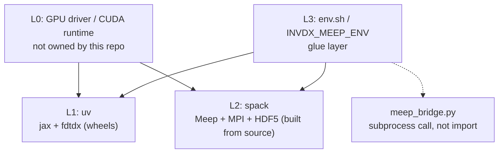

> **English** · [繁體中文](env.zh-TW.md)

[← back to docs index](README.md)

# Environment

How invdx's environment is laid out, how to reproduce it from a clean clone,
and a walkthrough of the spack setup for anyone new to spack. Machine-specific
facts (driver version, ports, hostnames) are deliberately kept out of this
repository — they belong in whatever site-local configuration you keep
outside version control.

## Architecture

Four layers, each owned by exactly one tool:

| Layer | Owns | Tool | Why |
|---|---|---|---|
| L0 | GPU driver / CUDA runtime / kernel | nothing in this repo | host state; any package manager that tried to own this would fight the vendor driver. Migration check: driver new enough for the pinned CUDA wheel (see `pyproject.toml`) |
| L1 | Python + GPU stack: `jax[cuda12]`, `fdtdx` | **uv** (`uv.lock`) | predominantly prebuilt wheels (CUDA runtime included), not source builds — uv's job |
| L2 | C++/MPI simulation stack: Meep, MPICH, HDF5-MPI, plus Lmod for the module interface | **spack** (`spack/env/spack.lock`, `spack/tools/spack.lock`) | compiled scientific software with a real dependency DAG — spack's home turf, and the common language of HPC clusters |
| L3 | Glue between L1 and L2 | `env.sh` (from `env.sh.example`) + env vars (`INVDX_MEEP_ENV`, `INVDX_GPU`) | machine-specific values never enter git |



L1 and L2 are independent stacks with no direct dependency edge between them
— neither installs, imports, or builds against the other. L3 is the only
layer that touches both, and it does so as configuration, not code: it never
imports Meep's Python bindings into the uv environment. The bridge to Meep
(`engines/meep_bridge.py`) always spawns Meep as a separate `mpirun`
subprocess and exchanges `.npy`/`.json` files — never an in-process import.

One-line version of the split: **the C++/MPI simulation stack is spack's
job, the Python/GPU stack is uv's job.** spack building `jax`+CUDA was tried
in design and rejected — `py-jaxlib`'s spack recipe lags upstream by a full
minor series and its `+cuda` variant is a from-source bazel build with a
standing failure mode tracked upstream. uv building Meep isn't possible
either — `pip install meep` doesn't exist; pymeep only ships via conda-forge
or source.

Two independent spack **environments** live under `spack/`, not one:

- `spack/env/` — Meep + its physics dependency chain (frozen; see below).
- `spack/tools/` — Lmod, so `module load meep` works against the environment
  next door. Site-provided on a real cluster; this is for machines without it.
  Kept separate so that installing or upgrading the tools chain (lua, tcl, ...)
  can never perturb the concretization that produces `meep@1.34.0` — the two
  `spack.yaml`/`spack.lock` pairs are independent inputs, and `spack/env/`'s
  stay frozen while the tools chain moves ("What the lockfile locks" below
  gives the concretize-and-diff check that confirms it from a clean clone).

## Reproducing from a clean clone

```bash
git clone <repo> && cd invdx

# L1: Python/GPU (idempotent — a second run says "already matches uv.lock")
bash scripts/bootstrap.sh

# L2: spack itself (idempotent — reuses $SPACK_ROOT if already cloned)
bash spack/bootstrap.sh
. "${SPACK_ROOT:-$HOME/spack}/share/spack/setup-env.sh"

# L2: Meep chain (hours on a cold cache; spack/bootstrap.sh already does
# concretize+install for spack/env — see that script if running by hand)
spack -e spack/env install

# L2: Lmod, only if your machine has no module system (a cluster will)
spack -e spack/tools install
spack module lmod refresh -y      # see "Module interface" below for scope

# L3: point the Meep bridge at the spack view
cp env.sh.example env.sh   # edit if your paths differ from the defaults
. env.sh

# Verify
uv run make smoke-meep     # expect 1.34.0
uv run make gates GPU=0    # G0-G5, all green (GPU=0 selects card 0; it
                           # does NOT disable the GPU -- G1..G5 need one)
```

`scripts/bootstrap.sh` is the L1 counterpart of `spack/bootstrap.sh`, and
does the one thing that one does not: it verifies the result rather than
echoing "done". Details, including what it checks and why the GPU driver is
one of the checks, are in "The uv layer (L1), in detail" below.

`make gates` runs six gates in order: G0 unit tests, G1 engine availability
and API surface, G2 adjoint gradients against central finite differences,
G3 physics baseline (flux conservation in vacuum), G4 reciprocity, and G5
cross-engine agreement (fdtdx against Meep).

There is no skip path in the gate runner: a gate whose prerequisites are
absent **fails**, it does not skip. That is deliberate -- a skipped gate reads
like a passing one in a summary line -- but it means "G5 must not be skipped"
was never a condition anything could violate. If Meep is missing, G5 fails
loudly, which is what you want.

The `INVDX_MEEP_ENV` path (`spack/env/.spack-env/view`) is what
`meep_bridge.py` uses by default with no `env.sh` at all — module loading is
a convenience layer on top, never a requirement for `make gates` or any
script to work.

### Module interface (optional)

`spack/tools/spack.yaml` installs Lmod (which pulls in Lua) but does **not**
carry `modules:` config for `spack/env`'s packages — modules config that
controls Lmod generation (`enable`, `autoload`, hierarchy) has to be visible
regardless of which spack environment is active when you run
`spack module lmod refresh`, since the specs being turned into modules
(meep, python, mpich, ...) live in `spack/env`, not `spack/tools`. Spack
environments can't reach into a sibling environment's config, so this one
piece of config lives in **user scope** (`~/.spack/modules.yaml`), not in a
committed file. Recreate it with:

```yaml
# ~/.spack/modules.yaml
modules:
  # meep is an AutotoolsPackage with a +python variant that self-installs its
  # bindings under its own prefix (no extends("python")), so the *default*
  # prefix_inspections never routes PYTHONPATH to them for module-based use
  # (spack/env's view sidesteps this by merging everything into one tree
  # instead). Re-declare the stock list plus this one addition — spack merges
  # this key as a dict update, not a list replace, but being explicit avoids
  # depending on that.
  prefix_inspections:
    bin: [PATH]
    man: [MANPATH]
    share/man: [MANPATH]
    share/aclocal: [ACLOCAL_PATH]
    lib/pkgconfig: [PKG_CONFIG_PATH]
    lib64/pkgconfig: [PKG_CONFIG_PATH]
    share/pkgconfig: [PKG_CONFIG_PATH]
    .: [CMAKE_PREFIX_PATH]
    lib/python3.13/site-packages: [PYTHONPATH]   # matches spack/env's python
  default:
    enable: [lmod]
    lmod:
      all:
        autoload: direct  # `module load meep` auto-loads its direct deps
                          # (python, py-numpy, mpich, ...) without a second
                          # `module load` per dependency
```

(`hierarchy: [mpi]` is spack's own built-in default and is left as-is —
see below.) Then generate the module tree once both envs are installed:

```bash
spack -e spack/env module lmod refresh -y
```

**The hierarchy in practice.** Spack's default Lmod layout is TACC-style
hierarchical, keyed on the `mpi` virtual: packages that don't depend on MPI
(python, py-numpy, gsl, ...) land in one `Core` directory; packages that do
(meep, hdf5, mpb, py-mpi4py, fftw — anything pulled in through meep's
`+mpi`) land in a second `Core` nested under `mpich/<version>-<hash>/`, only
reachable once `mpich` itself is on `MODULEPATH`. This is deliberately kept
(not forced flat) — it's the standard shape on real HPC clusters, and part
of the point of this exercise is seeing it up close. Concretely, that means
**two** `module use` calls, not one — one for each `Core` — after which
`module avail` shows meep directly and `module load meep` autoloads
everything else it needs:

```bash
. "${SPACK_ROOT:-$HOME/spack}/share/spack/setup-env.sh"
. $(spack -e spack/tools location -i lmod)/lmod/lmod/init/bash

LMOD_ROOT="$(spack location -r)/share/spack/lmod/linux-ubuntu22.04-x86_64"
module use "$LMOD_ROOT/Core"                                    # python, py-numpy, mpich, ...
module use "$LMOD_ROOT"/mpich/*/Core                            # meep, hdf5, mpb, py-mpi4py, ...

module avail             # meep/1.34.0 is listed
module load meep
module load python        # autoload also pulls in spack's internal
                           # python-venv build helper, which ends up earlier
                           # on PATH than the real interpreter; reloading
                           # python moves it back to the front — see "pit 4" below
module load py-scipy py-matplotlib   # meep's Python layer imports both at
                                      # runtime but neither is a *declared*
                                      # spack dependency of meep (they're
                                      # sibling root specs in spack/env's
                                      # spack.yaml, only unified via the
                                      # view) — autoload:direct can't see them
python -c "import meep; print(meep.__version__)"   # 1.34.0
```

The `linux-ubuntu22.04-x86_64` segment is the arch triplet of the machine this tree was generated on
(no compiler suffix, since `roots: lmod:` doesn't include the target); a
different OS/arch will produce a different segment name, so don't hardcode
it further than shown — `spack arch` prints the current value if needed.

**Pit 4 (bonus, module-interface-specific — not one of the three below,
which are all about the meep recipe itself): the module tree is not the
view.** `spack/env`'s filesystem view merges meep, python, numpy, scipy,
matplotlib, mpi4py into one directory tree, so the view's python transitively
finds all of them with no extra steps — that's what `meep_bridge.py` relies
on, and why it's the default, always-on path. The Lmod tree keeps every
package in its own separate spack prefix; `autoload: direct` only walks
meep's *declared* spack dependency edges (fftw, gsl, guile, harminv, hdf5,
libctl, libgdsii, mpb, mpich, openblas, py-mpi4py, py-numpy, python, swig),
which is missing scipy/matplotlib for the reason above, and also leaves
`python-venv` (a spack-internal build helper, pulled in as one of python's
own dependencies) shadowing the real interpreter on `PATH` until reloaded.
None of this is a bug in this project's spack.yaml or recipe — it's what you
get by default combining a non-`extends("python")` recipe with Lmod's
module-per-prefix model, and it's exactly the kind of gap the view was
built to route around.

## The uv layer (L1), in detail

L1 is the half of the environment that does the design work: JAX, the fdtdx
GPU engine, and the CUDA runtime that carries them. It is smaller in prose
than L2 because wheels are simpler than source builds — but it is where the
gradients are computed, so it gets the same treatment.

### Which layer a new dependency belongs in

The rule is **follow the build model, not the project**. Ask what has to
happen for the thing to exist on disk:

| The dependency is… | Goes to | Because |
|---|---|---|
| distributed as wheels, pure Python or with self-contained binaries | **uv** (L1) | there is nothing to build; a resolver plus hashes is the whole job |
| compiled, with a real dependency DAG through MPI / HDF5 / BLAS / a Fortran compiler | **spack** (L2) | the interesting decisions are which MPI, which compiler, which ABI — exactly what a concretizer exists for |
| host state (kernel, vendor driver, fabric) | **neither** (L0) | any package manager that claimed it would fight the vendor |

Two clarifications that decide most real cases:

**A Python binding does not make something a Python package.** Meep ships
`import meep`, and that is not an argument for uv. The thing being built is a
C++ library with an MPI dependency; the Python layer is a thin SWIG shell over
it. The question to ask is: *if this package had no Python API at all, would
it still need building?* For Meep the answer is yes, so it is L2. For fdtdx
the answer is "there would be nothing left", so it is L1.

**Shipping a wheel is not the same as being pure Python.** `jax[cuda12]`
pulls in gigabytes of NVIDIA binaries, and it is still L1 — because upstream
has already done the build and publishes the result. The JAX docs are explicit
that the pip wheels are the recommended CUDA path, and the CUDA wheel matrix
covers Linux x86_64 and aarch64 only. Handing that build to spack was
evaluated and rejected (see "Architecture" above); the pattern generalizes:
*a dependency whose upstream treats wheels as the primary distribution
channel stays in L1 even when it is enormous.*

Cases this rule does not settle — a package with both a conda-forge build and
a wheel, where the wheel bundles a different BLAS than L2 uses — are decided
by which side needs to agree with the cross-validation engine, and that
reasoning belongs in `docs/dependencies.md`, per package.

### What `uv.lock` locks

Same relationship as `spack.lock` to `spack.yaml`, one level up.
`pyproject.toml` records *intent* and is deliberately underspecified;
`uv.lock` records the *one solution* uv found for that intent. Measured on the
committed lock: **148 packages, 314 hashes.**

Only two things are pinned exactly in `pyproject.toml`
(`jax[cuda12]==0.11.0`, `fdtdx==0.6.2`); everything else floats there and is
held still by the lock. The two pins are **not** equally load-bearing, and
the difference decides how hard each is to bump:

- **`fdtdx==0.6.2` is structural.** Three modules under `src/invdx/engines/`
  vendor pieces of that exact release:
  `fdtdx_fixes.py` (a subclass repairing an axis-order bug in the 0.6.2
  Gaussian plane source), `fdtdx_perf.py` (a specialized copy of the inner
  time loop, gated on bitwise-identical output), and
  `fdtdx_checkpoint_buffers.py` — whose docstring cites the upstream site it
  patches down to *file and line numbers* in 0.6.2. Bumping fdtdx is not a
  version edit; it is re-deriving three patches. This is why
  `scripts/bootstrap.sh` imports `fdtdx_fixes` as part of verification
  instead of only comparing version strings: a lock that still says 0.6.2
  while the vendored subclass no longer binds is the failure a string
  comparison cannot see.
- **`jax==0.11.0` is conservative.** `jaxlib` and the two
  `jax-cuda12-*` plugins must track `jax` exactly, so pinning one pins four,
  and through them the whole CUDA wheel set. But nothing under `src/` imports
  a JAX private module (`jax._src` appears nowhere in the tree), so there is
  no vendored patch keyed to this version the way there is for fdtdx. Bumping
  it is a re-measurement, not a re-derivation.

One dependency is locked without being declared: `engines/fdtdx_checkpoint_buffers.py`
imports `equinox.internal`, and `equinox` appears nowhere in
`pyproject.toml` — it arrives only because fdtdx pulls it in. So a private
API of an undeclared package is load-bearing, held in place by a pin on a
*different* package. `docs/dependencies.md` records this as a declaration
problem to fix rather than document forever; it is repeated here because it
is also the sharpest reason the fdtdx pin cannot be treated as routine.

### Why the lock is single-platform

`pyproject.toml` carries:

```toml
[tool.uv]
environments = ["sys_platform == 'linux' and platform_machine == 'x86_64'"]
```

This narrows what uv resolves for, and it is copied from upstream's support
matrix rather than chosen for convenience: JAX publishes CUDA wheels for
Linux x86_64 and aarch64 only. Resolving for platforms whose wheels do not
exist would produce lock entries nobody can install and hashes nobody can
check. The honest reading of that line is a claim about where this project
has been run, not a claim that other platforms are unsupported in principle.

### The cost of `--extra gpu`, measured

On the reference environment (Python 3.12, `--extra gpu --extra dev`):

| | |
|---|---|
| `.venv` on disk | **5.8 GiB** (6.20 GB) |
| files under `.venv` | **19,633** |
| installed distributions | **148** |
| of which `nvidia-*-cu12` | **13** |
| the `nvidia/` payload alone | 4.42 GiB |
| next largest | `jax_plugins` 452 MiB, `jaxlib` 339 MiB |

Nineteen thousand small files is the number that matters on a cluster, not
the gigabytes. Several HPC centres name exactly this pattern — large counts
of small files on a shared parallel filesystem — as a metadata-server
problem, and a Python environment is the canonical offender. Both the
environment and uv's cache can be moved off the shared filesystem:

```bash
# LOCAL=whatever your site calls node-local scratch; both must be on it
export UV_PROJECT_ENVIRONMENT="$LOCAL/invdx-venv"   # where the venv is built
export UV_CACHE_DIR="$LOCAL/uv-cache"               # where wheels are unpacked
bash scripts/bootstrap.sh
```

Keep the two on the **same filesystem**: uv's cache documentation requires it,
because uv links out of the cache into the environment and a cross-filesystem
cache degrades to copying every file.

**Where this project's support stops.** This environment is built for
single-node and few-node runs, and that is the scale everything here has been
exercised at. Past the point where a site's own guidance says to switch to
containers for Python on a shared filesystem, that guidance is right and this
repo has nothing to add: containerization was evaluated and is deliberately
not part of this toolbox. Saying where the boundary is beats leaving it
blank.

### Offline / no-network reproduction

**There is no official uv guide for air-gapped installation.** uv documents
`--offline` / `UV_OFFLINE` ("relying only on locally cached data and locally
available files") at flag level and stops there. What follows is this
project's own procedure, and the results below were measured — at small
scale, stated plainly — not inferred from documentation.

First, the thing not to do: **do not copy `~/.cache/uv` to the target host.**
uv's cache docs claim only that the cache must sit on the same filesystem as
the environment, plus CI-caching advice. Nothing upstream claims the cache is
a portable artifact, and treating it as one is exactly the sort of assumption
that works until the day it does not.

The two committed/generated artifacts do **different** jobs, and the
difference is the point:

| Artifact | Restores with | Needs |
|---|---|---|
| `pylock.toml` (tracked) | `uv pip sync pylock.toml` | the pinned `https://files.pythonhosted.org/...` URLs to be reachable |
| `requirements.txt` (throwaway, `make requirements`) | `pip download` → `--find-links` | nothing but a directory of wheels |

**Measured, on a cold uv cache with one small pure-Python package:**
`uv pip sync --offline --no-index --find-links=<wheelhouse> pylock.toml`
**fails**, with `Network connectivity is disabled, but the requested data
wasn't found in the cache for: https://files.pythonhosted.org/...`, *while
the matching wheel is sitting in the wheelhouse*. A PEP 751 lock pins URLs;
it does not consult a flat index. The same wheelhouse, driven from
`requirements.txt`, installs offline and succeeds. A control run against an
empty wheelhouse fails, which is what makes the success meaningful rather
than a warm cache in disguise.

So `pylock.toml` is the **disaster-recovery and cross-installer** artifact —
it restores an exact environment on a host that can still reach the index (or
a mirror that preserves those URLs), with no uv project mode and no resolution
step, because PEP 751 requires the hashes to be there already.

One caveat that is easy to read past: the file carries an entry for `invdx`
itself as `directory = { path = "." }`, so `uv pip sync` *builds* that entry in
place. That needs `pyproject.toml` next to `pylock.toml` -- and the path is
resolved relative to the lock file's own directory, not `$PWD`, so run it from
the repository root. Syncing a copy of `pylock.toml` in an empty directory
fails with "does not appear to be a Python project". Drop that one entry if
you want the dependencies without the project.

The **air-gapped** path goes through a wheelhouse:

```bash
# On a host WITH network, same platform and Python as the target:
make requirements                       # hash-pinned, --no-emit-project
uv venv .dl && VIRTUAL_ENV=.dl uv pip install pip
.dl/bin/python -m pip download -d wheelhouse -r requirements.txt
.dl/bin/python -m pip download -d wheelhouse "setuptools>=68"   # see below

# Move `wheelhouse/` and `requirements.txt` to the air-gapped host, then:
uv venv
uv pip install --offline --no-index --find-links=wheelhouse -r requirements.txt
uv pip install --offline --no-index --find-links=wheelhouse --no-deps -e .
```

Three details in there are not optional:

- **`--no-emit-project`.** Without it the export begins with `-e .`, and pip
  treats a single `--hash` anywhere in a file as a global switch into
  hash-checking mode, where hashes are required for *all* requirements. The
  editable line has no single file to hash, so the whole download fails:
  `ERROR: The editable requirement file:///... cannot be installed when
  requiring hashes, because there is no single file to hash.` The `make
  requirements` target carries the flag for this reason, not for neatness.
- **`uv pip download` does not exist** (checked against uv 0.12.5:
  `uv pip` offers compile / sync / install / uninstall / freeze / list / show
  / tree / check and nothing else). Building the wheelhouse is pip's job; uv's
  role is on the install side, where `--find-links` works.
- **The build backend has to be staged too, and `--find-links` has to be
  repeated on the editable install.** `pip download -r requirements.txt`
  fetches *runtime* dependencies; it never fetches what
  `[build-system].requires` names. Installing the project itself then builds
  it in an isolated environment that goes looking for `setuptools>=68` and,
  offline, does not find it —
  `Failed to resolve requirements from build-system.requires … Because
  setuptools was not found in the provided package locations`. Measured, and
  measured again after adding `setuptools` to the wheelhouse and passing
  `--find-links` to the editable install, which is what makes the chain
  complete.

**Scale actually tested.** The mechanism above — export, wheelhouse,
cold-cache offline install of both the dependencies and the project, and the
negative controls — was exercised end to end on a **single ~10 KB
pure-Python wheel plus its build backend**, deliberately, to avoid
re-downloading 5.8 GiB. What that proves is the *mechanism*: which flags are
required, which artifact reads a flat index and which does not, that the
build backend is a separate staging step, and that the offline path is
genuinely offline (the same command against an empty wheelhouse fails, and
against a cold cache with no wheelhouse fails). What it does **not** prove is
the 148-package case; there the extrapolation is that `pip download` fetches
148 wheels instead of one and takes correspondingly longer. Platform-tagged
wheels add one risk the small test cannot see: `pip download` resolves wheel
tags for the *downloading* interpreter, so the staging host must match the
target's Python version and platform, or the wheelhouse will be silently
wrong for it — and with 13 CUDA wheels in the set, silently wrong is the
likely failure rather than loudly missing.

One more honest note: uv 0.12.5 prints
`warning: The --pylock option is experimental and may change without warning`
on every `uv pip sync pylock.toml`. PEP 751 itself is Final; uv's
implementation of it is not yet stable. `uv.lock` remains the source of
truth, which is why `pylock.toml` carries a header saying so and
`make env-drift` exists to keep it honest.

### Drift checks

The L2 half of this pattern is under "What the lockfile locks" below —
re-concretize and `git diff --exit-code` the tracked `spack.lock`. L1 does
the same thing at two levels, in one target:

```bash
make env-drift
```

1. `uv lock --check` — is `uv.lock` still what `pyproject.toml` resolves to?
   (uv's own freshness check; the same assertion `--locked` makes inside other
   commands.)
2. Re-export `pylock.toml` to a scratch path and `diff` it against the tracked
   one — is the committed export still what today's `uv.lock` produces?

No diff means the tracked files are still what the tracked intent produces.
Both steps have been shown to fail on purpose: bumping one version string
inside `pylock.toml` makes step 2 print the diff and exit non-zero, and adding
a dependency to `pyproject.toml` makes step 1 stop with
`The lockfile at uv.lock needs to be updated, but --check was provided`.
Regenerate with `make pylock` and commit the result.

`requirements.txt` is deliberately **not** tracked. uv's own documentation
recommends against keeping a `uv.lock` and a `requirements.txt` side by side —
the lock format expresses things `requirements.txt` cannot — so the only
`requirements.txt` in this repo is the scratch one `make requirements` writes
for `pip download`, and `.gitignore` keeps it out.

### Bootstrap, and what it verifies

`scripts/bootstrap.sh` follows the `scripts-to-rule-them-all` shape:
*"script/bootstrap … used solely for fulfilling dependencies of the
project."* It installs and verifies; it does not write `env.sh`, export
variables, or run simulations.

```bash
bash scripts/bootstrap.sh              # the GPU environment
bash scripts/bootstrap.sh --cpu-only   # skip the GPU extra and the driver gate
bash scripts/bootstrap.sh --dry-run    # run every check, install nothing
```

In order, and every failure exits with a command to run next rather than a
bare error:

1. **uv present, and capable.** Rather than a hardcoded version floor — a
   proxy that goes stale silently — it asks the binary whether
   `uv sync --locked` and `uv export --format pylock.toml` exist, since those
   are what the repo's workflow is built on.
2. **An interpreter matching `requires-python`,** read out of
   `pyproject.toml` rather than restated, and compared by `uv python find` so
   that no version arithmetic is hand-rolled in shell.
3. **The GPU driver (L0).** The layer table at the top of this page has always
   listed "driver new enough for the pinned CUDA wheel" as the migration
   check; until now nothing executed it. The script reads the CUDA major from
   the `jax[cuda12]` pin, looks up the floor (JAX's install docs require a
   driver `>= 525` for CUDA 12 on Linux; the table in the script carries
   NVIDIA's exact CUDA 12 minimum, **525.60.13**), takes the *oldest* driver
   among visible GPUs, and
   **fails** below it — with the two real ways out: raise the host driver, or
   install NVIDIA's CUDA forward-compatibility package, which NVIDIA supports
   on data-center GPUs only. A warning would be wrong here: a driver below the
   floor gives a *silent CPU fallback*, which is indistinguishable from a
   working install in a summary line and merely slow in a benchmark. On a host
   with no `nvidia-smi` at all this is not an error — it is reported, the CUDA
   wheels still install (they are files), and the GPU check downstream becomes
   informational.
4. **`uv sync --locked --extra gpu --extra dev`** — never bare `uv sync`,
   which re-resolves and rewrites `uv.lock` when it disagrees with
   `pyproject.toml`. Same two-level pinning contract as L2. `uv sync --check`
   runs first, so a re-run reports *"environment already matches uv.lock —
   nothing to install"* rather than silently redoing the work.
5. **Verification** — the section `spack/bootstrap.sh` does not have. That
   script ends on `echo done`, so a build that produced an unimportable result
   still reads as success. L1 instead imports out of what it just installed:
   `jax`, `jaxlib` and `fdtdx` versions must equal the pins in
   `pyproject.toml`; `jax.devices()` must show a GPU when a driver above the
   floor was found; and `invdx.engines.fdtdx_fixes` must import, which is the
   only check that notices when the pin and the vendored patch have come
   apart.

### How to tell a good install from a bad one

L2's answer is `make smoke-meep`, expecting `1.34.0`. L1's, in ascending
cost:

```bash
bash scripts/bootstrap.sh          # seconds when already installed; the five
                                   # checks above, all printed
uv run python -m invdx.hardware    # what JAX thinks it is running on:
                                   # device kind, compute capability, the
                                   # bytes_limit it will actually allow
make check                         # G0 only: 178 pure-python unit tests
                                   # (~5 min; they are not all trivial)
make smoke                         # a tiny forward fdtdx sim on the GPU,
                                   # through config/cli/runio
make gates                         # G0..G5; G5 additionally needs L2
```

### Pits actually fallen into (L1)

The L2 counterparts are below under "Three pits actually fallen into". These
are the environment-shaped ones on this side.

**1. The same source runs at a different float precision on a different
card, and the run record cannot tell you.** JAX's `Precision.DEFAULT` on GPU
means "use TF32 where available", so identical code is float32 on compute
capability 7.5 and TF32 on 8.9 — two orders of magnitude apart in relative
error — while `env.txt` recorded `jax.devices: [CudaDevice(id=0)]`, which is
byte-identical on both. Any question of the form "was this measured on the
same hardware as that?" was unanswerable from the stored record.
`src/invdx/hardware.py` exists for this: it probes and reports (never
applies), and `pin_matmul_precision()` makes the math mode an explicit,
recorded choice. Worth knowing that PyTorch shipped the same default in 1.7
and reverted it in 1.12 for precisely this reason; JAX still defaults it on.

**2. `bytes_limit` is a fraction of what was free at initialisation, not of
the card.** JAX's allocator reports a `bytes_limit` that is ~75% of memory
*free when the process started*, so another process holding a few hundred MiB
moves it. A memory budget derived from the card's nameplate size is therefore
optimistic by a variable amount, and the failure shows up as an out-of-memory
(OOM) error in an eight-hour job rather than at startup.
`invdx.hardware.main()` prints the fraction next to the nameplate figure so
the gap is visible before the run,
and every field of `DeviceProbe` is optional on purpose — `memory_stats()`
returns `None` on the CPU backend and `compute_capability` reaches JAX
through `__getattr__`, so a probe that guessed when it could not see would be
worse than one that says `None`.

**3. A vendored fix is only correct for the version it was derived against.**
`engines/fdtdx_fixes.py` repairs fdtdx 0.6.2's `GaussianPlaneSource`, whose
`_gauss_profile` builds its coordinate grid in (vertical, horizontal) order
while receiving `center` in (horizontal, vertical) order. On a square source
plane the swap is invisible — which is why upstream's tests pass — and on a
strongly rectangular plane every grid point falls outside the truncation mask
and the profile normalizes to `0/0 = NaN`. Upstream's development branch has
rewritten that path entirely, so the patch is *wrong* against a newer fdtdx,
not merely unnecessary. This is what makes the pin structural, and why the
bootstrap verification imports the subclass rather than trusting
`version("fdtdx")`.

**4. `jax_enable_x64` must be set before the first array exists.** JAX
defaults to float32 while numpy defaults to float64, and the flag is only
honoured if it is flipped before any JAX array is created — so the line has
to sit at the very top of the imports, not next to the code that needs it.
The symptom is a numpy-vs-JAX difference stuck around `1e-7` that will not go
lower no matter what tolerance is adjusted; `tutorials/01-jax-port` lists it
first in its gotchas for that reason. `tests/test_toy_jax.py` and
`tests/test_toy_adjoint.py` encode the ordering rather than assume it: each
checks the flag, tries to set it, and catches the `RuntimeError` that JAX
raises when arrays already exist — skipping with the reason spelled out
(`"x64 must be enabled before jax arrays exist"`) instead of failing on a
tolerance and sending the reader hunting for a numerical bug.

## Spack, explained for a first-timer

This project didn't have an existing spack habit to inherit — the notes
below are what a spack newcomer needs to read a spack recipe and this
project's `spack.yaml` without guessing.

### Reading a recipe (`package.py`)

A spack package is a Python class. The three directives that matter for
reading (not writing) one:

- `version("1.34.0", sha256="...")` — one buildable version and the hash
  spack checks the downloaded tarball against before building anything.
  Order matters for defaults (`spack install meep` with no version picks
  the *first* listed `version()`, so newest-first isn't just cosmetic).
- `depends_on("py-numpy@2:", when="@1.32:")` — a conditional dependency
  edge: only applies `py-numpy@2:` when the package's own version
  satisfies `@1.32:`. The `when=` clause is spack's if-statement; without
  it, the `depends_on` is unconditional.
- `variant("mpi", default=True)` — a build-time boolean/multi-valued
  toggle, referenced in specs as `+mpi` / `~mpi` and in the recipe body as
  `if "+mpi" in spec:`.

A concretized spec (what `spack install`/`spack find` prints) is the fully
resolved answer to "which version, which variants, which compiler, which
dependency versions" for one build — e.g.
`meep@1.34.0+python+mpi ... %gcc@11.4.0 ^py-numpy@2:`.

### This project's own recipe: `spack/spack_repo/invdx/packages/meep/package.py`

Upstream's `meep` recipe caps out at `python@:3.11` unconditionally. This
project needs Python 3.13. The tempting fix — `class Meep(BuiltinMeep):`
and override the dependency — doesn't work: spack constraint inheritance
can only **tighten**, never loosen, so a subclass can't widen a parent's
`depends_on("python@:3.11")`. The only correct fix (and spack's own
documented convention for this situation) is a full copy of the upstream
recipe into a project-owned **package repo**
(`spack/spack_repo/invdx/`, namespace `invdx`, referenced from `spack/env/spack.yaml`
as `repos: invdx: $env/../spack_repo/invdx`), edited in place. Three lines
changed relative to upstream:

```python
version("1.34.0", sha256="1fa6dd4a363cd8085533e18913b02bba958618518c5843e94483545651d78ea4")

with when("+python"):
    depends_on("python@:3.11",     when="@:1.31")
    depends_on("python@3.11:3.13", when="@1.32:")
    depends_on("py-numpy@2:",      when="@1.32:")
```

Line 1 adds the version this project targets (upstream tops out lower).
Lines 2-3 relax the python ceiling only for `@1.32:` (upstream NEWS confirms
1.32.0 is where Meep's Python-3.12+ compatibility fixes landed — versions
before that genuinely can't build against newer CPython, so the gate isn't
arbitrary). Line 4 requires numpy 2 only from `@1.32:` on, matching the
conda-forge baseline this project cross-validates against.

### Why `spack.yaml` looks the way it does

`spack/env/spack.yaml` (frozen, read-only reference — do not copy patterns
from it into new environments without re-checking they still apply):

- `specs:` names root packages only — everything each one pulls in
  transitively is decided by the concretizer, not listed here.
- `packages: all: require: ["target=x86_64_v3"]` pins the microarchitecture
  baseline instead of letting spack autodetect the exact CPU (`x86_64_v4`,
  `icelake`, ...). A generic baseline is what makes the resulting binaries
  portable to a different machine in the same architecture family — the
  whole point of committing a lockfile for other people to reuse.
- `packages: mpi: require: [mpich]` pins the MPI *provider* (spack lets
  many packages satisfy the `mpi` virtual — openmpi, mpich, intel-mpi, ...).
  Pinned to mpich here specifically to match the conda-forge Meep baseline
  this project cross-validates against, removing "which MPI" as a variable
  when comparing results across engines.
- `concretizer: unify: true` forces one consistent version of every shared
  dependency across all root specs in the environment (no
  `py-numpy@1.26.4` for one root and `@2.4.6` for another). `reuse: false`
  disables reusing already-installed packages from other environments/specs
  during concretization — slower, but produces a clean, fully-specified
  lineage, which is what this project's spack practice is optimizing to
  learn.
- `repos: builtin: {git: ..., tag: v2026.06.0}` — spack's built-in recipes
  moved to a separate `spack-packages` repo as of spack 1.0; pinning this
  tag is the **second** of two version pins this project relies on (the
  first is the spack tool itself, `v1.2.0`, pinned in `bootstrap.sh`).
  Skipping this one is a common newcomer mistake: it looks like the tool
  version is "the" pin, but recipes can and do change independently of the
  tool.
- `view: default: {root: .spack-env/view, link: all, link_type: hardlink}`
  — a filesystem view is a flattened `bin/`, `lib/`, `share/`, ... tree
  built out of symlinks/hardlinks into spack's real (content-hashed)
  install prefixes, so `INVDX_MEEP_ENV` can point at one ordinary-looking
  directory instead of a hash-named path. `hardlink` (not the default
  `symlink`) matters here specifically because a symlinked `bin/python`
  resolves `sys.prefix` back to spack's real hashed prefix, and the view's
  own `site-packages` never ends up on `sys.path` for a Python spawned with
  no `spack env activate` — exactly `meep_bridge.py`'s situation (it forks
  a bare subprocess, not an activated shell). Hardlinking keeps the file
  identity — and therefore `sys.prefix` — inside the view.

`spack/tools/spack.yaml` reuses the same two pins (spack tool version via
`bootstrap.sh`, `repos: builtin: tag:`) and the same `target=x86_64_v3`
requirement, but does **not** carry a `concretizer: reuse: false` — no
`view:` block is declared either (spack gives every environment an
implicit default view unless `view: false` is set, which is enough here;
`spack/env` declares an explicit one only because it needed the
non-default `hardlink` link type).

### What the lockfile locks

`spack.lock` (per environment) is the fully concretized answer: every
package name, version, variant setting, compiler, and target from a
`spack concretize` run, plus each node's content-hash. `spack.yaml` records
*intent* ("meep 1.34 with these variants"); `spack.lock` records the
*one specific solution* the concretizer found for that intent, given
whatever recipes and externals were visible at concretize time. Same
mechanism as `uv.lock` next to `pyproject.toml`: the human-edited file is
underspecified on purpose, the lockfile is what makes a second `spack
install` on another machine reproduce the exact same build instead of
whatever the concretizer feels like solving today. Verify a lockfile is
still faithful to its `spack.yaml` with:

```bash
spack -e spack/env concretize --force   # or spack/tools
git diff --exit-code spack/env/spack.lock
```

No diff means the committed lock is still what the committed intent
concretizes to.

### Three pits actually fallen into

**1. SWIG's `READONLY` macro collision (meep 1.29 build).** Meep's Python
bindings are generated by SWIG as one giant `meep-python.cpp` translation
unit. SWIG ≥4.1's generated code collides with a `meep.hpp` enum through the
`structmember.h` `READONLY` macro — a known SWIG regression, fixed upstream
in Meep only as of 1.30/1.31. The first build (targeting meep 1.29.0)
failed here; the fix was pinning `swig` in `spack/env/spack.yaml`:
`packages: swig: require: ["@=4.0.2"]`. That pin was removed once the
project bumped to meep 1.34.0 — rebuilding confirmed the upstream fix, meep
built clean against whatever current swig the concretizer picked (4.4.1).

**2. `@=` vs `@` in a version constraint.** The obvious way to write "pin
swig to exactly 4.0.2" is `require: ["@4.0.2"]`. That's wrong: bare `@`
version constraints in spack are *range* syntax, and `4.0.2` alone matches
any version spack considers compatible by its own version-comparison rules
— which, for swig specifically, includes matching into the unrelated
`swig-fortran` fork's version numbering. `@=4.0.2` is the exact-version
operator (`=` before the version) and is what actually pins to that one
build. Easy trap: the syntax difference is one character and both forms
concretize successfully, so a bare `@` pin fails silently by resolving to
the wrong package rather than erroring.

**3. Two legitimate tarballs behind one git tag.** Bumping to meep 1.34.0
needed a sha256 for the new `version()` line. `spack checksum meep 1.34.0`
computed one hash from the git-tag source archive; the conda-forge
pymeep-feedstock's recorded hash for the "same" version disagreed. Both
hashes check out directly against github.com — NanoComp/meep genuinely
publishes two different archives for one tag: the release-asset tarball
(`make dist` output, what conda-forge builds from) is missing
`python/numpy.i` from its `EXTRA_DIST` list and fails the SWIG build before
even reaching the READONLY question above; the git-tag archive carries the
tracked file and matches what this recipe's `--enable-maintainer-mode`
autoreconf path expects. The recipe here (and its committed sha256) uses
the git-tag archive. Lesson: a sha256 mismatch against a second trusted
source isn't automatically tampering — verify both artifacts independently
against the origin before assuming either is wrong.

## When nix, when pixi

**nix** was evaluated and rejected for this project, not merely deferred:
nixpkgs has no `meep` in its main package set (only a third-party overlay,
NixOS-QChem), and nix-built CUDA/jax has standing devShell friction the nix
CUDA docs themselves acknowledge. It would earn its place only if this
project ever lands on a machine with **no sudo, no apt, and no direct
network access to PyPI/conda-forge/spack's git remotes** — i.e. a locked-down
environment where spack's own bootstrap (cloning `spack-packages` over git)
and uv's wheel downloads both stop working, and something has to pin a
toolchain from a single offline flake input instead. Not the situation
targeted here: the reference environment has sudo and outbound network
access, and Lmod has a first-class spack recipe, so one tool (spack) already
covers everything L2 needs — a second package manager would add surface
without adding capability.

**pixi** (`pixi.toml`, repo root) is a prepared fallback for the L2 Meep
chain specifically, not installed or active. Switch to it if any of:

- troubleshooting the spack Meep build has taken >4h with no acceptance
  progress on the bare-`view` import check
- a single spack package is stuck building >90min with no forward progress
- total L2 spack effort exceeds ~8h without a working `INVDX_MEEP_ENV`
- `meep`+`py-numpy` concretization has no solution even after pinning numpy
  down a major version

Switching is one line: `pixi install`, then point `INVDX_MEEP_ENV` in
`env.sh` at the resulting env prefix instead of the spack view. No
`pixi.lock` is committed — the manifest is pinned tightly enough
(`pymeep = "1.34.*"`, exact build strings) that locking only matters once
something actually installs from it.

---

## Appendix: the files named above, and what each one does

This table collects the paths used above in one place for lookup, and tags
each file with the layer it belongs to.

| File | Layer | Role |
|---|---|---|
| `pyproject.toml` | L1 | intent: `requires-python`, the two pins, `[tool.uv] environments` |
| `uv.lock` | L1 | the source of truth: 148 packages / 314 hashes |
| `pylock.toml` | L1 | export; disaster recovery and cross-installer use, needs a reachable index |
| `requirements.txt` | L1 | scratch file from `make requirements`, fed to `pip download`; not tracked |
| `scripts/bootstrap.sh` | L1 | installs and **verifies** (five checks, including the GPU driver floor) |
| `src/invdx/hardware.py` | L1 | probes and reports the device (never applies); `pin_matmul_precision()` |
| `src/invdx/engines/fdtdx_fixes.py` | L1 | repairs the `GaussianPlaneSource` axis order in fdtdx 0.6.2; why the pin is structural |
| `src/invdx/engines/fdtdx_perf.py` | L1 | specialized copy of the inner time loop, gated on bitwise-identical output |
| `src/invdx/engines/fdtdx_checkpoint_buffers.py` | L1 | patch keyed to file and line numbers in 0.6.2; uses the undeclared `equinox.internal` |
| `src/invdx/engines/meep_bridge.py` | L3 | spawns Meep as a subprocess, exchanges `.npy`/`.json`, never imports |
| `spack/bootstrap.sh` | L2 | installs spack itself (pinned `v1.2.0`) and runs concretize+install for `spack/env` |
| `spack/env/spack.yaml` / `spack.lock` | L2 | the Meep chain, frozen |
| `spack/tools/spack.yaml` / `spack.lock` | L2 | the Lmod tools chain, fully independent of the pair above |
| `spack/spack_repo/invdx/packages/meep/package.py` | L2 | this project's own meep recipe (three lines changed relative to upstream) |
| `~/.spack/modules.yaml` | L2 | user-scope config, not tracked; controls Lmod generation |
| `env.sh.example` → `env.sh` | L3 | machine-specific values, never in git |
| `pixi.toml` | L2 fallback | prepared but unused; switch conditions in the section above |
| `docs/dependencies.md` | — | the per-package reasoning, and the declaration problem still to fix |
