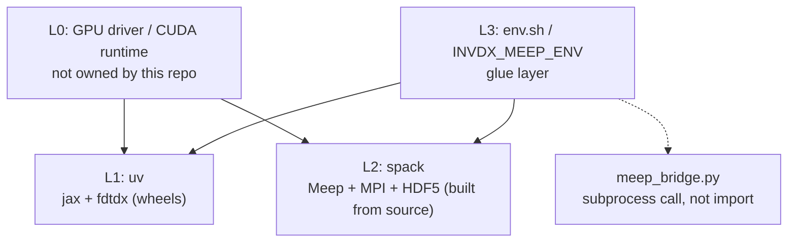

[← back to docs index](README.md)

# Environment

How invdx's environment is laid out, how to reproduce it from a clean clone,
and a walkthrough of the spack setup for anyone new to spack. Machine-specific
facts (driver version, ports, hostnames) are deliberately kept out of this
repository — they belong in whatever site-local configuration you keep
outside version control.

## Architecture

Four layers, each owned by exactly one tool:

| Layer | Owns | Tool | Why |
|---|---|---|---|
| L0 | GPU driver / CUDA runtime / kernel | nothing in this repo | host state; any package manager that tried to own this would fight the vendor driver. Migration check: driver new enough for the pinned CUDA wheel (see `pyproject.toml`) |
| L1 | Python + GPU stack: `jax[cuda12]`, `fdtdx` | **uv** (`uv.lock`) | predominantly prebuilt wheels (CUDA runtime included), not source builds — uv's job |
| L2 | C++/MPI simulation stack: Meep, MPICH, HDF5-MPI, and the cluster user-space layer (Lmod, Apptainer) | **spack** (`spack/env/spack.lock`, `spack/tools/spack.lock`) | compiled scientific software with a real dependency DAG — spack's home turf, and the common language of HPC clusters |
| L3 | Glue between L1 and L2 | `env.sh` (from `env.sh.example`) + env vars (`INVDX_MEEP_ENV`, `INVDX_GPU`) | machine-specific values never enter git |



L1 and L2 are independent stacks with no direct dependency edge between them
— neither installs, imports, or builds against the other. L3 is the only
layer that touches both, and it does so as configuration, not code: it never
imports Meep's Python bindings into the uv environment. The bridge to Meep
(`engines/meep_bridge.py`) always spawns Meep as a separate `mpirun`
subprocess and exchanges `.npy`/`.json` files — never an in-process import.

One-line version of the split: **the C++/MPI simulation stack is spack's
job, the Python/GPU stack is uv's job.** spack building `jax`+CUDA was tried
in design and rejected — `py-jaxlib`'s spack recipe lags upstream by a full
minor series and its `+cuda` variant is a from-source bazel build with a
standing failure mode tracked upstream. uv building Meep isn't possible
either — `pip install meep` doesn't exist; pymeep only ships via conda-forge
or source.

Two independent spack **environments** live under `spack/`, not one:

- `spack/env/` — Meep + its physics dependency chain (frozen; see below).
- `spack/tools/` — Lmod and Apptainer, the cluster-user-space layer. Kept
  separate so that installing/upgrading the tools chain (lua, go, glib, ...)
  can never perturb the concretization that produces `meep@1.34.0` — the two
  `spack.yaml`/`spack.lock` pairs are independent inputs, and `spack/env/`'s
  stay frozen while the tools chain moves ("What the lockfile locks" below
  gives the concretize-and-diff check that confirms it from a clean clone).

## Reproducing from a clean clone

```bash
git clone <repo> && cd invdx

# L1: Python/GPU
uv sync --extra gpu --extra dev
uv run python -c "import jax; print(jax.devices())"

# L2: spack itself (idempotent — reuses $SPACK_ROOT if already cloned)
bash spack/bootstrap.sh
. "${SPACK_ROOT:-$HOME/spack}/share/spack/setup-env.sh"

# L2: Meep chain (hours on a cold cache; spack/bootstrap.sh already does
# concretize+install for spack/env — see that script if running by hand)
spack -e spack/env install

# L2: cluster user-space layer (lmod + apptainer), optional but recommended
spack -e spack/tools install
spack module lmod refresh -y      # see "Module interface" below for scope

# L3: point the Meep bridge at the spack view
cp env.sh.example env.sh   # edit if your paths differ from the defaults
. env.sh

# Verify
uv run make smoke-meep     # expect 1.34.0
uv run make gates GPU=0    # G0-G5, all green (GPU=0 selects card 0; it
                           # does NOT disable the GPU -- G1..G5 need one)
```

There is no skip path in the gate runner: a gate whose prerequisites are
absent **fails**, it does not skip. That is deliberate -- a skipped gate reads
like a passing one in a summary line -- but it means "G5 must not be skipped"
was never a condition anything could violate. If Meep is missing, G5 fails
loudly, which is what you want.

The `INVDX_MEEP_ENV` path (`spack/env/.spack-env/view`) is what
`meep_bridge.py` uses by default with no `env.sh` at all — module loading is
a convenience layer on top, never a requirement for `make gates` or any
script to work.

### Module interface (optional)

`spack/tools/spack.yaml` installs Lmod (which pulls in Lua) but does **not**
carry `modules:` config for `spack/env`'s packages — modules config that
controls Lmod generation (`enable`, `autoload`, hierarchy) has to be visible
regardless of which spack environment is active when you run
`spack module lmod refresh`, since the specs being turned into modules
(meep, python, mpich, ...) live in `spack/env`, not `spack/tools`. Spack
environments can't reach into a sibling environment's config, so this one
piece of config lives in **user scope** (`~/.spack/modules.yaml`), not in a
committed file. Recreate it with:

```yaml
# ~/.spack/modules.yaml
modules:
  # meep is an AutotoolsPackage with a +python variant that self-installs its
  # bindings under its own prefix (no extends("python")), so the *default*
  # prefix_inspections never routes PYTHONPATH to them for module-based use
  # (spack/env's view sidesteps this by merging everything into one tree
  # instead). Re-declare the stock list plus this one addition — spack merges
  # this key as a dict update, not a list replace, but being explicit avoids
  # depending on that.
  prefix_inspections:
    bin: [PATH]
    man: [MANPATH]
    share/man: [MANPATH]
    share/aclocal: [ACLOCAL_PATH]
    lib/pkgconfig: [PKG_CONFIG_PATH]
    lib64/pkgconfig: [PKG_CONFIG_PATH]
    share/pkgconfig: [PKG_CONFIG_PATH]
    .: [CMAKE_PREFIX_PATH]
    lib/python3.13/site-packages: [PYTHONPATH]   # matches spack/env's python
  default:
    enable: [lmod]
    lmod:
      all:
        autoload: direct  # `module load meep` auto-loads its direct deps
                          # (python, py-numpy, mpich, ...) without a second
                          # `module load` per dependency
```

(`hierarchy: [mpi]` is spack's own built-in default and is left as-is —
see below.) Then generate the module tree once both envs are installed:

```bash
spack -e spack/env module lmod refresh -y
```

**The hierarchy in practice.** Spack's default Lmod layout is TACC-style
hierarchical, keyed on the `mpi` virtual: packages that don't depend on MPI
(python, py-numpy, gsl, ...) land in one `Core` directory; packages that do
(meep, hdf5, mpb, py-mpi4py, fftw — anything pulled in through meep's
`+mpi`) land in a second `Core` nested under `mpich/<version>-<hash>/`, only
reachable once `mpich` itself is on `MODULEPATH`. This is deliberately kept
(not forced flat) — it's the standard shape on real HPC clusters, and part
of the point of this exercise is seeing it up close. Concretely, that means
**two** `module use` calls, not one — one for each `Core` — after which
`module avail` shows meep directly and `module load meep` autoloads
everything else it needs:

```bash
. "${SPACK_ROOT:-$HOME/spack}/share/spack/setup-env.sh"
. $(spack -e spack/tools location -i lmod)/lmod/lmod/init/bash

LMOD_ROOT="$(spack location -r)/share/spack/lmod/linux-ubuntu22.04-x86_64"
module use "$LMOD_ROOT/Core"                                    # python, py-numpy, mpich, ...
module use "$LMOD_ROOT"/mpich/*/Core                            # meep, hdf5, mpb, py-mpi4py, ...

module avail             # meep/1.34.0 is listed
module load meep
module load python        # autoload also pulls in spack's internal
                           # python-venv build helper, which ends up earlier
                           # on PATH than the real interpreter; reloading
                           # python moves it back to the front — see "pit 4" below
module load py-scipy py-matplotlib   # meep's Python layer imports both at
                                      # runtime but neither is a *declared*
                                      # spack dependency of meep (they're
                                      # sibling root specs in spack/env's
                                      # spack.yaml, only unified via the
                                      # view) — autoload:direct can't see them
python -c "import meep; print(meep.__version__)"   # 1.34.0
```

The `linux-ubuntu22.04-x86_64` segment is the arch triplet of the machine this tree was generated on
(no compiler suffix, since `roots: lmod:` doesn't include the target); a
different OS/arch will produce a different segment name, so don't hardcode
it further than shown — `spack arch` prints the current value if needed.

**Pit 4 (bonus, module-interface-specific — not one of the three below,
which are all about the meep recipe itself): the module tree is not the
view.** `spack/env`'s filesystem view merges meep, python, numpy, scipy,
matplotlib, mpi4py into one directory tree, so the view's python transitively
finds all of them with no extra steps — that's what `meep_bridge.py` relies
on, and why it's the default, always-on path. The Lmod tree keeps every
package in its own separate spack prefix; `autoload: direct` only walks
meep's *declared* spack dependency edges (fftw, gsl, guile, harminv, hdf5,
libctl, libgdsii, mpb, mpich, openblas, py-mpi4py, py-numpy, python, swig),
which is missing scipy/matplotlib for the reason above, and also leaves
`python-venv` (a spack-internal build helper, pulled in as one of python's
own dependencies) shadowing the real interpreter on `PATH` until reloaded.
None of this is a bug in this project's spack.yaml or recipe — it's what you
get by default combining a non-`extends("python")` recipe with Lmod's
module-per-prefix model, and it's exactly the kind of gap the view was
built to route around.

### Apptainer (optional, forward-looking)

`spack/tools/spack.yaml` also installs Apptainer. It isn't wired into any
invdx workflow today — the point is a working `.sif` container toolchain
sitting ready for whenever this project (or its results) needs to move to
a different cluster. Smoke test:

```bash
apptainer --version
apptainer exec docker://alpine cat /etc/os-release   # rootless, userns mode
```

## Spack, explained for a first-timer

This project didn't have an existing spack habit to inherit — the notes
below are what a spack newcomer needs to read a spack recipe and this
project's `spack.yaml` without guessing.

### Reading a recipe (`package.py`)

A spack package is a Python class. The three directives that matter for
reading (not writing) one:

- `version("1.34.0", sha256="...")` — one buildable version and the hash
  spack checks the downloaded tarball against before building anything.
  Order matters for defaults (`spack install meep` with no version picks
  the *first* listed `version()`, so newest-first isn't just cosmetic).
- `depends_on("py-numpy@2:", when="@1.32:")` — a conditional dependency
  edge: only applies `py-numpy@2:` when the package's own version
  satisfies `@1.32:`. The `when=` clause is spack's if-statement; without
  it, the `depends_on` is unconditional.
- `variant("mpi", default=True)` — a build-time boolean/multi-valued
  toggle, referenced in specs as `+mpi` / `~mpi` and in the recipe body as
  `if "+mpi" in spec:`.

A concretized spec (what `spack install`/`spack find` prints) is the fully
resolved answer to "which version, which variants, which compiler, which
dependency versions" for one build — e.g.
`meep@1.34.0+python+mpi ... %gcc@11.4.0 ^py-numpy@2:`.

### This project's own recipe: `spack_repo/invdx/packages/meep/package.py`

Upstream's `meep` recipe caps out at `python@:3.11` unconditionally. This
project needs Python 3.13. The tempting fix — `class Meep(BuiltinMeep):`
and override the dependency — doesn't work: spack constraint inheritance
can only **tighten**, never loosen, so a subclass can't widen a parent's
`depends_on("python@:3.11")`. The only correct fix (and spack's own
documented convention for this situation) is a full copy of the upstream
recipe into a project-owned **package repo**
(`spack_repo/invdx/`, namespace `invdx`, referenced from `spack/env/spack.yaml`
as `repos: invdx: $env/../spack_repo/invdx`), edited in place. Three lines
changed relative to upstream:

```python
version("1.34.0", sha256="1fa6dd4a363cd8085533e18913b02bba958618518c5843e94483545651d78ea4")

with when("+python"):
    depends_on("python@:3.11",     when="@:1.31")
    depends_on("python@3.11:3.13", when="@1.32:")
    depends_on("py-numpy@2:",      when="@1.32:")
```

Line 1 adds the version this project targets (upstream tops out lower).
Lines 2-3 relax the python ceiling only for `@1.32:` (upstream NEWS confirms
1.32.0 is where Meep's Python-3.12+ compatibility fixes landed — versions
before that genuinely can't build against newer CPython, so the gate isn't
arbitrary). Line 4 requires numpy 2 only from `@1.32:` on, matching the
conda-forge baseline this project cross-validates against.

### Why `spack.yaml` looks the way it does

`spack/env/spack.yaml` (frozen, read-only reference — do not copy patterns
from it into new environments without re-checking they still apply):

- `specs:` names root packages only — everything each one pulls in
  transitively is decided by the concretizer, not listed here.
- `packages: all: require: ["target=x86_64_v3"]` pins the microarchitecture
  baseline instead of letting spack autodetect the exact CPU (`x86_64_v4`,
  `icelake`, ...). A generic baseline is what makes the resulting binaries
  portable to a different machine in the same architecture family — the
  whole point of committing a lockfile for other people to reuse.
- `packages: mpi: require: [mpich]` pins the MPI *provider* (spack lets
  many packages satisfy the `mpi` virtual — openmpi, mpich, intel-mpi, ...).
  Pinned to mpich here specifically to match the conda-forge Meep baseline
  this project cross-validates against, removing "which MPI" as a variable
  when comparing results across engines.
- `concretizer: unify: true` forces one consistent version of every shared
  dependency across all root specs in the environment (no
  `py-numpy@1.26.4` for one root and `@2.4.6` for another). `reuse: false`
  disables reusing already-installed packages from other environments/specs
  during concretization — slower, but produces a clean, fully-specified
  lineage, which is what this project's spack practice is optimizing to
  learn.
- `repos: builtin: {git: ..., tag: v2026.06.0}` — spack's built-in recipes
  moved to a separate `spack-packages` repo as of spack 1.0; pinning this
  tag is the **second** of two version pins this project relies on (the
  first is the spack tool itself, `v1.2.0`, pinned in `bootstrap.sh`).
  Skipping this one is a common newcomer mistake: it looks like the tool
  version is "the" pin, but recipes can and do change independently of the
  tool.
- `view: default: {root: .spack-env/view, link: all, link_type: hardlink}`
  — a filesystem view is a flattened `bin/`, `lib/`, `share/`, ... tree
  built out of symlinks/hardlinks into spack's real (content-hashed)
  install prefixes, so `INVDX_MEEP_ENV` can point at one ordinary-looking
  directory instead of a hash-named path. `hardlink` (not the default
  `symlink`) matters here specifically because a symlinked `bin/python`
  resolves `sys.prefix` back to spack's real hashed prefix, and the view's
  own `site-packages` never ends up on `sys.path` for a Python spawned with
  no `spack env activate` — exactly `meep_bridge.py`'s situation (it forks
  a bare subprocess, not an activated shell). Hardlinking keeps the file
  identity — and therefore `sys.prefix` — inside the view.

`spack/tools/spack.yaml` reuses the same two pins (spack tool version via
`bootstrap.sh`, `repos: builtin: tag:`) and the same `target=x86_64_v3`
requirement, but does **not** carry a `concretizer: reuse: false` — no
`view:` block is declared either (spack gives every environment an
implicit default view unless `view: false` is set, which is enough here;
`spack/env` declares an explicit one only because it needed the
non-default `hardlink` link type).

### What the lockfile locks

`spack.lock` (per environment) is the fully concretized answer: every
package name, version, variant setting, compiler, and target from a
`spack concretize` run, plus each node's content-hash. `spack.yaml` records
*intent* ("meep 1.34 with these variants"); `spack.lock` records the
*one specific solution* the concretizer found for that intent, given
whatever recipes and externals were visible at concretize time. Same
mechanism as `uv.lock` next to `pyproject.toml`: the human-edited file is
underspecified on purpose, the lockfile is what makes a second `spack
install` on another machine reproduce the exact same build instead of
whatever the concretizer feels like solving today. Verify a lockfile is
still faithful to its `spack.yaml` with:

```bash
spack -e spack/env concretize --force   # or spack/tools
git diff --exit-code spack/env/spack.lock
```

No diff means the committed lock is still what the committed intent
concretizes to.

### Three pits actually fallen into

**1. SWIG's `READONLY` macro collision (meep 1.29 build).** Meep's Python
bindings are generated by SWIG as one giant `meep-python.cpp` translation
unit. SWIG ≥4.1's generated code collides with a `meep.hpp` enum through the
`structmember.h` `READONLY` macro — a known SWIG regression, fixed upstream
in Meep only as of 1.30/1.31. The first build (targeting meep 1.29.0)
failed here; the fix was pinning `swig` in `spack/env/spack.yaml`:
`packages: swig: require: ["@=4.0.2"]`. That pin was removed once the
project bumped to meep 1.34.0 — rebuilding confirmed the upstream fix, meep
built clean against whatever current swig the concretizer picked (4.4.1).

**2. `@=` vs `@` in a version constraint.** The obvious way to write "pin
swig to exactly 4.0.2" is `require: ["@4.0.2"]`. That's wrong: bare `@`
version constraints in spack are *range* syntax, and `4.0.2` alone matches
any version spack considers compatible by its own version-comparison rules
— which, for swig specifically, includes matching into the unrelated
`swig-fortran` fork's version numbering. `@=4.0.2` is the exact-version
operator (`=` before the version) and is what actually pins to that one
build. Easy trap: the syntax difference is one character and both forms
concretize successfully, so a bare `@` pin fails silently by resolving to
the wrong package rather than erroring.

**3. Two legitimate tarballs behind one git tag.** Bumping to meep 1.34.0
needed a sha256 for the new `version()` line. `spack checksum meep 1.34.0`
computed one hash from the git-tag source archive; the conda-forge
pymeep-feedstock's recorded hash for the "same" version disagreed. Both
hashes check out directly against github.com — NanoComp/meep genuinely
publishes two different archives for one tag: the release-asset tarball
(`make dist` output, what conda-forge builds from) is missing
`python/numpy.i` from its `EXTRA_DIST` list and fails the SWIG build before
even reaching the READONLY question above; the git-tag archive carries the
tracked file and matches what this recipe's `--enable-maintainer-mode`
autoreconf path expects. The recipe here (and its committed sha256) uses
the git-tag archive. Lesson: a sha256 mismatch against a second trusted
source isn't automatically tampering — verify both artifacts independently
against the origin before assuming either is wrong.

## When nix, when pixi

**nix** was evaluated and rejected for this project, not merely deferred:
nixpkgs has no `meep` in its main package set (only a third-party overlay,
NixOS-QChem), and nix-built CUDA/jax has standing devShell friction the nix
CUDA docs themselves acknowledge. It would earn its place only if this
project ever lands on a machine with **no sudo, no apt, and no direct
network access to PyPI/conda-forge/spack's git remotes** — i.e. a locked-down
environment where spack's own bootstrap (cloning `spack-packages` over git)
and uv's wheel downloads both stop working, and something has to pin a
toolchain from a single offline flake input instead. Not the situation
targeted here: the reference environment has sudo and outbound network
access, and Lmod/Apptainer both have first-class spack recipes, so one tool
(spack) covers the whole cluster-user-space layer already provisioned here —
a second package manager would add surface without adding capability.

**pixi** (`pixi.toml`, repo root) is a prepared fallback for the L2 Meep
chain specifically, not installed or active. Switch to it if any of:

- troubleshooting the spack Meep build has taken >4h with no acceptance
  progress on the bare-`view` import check
- a single spack package is stuck building >90min with no forward progress
- total L2 spack effort exceeds ~8h without a working `INVDX_MEEP_ENV`
- `meep`+`py-numpy` concretization has no solution even after pinning numpy
  down a major version

Switching is one line: `pixi install`, then point `INVDX_MEEP_ENV` in
`env.sh` at the resulting env prefix instead of the spack view. No
`pixi.lock` is committed — the manifest is pinned tightly enough
(`pymeep = "1.34.*"`, exact build strings) that locking only matters once
something actually installs from it.
