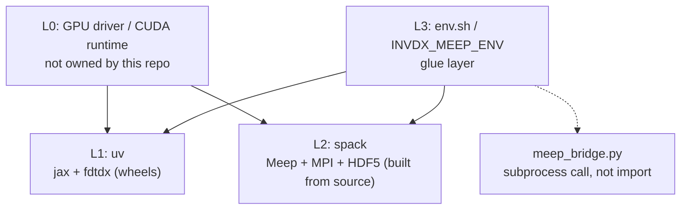

> [English](env.md) · **繁體中文**

[← back to docs index](README.md)

# 環境

這份文件講三件事:invdx 的環境怎麼分層、怎麼從一份乾淨的 clone 重現
出來,以及第一次碰 spack 的人要怎麼讀懂這裡的 spack 設定。機器專屬的
事實(driver 版本、埠號、主機名)刻意不放進這個 repo——那些東西屬於你
所在的計算中心(site),由你自己在版控之外維護。

> **這份文件刻意不譯的幾個詞(先讀這個)**:下面這些詞照字面翻成中文,
> 會把讀者帶到錯的地方,所以全文一律用英文原詞。
>
> - **module** — Lmod 的環境 module(`module load meep` 的那個 module)。
>   它和 Python 的「模組」中文剛好同名,但完全是兩回事;本文只要寫
>   「module」就是指 Lmod 那個,寫「Python 模組」才是 `import` 的那個。
> - **view** — spack 的檔案系統 view。它不是資料庫或 GUI 那種虛的
>   「視圖」,而是硬碟上一棵真的目錄樹(見〈`spack.yaml` 為什麼長這樣〉)。
>   譯成「視圖」會讓人以為它可有可無,實際上它是本專案預設、常開的那條路。
> - **prefix** — spack 把每個套件裝進去的那個目錄根,不是字串的「前綴」。
> - **spec / variant / recipe / concretize / concretizer** — spack 的五個
>   核心名詞(concretizer 就是負責做 concretize 這件事的求解器),意思在
>   〈spack 給第一次用的人〉那節逐一解釋,在那之前請先當專有名詞看。
> - **air-gapped** — 完全不連外網的機器。在一個做光子元件的專案裡把它
>   譯成「氣隙」,會直接撞上結構裡真正的空氣層,所以不譯。
> - **wheel / wheelhouse** — Python 預先建好的二進位安裝包,以及一個
>   裝滿這種包的目錄。
> - **drift** — 環境或匯出檔和 lockfile 對不上了(`make env-drift` 查的
>   就是這件事)。
> - **gate** — `make gates` 依序跑完的六道驗收關卡,代號 G0–G5,六道各是
>   什麼見〈從乾淨的 clone 重現〉。要加中文補述時只用「關卡」;本文不拿
>   「門檻」指 gate,那個詞留給 threshold。
> - **vendor(動詞)** — 把上游某個 release 的程式碼複製一份進本 repo 自行
>   維護,不再走套件安裝那條路。中文沒有「vendor 某物」這個動詞,而
>   「廠商 / 供應商」會把人帶到反方向。
>
> 還有幾個只出現在單一節的保留詞(virtual、external、root spec、extra、
> build backend、editable、manifest、build string),在各自第一次出現的
> 地方就地註解,不進這個方塊;全 repo 的用詞裁定收在
> `docs/glossary.zh-TW.md`。
>
> 另外:程式碼區塊裡的指令、旗標、路徑、設定鍵、版本號、錯誤訊息一律
> 原樣不動,只有註解譯成中文。

## 架構

四層,每一層剛好由一個工具負責:

| 層 | 管什麼 | 誰管 | 為什麼 |
|---|---|---|---|
| L0 | GPU driver / CUDA runtime / kernel | 這個 repo 不管 | 屬於主機狀態;任何套件管理器想接管這層,都會和廠商 driver 打架。搬機器時要檢查的是:driver 夠不夠新,撐得住釘住的那版 CUDA wheel(見 `pyproject.toml`) |
| L1 | Python + GPU 這一串:`jax[cuda12]`、`fdtdx` | **uv**(`uv.lock`) | 幾乎清一色是預先建好的 wheel(CUDA runtime 也包在裡面),不是從原始碼建——這是 uv 的活 |
| L2 | C++/MPI 模擬這一串:Meep、MPICH、HDF5-MPI,再加上提供 module 介面的 Lmod | **spack**(`spack/env/spack.lock`、`spack/tools/spack.lock`) | 要編譯、而且相依關係是一張真的 DAG(有向無環圖)的科學軟體——spack 的主場,也是 HPC 叢集共通的語言 |
| L3 | L1 和 L2 之間的膠水 | `env.sh`(從 `env.sh.example` 複製過來)加上環境變數(`INVDX_MEEP_ENV`、`INVDX_GPU`) | 機器專屬的值永遠不進 git |



(圖裡的節點文字沿用英文,對照上面那張表看。)

L1 和 L2 是兩套獨立的堆疊,彼此之間沒有直接的相依邊——誰都不會去裝
對方、import 對方,或拿對方來編譯。只有 L3 同時碰到兩邊,而且 L3 是用
設定去碰,不是用程式碼:它從來不把 Meep 的 Python 綁定 import 進 uv 的
環境裡。通往 Meep 的橋(`engines/meep_bridge.py`)一律把 Meep 當成獨立的
`mpirun` subprocess 生出來,雙方交換 `.npy`/`.json` 檔——**永遠不是行程內的
import**。

這條分界線的一句話版本:**C++/MPI 模擬堆疊是 spack 的工作,Python/GPU
堆疊是 uv 的工作。** 用 spack 建 `jax`+CUDA 在設計階段就試過並否決了——
`py-jaxlib` 的 spack recipe 落後上游整整一個 minor 系列,它的 `+cuda`
variant 是一條從原始碼跑 bazel 的建置路徑,而且有一個上游追蹤中、至今
仍在的失敗模式。反過來用 uv 建 Meep 也不可能——`pip install meep` 這個
東西不存在;pymeep 只從 conda-forge 或原始碼出貨。

`spack/` 底下住的是**兩個獨立的 spack environment**,不是一個:

- `spack/env/` — Meep 和它那一整串物理相依(已凍結;見下)。
- `spack/tools/` — Lmod,讓 `module load meep` 能對隔壁那個 environment
  生效。在真的叢集上這是計算中心提供好的;這裡是給沒有 module 系統的機器用的。
  之所以拆開,是為了讓工具鏈(lua、tcl……)的安裝或升級,**永遠不可能**去
  擾動那個產出 `meep@1.34.0` 的 concretize 結果——兩組
  `spack.yaml`/`spack.lock` 是各自獨立的輸入,`spack/env/` 那組保持凍結,
  工具鏈那組可以自己動。〈lockfile 鎖住的是什麼〉那節給了一個
  concretize-然後-diff 的檢查,從乾淨的 clone 就能確認這件事成立。

## 從乾淨的 clone 重現

這一整串裡最慢的是 Meep 那段編譯,**cache 全冷時要以小時計**。

```bash
git clone <repo> && cd invdx

# L1:Python/GPU(冪等 idempotent——第二次跑會說「已經和 uv.lock 一致」)
bash scripts/bootstrap.sh

# L2:spack 本體(冪等——$SPACK_ROOT 已經 clone 過就直接沿用)
bash spack/bootstrap.sh
. "${SPACK_ROOT:-$HOME/spack}/share/spack/setup-env.sh"

# L2:Meep 那一串(cache 全冷時要跑數小時;spack/bootstrap.sh 已經
# 幫 spack/env 做過 concretize+install——想手動跑就先去看那支腳本)
spack -e spack/env install

# L2:Lmod,只有在你的機器沒有 module 系統時才需要(叢集一定有)
spack -e spack/tools install
spack module lmod refresh -y      # 作用範圍見下面〈module 介面(選用)〉

# L3:把 Meep 的橋指向 spack view
cp env.sh.example env.sh   # 路徑和預設值不同的話在這裡改
. env.sh

# 驗收
uv run make smoke-meep     # 預期印出 1.34.0
uv run make gates GPU=0    # G0-G5 全綠(GPU=0 是「選第 0 張卡」,
                           # 不是「關掉 GPU」——G1..G5 都需要 GPU)
```

`scripts/bootstrap.sh` 是 `spack/bootstrap.sh` 在 L1 這側的對應物,而且
多做了一件對方沒做的事:**它會驗證結果,而不是印一句 done 就收工。**
它到底檢查了哪些東西、為什麼 GPU driver 也是其中一項,見下面〈uv 這層
(L1)詳解〉。

`make gates` 依序跑六道 gate:G0 單元測試、G1 引擎可用性與 API 介面、
G2 adjoint 梯度對中央有限差分、G3 物理基準(真空裡的通量守恆)、G4 互易性、
G5 跨引擎一致性(fdtdx 對 Meep)。

gate runner 沒有「跳過」這條路:前置條件不在的 gate 會**失敗**,不會被
跳過。這是刻意的——在一行摘要裡,被跳過的 gate 看起來和通過的 gate
一模一樣——但也因此,「G5 不可以被跳過」這個條件根本沒有東西違反得了。
Meep 沒裝,G5 就大聲失敗,而這正是你要的。

就算完全沒有 `env.sh`,`meep_bridge.py` 也會拿
`spack/env/.spack-env/view` 這條路徑當 `INVDX_MEEP_ENV` 的預設值——載入
module 只是疊在上面的方便層,對 `make gates` 或任何腳本來說**都不是必要
條件**。

### module 介面(選用)

`spack/tools/spack.yaml` 會裝 Lmod(連帶把 Lua 拉進來),但它**不帶**
針對 `spack/env` 那些套件的 `modules:` 設定。原因是這樣的:控制 Lmod 產生
行為的那份 modules 設定(`enable`、`autoload`、hierarchy),你在跑
`spack module lmod refresh` 的時候一定要看得到,而且不管當下啟用的是哪一個
spack environment 都要看得到——因為要被轉成 module 的那些 spec(meep、
python、mpich……)住在 `spack/env`,不住在 `spack/tools`。偏偏一個 spack
environment 沒辦法伸手去讀隔壁 environment 的設定。所以這一小塊設定只能
放在**使用者範圍**(`~/.spack/modules.yaml`),不能放進版控。要重建它:

```yaml
# ~/.spack/modules.yaml
modules:
  # meep 是 AutotoolsPackage,它的 +python variant 會把 Python 綁定裝在
  # 自己的 prefix 底下(沒有 extends("python")),所以*預設*的
  # prefix_inspections 從來不會把 PYTHONPATH 指到那裡去——這只影響走
  # module 的用法(spack/env 的 view 是靠把所有東西併成一棵樹來繞開)。
  # 下面把原廠那份清單原樣重列一次,只多加最後一行:spack 對這個 key
  # 是 dict 更新而不是整串取代,但寫明白就不必依賴那個行為。
  prefix_inspections:
    bin: [PATH]
    man: [MANPATH]
    share/man: [MANPATH]
    share/aclocal: [ACLOCAL_PATH]
    lib/pkgconfig: [PKG_CONFIG_PATH]
    lib64/pkgconfig: [PKG_CONFIG_PATH]
    share/pkgconfig: [PKG_CONFIG_PATH]
    .: [CMAKE_PREFIX_PATH]
    lib/python3.13/site-packages: [PYTHONPATH]   # 對應 spack/env 的 python
  default:
    enable: [lmod]
    lmod:
      all:
        autoload: direct  # `module load meep` 會自動載入它的直接相依
                          # (python、py-numpy、mpich……),不必每個相依
                          # 各下一次 `module load`
```

(`hierarchy: [mpi]` 是 spack 自己內建的預設值,原樣保留——理由見下。)
兩個 environment 都裝好之後,產生 module 樹一次:

```bash
spack -e spack/env module lmod refresh -y
```

**hierarchy 實際長什麼樣。** spack 預設的 Lmod 佈局是 TACC 風格的階層式,
以 `mpi` 這個 virtual(虛擬套件:一個抽象名字,由多家實作去滿足)當鑰匙:
不相依 MPI 的套件(python、py-numpy、gsl……)落在一個 `Core` 目錄;相依
MPI 的(meep、hdf5、mpb、py-mpi4py、
fftw——任何從 meep 的 `+mpi` 被拉進來的東西)落在第二個 `Core`,而那個
`Core` 巢狀在 `mpich/<version>-<hash>/` 底下,要等 `mpich` 本身進了
`MODULEPATH` 才看得到。這裡刻意保留這個階層(沒有壓平)——真的 HPC 叢集
就長這樣,而把它看清楚正是這個練習的目的之一。具體來說,這代表你要下
**兩次** `module use` 而不是一次(每個 `Core` 各一次);做完之後
`module avail` 就會直接列出 meep,`module load meep` 會把它需要的其他東西
一併自動載入:

```bash
. "${SPACK_ROOT:-$HOME/spack}/share/spack/setup-env.sh"
. $(spack -e spack/tools location -i lmod)/lmod/lmod/init/bash

LMOD_ROOT="$(spack location -r)/share/spack/lmod/linux-ubuntu22.04-x86_64"
module use "$LMOD_ROOT/Core"                                    # python、py-numpy、mpich……
module use "$LMOD_ROOT"/mpich/*/Core                            # meep、hdf5、mpb、py-mpi4py……

module avail             # 清單裡會有 meep/1.34.0
module load meep
module load python        # autoload 會連 spack 內部的 python-venv 建置
                           # 輔助工具一起拉進來,而它在 PATH 上會排在真正的
                           # 直譯器前面;重新 load 一次 python 就會把真的
                           # 那支移回最前面——見下面的「坑 4」
module load py-scipy py-matplotlib   # meep 的 Python 層在執行期會 import
                                      # 這兩個,但它們都不是 meep *宣告*的
                                      # spack 相依(它們是 spack/env 的
                                      # spack.yaml 在 `specs:` 裡自己點名的
                                      # root spec——root spec 就是你自己在
                                      # `specs:` 點名的那幾個,相對於被遞移
                                      # 拉進來的;它們只在 view 裡才被統一
                                      # 起來)——autoload:direct 看不到它們
python -c "import meep; print(meep.__version__)"   # 1.34.0
```

路徑中 `linux-ubuntu22.04-x86_64` 那一段,是產生這棵樹的那台機器的 arch
三元組,三段依序是平台、作業系統、架構(沒有 compiler 後綴,因為
`roots: lmod:` 不含 target);換一個 OS/架構就會是另一個名字,所以不要把
它寫死得比上面更多——需要的話 `spack arch`
會印出當下的值。

**坑 4(附贈,只跟 module 介面有關——不是下面那三個坑之一,那三個講的
都是 meep recipe 本身):module 樹不等於 view。** `spack/env` 的檔案系統
view 把 meep、python、numpy、scipy、matplotlib、mpi4py 併進同一棵目錄樹,
所以 view 裡的那支 python 不必多做任何事就找得到全部——這正是
`meep_bridge.py` 依賴的東西,也是它成為預設、常開路徑的原因。Lmod 樹則
相反,它讓每個套件各自待在自己的 spack prefix 裡;`autoload: direct` 只會
走 meep *宣告過*的 spack 相依邊(fftw、gsl、guile、harminv、hdf5、libctl、
libgdsii、mpb、mpich、openblas、py-mpi4py、py-numpy、python、swig),裡面
沒有 scipy/matplotlib(理由如上),而且還會讓 `python-venv`(spack 內部的
建置輔助工具,以 python 自己的相依身分被拉進來)在 `PATH` 上遮住真正的
直譯器,直到你重新 load 為止。這些都不是本專案 spack.yaml 或 recipe 的
bug——把一份沒有 `extends("python")` 的 recipe 和 Lmod「一個 prefix 一個
module」的模型湊在一起,預設就會得到這個結果;而這正是當初做 view 想
繞過的那類缺口。

## uv 這層(L1)詳解

L1 是這個環境裡真正在做設計工作的那一半:JAX、fdtdx 這個 GPU 引擎,以及
撐著它們的 CUDA runtime。它在本文的篇幅比 L2 短,只是因為 wheel 比從
原始碼建簡單——但梯度是在這裡算出來的,所以待遇一樣。

### 新的相依該放進哪一層

規則是**跟著建置模型走,不是跟著專案走**。要問的是:讓這個東西出現在
硬碟上,必須發生什麼事?

| 這個相依是… | 放進 | 因為 |
|---|---|---|
| 以 wheel 出貨,純 Python 或自帶完整二進位 | **uv**(L1) | 根本沒有東西要建;一個 resolver 加一組 hash 就是全部的工作 |
| 需要編譯,而且相依關係是一張穿過 MPI / HDF5 / BLAS / Fortran 編譯器的真 DAG | **spack**(L2) | 真正需要決策的是用哪個 MPI、哪個編譯器、哪套 ABI——concretizer 存在的理由正是為了這個 |
| 主機狀態(kernel、廠商 driver、網路 fabric) | **兩個都不放**(L0) | 任何套件管理器來認領這一層,都會和廠商打架 |

兩條補充,實務上大部分案例靠它們就判得出來:

> **有 Python 綁定,不代表它是一個 Python 套件。**

Meep 出貨時附了 `import meep`,但那不構成把它放進 uv 的理由。真正在被
建的東西是一個相依 MPI 的 C++ 函式庫,Python 層只是罩在外面一層薄薄的
SWIG 殼。要問的問題是:*如果這個套件根本沒有 Python API,它還需不需要被
建?* 對 Meep 來說答案是「要」,所以它是 L2;對 fdtdx 來說答案是「拿掉
Python 就什麼都不剩了」,所以它是 L1。

> **出 wheel,不等於是純 Python。**

`jax[cuda12]` 會拉進好幾 GB 的 NVIDIA 二進位檔,它仍然是 L1——因為上游
已經把建置做完並且把結果發佈出來了。JAX 官方文件明講 pip wheel 是建議的
CUDA 路徑,而它的 CUDA wheel 矩陣只涵蓋 Linux x86_64 和 aarch64。把這段
建置交給 spack 是評估過並否決的(見上面〈架構〉);這個模式可以推廣:
*只要上游把 wheel 當成主要的發佈通道,這個相依就留在 L1,即使它很巨大。*

這條規則判不出來的案例——例如某個套件同時有 conda-forge 建置和 wheel,
而 wheel 裡打包的 BLAS 和 L2 用的那套不同——要看哪一側必須和交叉驗證
用的引擎對得起來才能決定,而那個推理逐套件記在 `docs/dependencies.md`。

### `uv.lock` 鎖住的是什麼

和 `spack.lock` 對 `spack.yaml` 的關係一模一樣,只是換一層。
`pyproject.toml` 記的是*意圖*,而且刻意寫得不完整;`uv.lock` 記的是 uv
針對那份意圖找到的*那一組解*。就目前 commit 進去的 lock 量到的數字:
**148 個套件、314 個 hash。**

`pyproject.toml` 裡只有兩樣東西被釘死(`jax[cuda12]==0.11.0`、
`fdtdx==0.6.2`),其他全部是浮動的,靠 lock 壓住。這兩根釘子**撐住的東西
並不一樣多**,而這個差別決定了各自升版有多難:

- **`fdtdx==0.6.2` 是結構性的。** `src/invdx/engines/` 底下有三個模組把那個
  特定 release 的片段 vendor 進來(複製一份進本 repo 自行維護):
  `fdtdx_fixes.py`(一個子類別,修掉 0.6.2 的高斯平面波源的軸序 bug)、
  `fdtdx_perf.py`(內層時間迴圈的特化複本,以「輸出必須逐位元相同」為
  通過條件)、以及
  `fdtdx_checkpoint_buffers.py`——它的 docstring 引用上游被 patch 的位置,
  精確到 0.6.2 的*檔名與行號*。所以升 fdtdx 不是改一個版本字串,是把三份
  patch 重推一次。這也是為什麼 `scripts/bootstrap.sh` 在驗證時會真的去
  `import fdtdx_fixes`,而不是只比對版本字串:lock 上仍然寫著 0.6.2、
  但 vendor 的那個子類別已經接不上去了——這種失敗,字串比對看不見。
- **`jax==0.11.0` 是保守起見。** `jaxlib` 和兩個 `jax-cuda12-*` plugin
  必須和 `jax` 完全同步,所以釘一個等於釘四個,再透過它們釘住整組 CUDA
  wheel。但是 `src/` 底下沒有任何地方 import JAX 的私有模組(`jax._src`
  在整棵樹裡出現零次),所以不像 fdtdx 那樣有一份綁在這個版本上的 vendor
  patch。升它是重新量一次,不是重新推導一次。

有一個相依是「被鎖住但沒被宣告」的:`engines/fdtdx_checkpoint_buffers.py`
會 import `equinox.internal`,而 `equinox` 在 `pyproject.toml` 裡完全沒有
出現——它是因為 fdtdx 把它拉進來才在的。換句話說,整串東西是掛在一個
**根本沒被宣告的套件的私有 API** 上,而把它按住的,是釘在*另一個*套件上
的那根釘子。`docs/dependencies.md` 把這件事登記成「要修掉的宣告問題」,
而不是「永遠
記錄在案」;這裡重述一次,是因為它同時也是「fdtdx 那根釘子不能當例行公事
處理」最鋒利的理由。

### 為什麼這份 lock 只針對單一平台

`pyproject.toml` 裡有這段:

```toml
[tool.uv]
environments = ["sys_platform == 'linux' and platform_machine == 'x86_64'"]
```

它縮小了 uv 要解相依的範圍,而且這個範圍是照抄上游的支援矩陣、不是為了
省事挑的:JAX 只為 Linux x86_64 和 aarch64 發佈 CUDA wheel。去解那些
wheel 根本不存在的平台,只會產生沒人裝得起來的 lock 條目和沒人驗得了的
hash。老實說,這一行講的是這個專案**實際跑過**哪些平台,不是說別的平台
原則上不受支援。

### `--extra gpu` 的代價(實測)

在參考環境上(Python 3.12,`--extra gpu --extra dev`;extra 是 Python
packaging 的名詞,指 `pyproject.toml` 裡宣告的一組選用相依,`--extra gpu`
就是裝那一組):

| 項目 | 值 |
|---|---|
| `.venv` 佔用磁碟 | **5.8 GiB**(6.20 GB) |
| `.venv` 底下的檔案數 | **19,633** |
| 已安裝的發行套件數 | **148** |
| 其中 `nvidia-*-cu12` | **13** |
| 光是 `nvidia/` 這一坨 | 4.42 GiB |
| 次大的兩個 | `jax_plugins` 452 MiB、`jaxlib` 339 MiB |

在叢集上真正要命的數字不是那幾 GB,是那一萬九千個小檔。好幾個 HPC 中心
都指名這個型態——共用的平行檔案系統上堆著大量小檔——是 metadata server
(中繼資料伺服器)的負擔來源,而 Python 環境正是最典型的那個犯人。環境
和 uv 的 cache 兩者都可以搬離共用檔案系統:

```bash
# LOCAL=你們計算中心對「節點本機暫存空間」的稱呼;兩個都要放在上面
export UV_PROJECT_ENVIRONMENT="$LOCAL/invdx-venv"   # venv 建在哪
export UV_CACHE_DIR="$LOCAL/uv-cache"               # wheel 解開在哪
bash scripts/bootstrap.sh
```

這兩個要放在**同一個檔案系統**上:uv 的 cache 文件要求如此,因為 uv 是
從 cache 連結(link)到環境裡去的,跨檔案系統的 cache 會退化成一個檔一個檔
複製。

**這個專案的支援範圍到哪裡為止。** 這套環境是為單節點和少數節點的執行
建的,所有東西也都只在這個尺度上操過。一旦超過「計算中心自己的指引開始
叫你在共用檔案系統上改用容器跑 Python」那個點,那份指引是對的,而這個
repo 沒有東西可以補充:容器化評估過,而且刻意不放進這個工具箱。說清楚
邊界在哪裡,好過留白。

### 離線 / 無網路重現

**uv 沒有官方的 air-gapped 安裝指南。** uv 在旗標層級記載了 `--offline` /
`UV_OFFLINE`(「只依賴本地 cache 的資料和本地既有的檔案」),然後就沒有了。
底下是這個專案自己的做法,而且下面的結果是**實際量過的**(規模很小,
如實說明),不是從文件推論出來的。

先講不要做的那件事:**不要把 `~/.cache/uv` 複製到目標主機。** uv 的
cache 文件只主張 cache 必須和環境在同一個檔案系統上,外加一些 CI 快取的
建議。上游從來沒有主張 cache 可以搬著走,把它當成可以搬著走,正是那種
平常都沒事、出事就一次到底的假設。

兩個產物(一個 commit 進版控、一個現產)做的是**不同的事**,而這個差別
正是重點:

| 產物 | 用什麼還原 | 需要什麼 |
|---|---|---|
| `pylock.toml`(有版控) | `uv pip sync pylock.toml` | 釘在裡面的那些 `https://files.pythonhosted.org/...` URL 連得到 |
| `requirements.txt`(用完即丟,`make requirements` 產) | `pip download` → `--find-links` | 只要一個裝著 wheel 的目錄 |

**實測(uv cache 全冷,一個小型純 Python 套件):**
`uv pip sync --offline --no-index --find-links=<wheelhouse> pylock.toml`
會**失敗**,訊息是 `Network connectivity is disabled, but the requested data
wasn't found in the cache for: https://files.pythonhosted.org/...`,*而對應的
那個 wheel 就好端端躺在 wheelhouse 裡*。PEP 751 的 lock 釘的是 URL;它不會
去翻一個裝滿 wheel 的目錄(`--find-links` 指過去的那種)。同一個
wheelhouse 改用 `requirements.txt` 驅動,離線
安裝就成功了。另外對著一個空的 wheelhouse 跑了一次對照組(control),它
如預期失敗——有這個對照,前面那次成功才有意義,而不是「其實 cache 是熱的」。

所以 `pylock.toml` 是**災難復原與跨安裝器**用的產物——它能在一台「仍然
連得到索引(或連得到一個保留了那些 URL 的鏡像)」的主機上還原出一個精確的
環境,不需要 uv 的專案模式,也不需要任何解相依步驟,因為 PEP 751 要求
hash 本來就得在檔案裡。

有一個很容易讀過去的細節:這個檔案裡有一筆是 `invdx` 自己,寫成
`directory = { path = "." }`,所以 `uv pip sync` 會就地*建*那一筆。這需要
`pyproject.toml` 就在 `pylock.toml` 旁邊——而且那個路徑是相對於 lock 檔
自己所在的目錄解析的,不是相對於 `$PWD`,所以要在 repo 根目錄跑。把
`pylock.toml` 單獨複製到一個空目錄再 sync,會以 "does not appear to be a
Python project" 失敗。如果你只要相依、不要專案本身,把那一筆刪掉。

**air-gapped**(完全不連外網)的路徑要走 wheelhouse:

```bash
# 在一台有網路、且平台與 Python 版本都和目標機相同的主機上:
make requirements                       # 帶 hash、--no-emit-project
uv venv .dl && VIRTUAL_ENV=.dl uv pip install pip
.dl/bin/python -m pip download -d wheelhouse -r requirements.txt
.dl/bin/python -m pip download -d wheelhouse "setuptools>=68"   # 理由見下

# 把 `wheelhouse/` 和 `requirements.txt` 搬到 air-gapped 那台,然後:
uv venv
uv pip install --offline --no-index --find-links=wheelhouse -r requirements.txt
uv pip install --offline --no-index --find-links=wheelhouse --no-deps -e .
```

裡面有三個細節不是可選的:

- **`--no-emit-project`。** 沒有它,匯出的第一行會是 `-e .`,而 pip 只要
  在檔案裡任何一處看到 `--hash`,就會整份切換成「檢查 hash」模式,那個
  模式下*所有*需求都必須有 hash。editable 安裝(`-e .`,把專案原地連進
  環境而不複製)那一行沒有單一檔案可以算 hash,於是整個下載直接失敗:
  `ERROR: The editable requirement file:///... cannot
  be installed when requiring hashes, because there is no single file to
  hash.` `make requirements` 這個 Makefile target 帶著這個旗標是為了這個
  理由,不是為了輸出好看。
- **`uv pip download` 不存在**(對 uv 0.12.5 查證過:`uv pip` 只提供
  compile / sync / install / uninstall / freeze / list / show / tree / check,
  沒有別的)。把 wheelhouse 湊出來是 pip 的工作;uv 的角色在安裝那一側,
  `--find-links` 在那邊是有效的。
- **build backend 也要一起備齊,而且 editable 安裝那一行也要再帶一次
  `--find-links`。** build backend 是 `[build-system].requires` 點名、
  負責把原始碼變成 wheel 的那個套件,這裡是 `setuptools`;它自己要另外
  下載,這正是它會在離線機器上絆倒人的原因。`pip download -r
  requirements.txt` 抓的是*執行期*相依;它從來不會去抓
  `[build-system].requires` 點名的東西。接著安裝專案
  本身時,它會在一個隔離環境裡建置,然後跑去找 `setuptools>=68`,離線狀態
  下找不到——`Failed to resolve requirements from build-system.requires …
  Because setuptools was not found in the provided package locations`。這是
  量過的;把 `setuptools` 加進 wheelhouse、並在 editable 安裝那行補上
  `--find-links` 之後又量了一次,整條鏈才算接通。

**實際測到的規模。** 上面那套機制——匯出、wheelhouse、在冷 cache 上離線
裝好相依與專案本體,以及那幾個反面對照——是拿**一個約 10 KB 的純 Python
wheel 加上它的 build backend** 從頭到尾走過一遍的,刻意如此,為的是不要
重新下載 5.8 GiB。這證明的是那個*機制*:哪些旗標是必要的、哪個產物會去
翻那個裝滿 wheel 的目錄哪個不會、build backend 是一個獨立的備料步驟,
以及這條離線路徑是真的離線(同一條指令對著空的 wheelhouse 會失敗,對著
冷 cache 又沒有
wheelhouse 也會失敗)。它**沒有**證明的是 148 個套件的情況;那邊的外推是
「`pip download` 抓 148 個 wheel 而不是 1 個,時間按比例拉長」。帶平台
標籤的 wheel 還多一個小規模測試看不到的風險:`pip download` 是按照*執行
下載的那支*直譯器來解 wheel 標籤的,所以備料的那台機器必須和目標機的
Python 版本與平台一致,否則你備出來的 wheelhouse 對目標機來說是錯的,而且
不會有人告訴你——這組東西裡有 13 個 CUDA wheel,「無聲地錯」比「大聲地缺」
更可能是實際的失敗形態。

再補一句誠實話:uv 0.12.5 每次跑 `uv pip sync pylock.toml` 都會印
`warning: The --pylock option is experimental and may change without warning`。
PEP 751 本身是 Final 了;uv 對它的實作還沒穩定。`uv.lock` 仍然是唯一的
真相來源,這也是為什麼 `pylock.toml` 的檔頭寫著這件事、以及為什麼
`make env-drift` 存在——用來讓它保持誠實。

### drift 檢查

這個模式在 L2 那一半寫在下面〈lockfile 鎖住的是什麼〉:重新 concretize
一次,然後對版控裡的 `spack.lock` 下 `git diff --exit-code`。L1 做的是
同一件事,在兩個層級上,包在同一個 Makefile target 裡:

```bash
make env-drift
```

1. `uv lock --check` —— `uv.lock` 還是不是 `pyproject.toml` 解出來的東西?
   (uv 自己的新鮮度檢查;和其他指令裡 `--locked` 所做的斷言相同。)
2. 把 `pylock.toml` 重新匯出到一個暫存路徑,再和版控裡那份 `diff` ——
   commit 進去的那份匯出,還是不是今天的 `uv.lock` 會產生的東西?

沒有 diff,就代表版控裡的檔案仍然是版控裡的意圖所產生的東西。這兩步都
被**故意弄壞驗過**:把 `pylock.toml` 裡的某個版本字串改掉,第 2 步會印出
diff 並以非零狀態退出;在 `pyproject.toml` 裡加一個相依,第 1 步會停在
`The lockfile at uv.lock needs to be updated, but --check was provided`。
用 `make pylock` 重新產生,然後把結果 commit 進去。

`requirements.txt` 刻意**不進版控**。uv 自己的文件就不建議把 `uv.lock`
和 `requirements.txt` 並排放著——lock 格式能表達的東西 `requirements.txt`
表達不了——所以這個 repo 裡唯一的 `requirements.txt`,是 `make requirements`
為了 `pip download` 寫出來的那份暫時檔,而 `.gitignore` 會把它擋在外面。

### bootstrap 做了什麼、驗了什麼

`scripts/bootstrap.sh` 遵循 `scripts-to-rule-them-all` 的形狀:
*"script/bootstrap … used solely for fulfilling dependencies of the
project."* 它負責安裝與驗證;它不寫 `env.sh`、不 export 變數、不跑模擬。

```bash
bash scripts/bootstrap.sh              # GPU 環境
bash scripts/bootstrap.sh --cpu-only   # 跳過 gpu extra 與 driver 那道 gate
bash scripts/bootstrap.sh --dry-run    # 每一項檢查都跑,什麼都不裝
```

依序如下,而且每一次失敗退出時給的是「接下來該下哪一條指令」,不是一句
乾巴巴的錯誤:

1. **uv 在,而且夠用。** 它不是去比對一個寫死的版本下限——那是拿版本號
   當替身,會無聲過期——而是直接問這支執行檔:有沒有 `uv sync --locked` 和
   `uv export --format pylock.toml`——因為整個 repo 的工作流就是建在這
   兩者之上。
2. **有一支符合 `requires-python` 的直譯器**,這個條件是從
   `pyproject.toml` 讀出來的、不是另外抄一份,並且交給 `uv python find`
   去比對,免得在 shell 裡手刻版本號的算術。
3. **GPU driver(L0)。** 本頁最上面那張分層表一直寫著「driver 夠不夠新,
   撐得住釘住的那版 CUDA wheel」是搬機器時要檢查的項目;在此之前沒有任何
   東西真的去執行它。這支腳本會從 `jax[cuda12]` 這根釘子讀出 CUDA 主版本,
   查出下限(JAX 的安裝文件要求 Linux 上 CUDA 12 需要 driver `>= 525`;
   腳本裡的表帶的是 NVIDIA 給的精確 CUDA 12 最低值 **525.60.13**),取所有
   可見 GPU 中**最舊**的那個 driver,低於下限就**失敗**——並附上兩條真正
   的出路:把主機的 driver 升上去,或安裝 NVIDIA 的 CUDA 前向相容套件
   (NVIDIA 只在資料中心級 GPU 上支援它)。這裡用警告是錯的:driver 低於
   下限會導致*無聲退回 CPU 跑*,在一行摘要裡它和一個正常安裝長得一模一樣,
   在 benchmark 裡也只是「有點慢」。至於一台根本沒有 `nvidia-smi` 的主機,
   這不算錯誤——照實回報,CUDA wheel 照樣裝得起來(它們就是檔案),而下游
   的 GPU 檢查則降級成純資訊。
4. **`uv sync --locked --extra gpu --extra dev`** —— 絕不用光禿禿的
   `uv sync`,後者在 `uv.lock` 和 `pyproject.toml` 不一致時會重新解相依並
   改寫 `uv.lock`。這和 L2 是同一份「兩層釘死」的契約。`uv sync --check`
   會先跑,所以重跑一次會回報*「環境已經和 uv.lock 一致——沒有東西要裝」*,
   而不是默默把工作再做一遍。
5. **驗證** —— 這是 `spack/bootstrap.sh` 沒有的那一節。那支腳本結尾是
   `echo done`,所以一個「建出來但 import 不了」的結果照樣讀起來像成功。
   L1 反過來,直接從它剛裝好的東西裡 import:`jax`、`jaxlib`、`fdtdx` 的
   版本必須等於 `pyproject.toml` 裡的釘子;找得到高於下限的 driver 時,
   `jax.devices()` 必須看得到 GPU;而 `invdx.engines.fdtdx_fixes` 必須
   import 得起來——這是唯一一項能發現「釘子和 vendor 的 patch 已經脫節」
   的檢查。

### 怎麼分辨裝好了還是裝壞了

L2 那邊的答案是 `make smoke-meep`,預期 `1.34.0`。L1 這邊,按成本由低到高:

```bash
bash scripts/bootstrap.sh          # 已經裝好時只要幾秒;上面那五項檢查
                                   # 會全部印出來
uv run python -m invdx.hardware    # JAX 自認為跑在什麼上面:裝置種類、
                                   # compute capability、它實際會允許的
                                   # bytes_limit
make check                         # 只跑 G0:178 個純 Python 單元測試
                                   # (~5 分鐘;它們並不都是瑣碎的)
make smoke                         # GPU 上一個很小的 fdtdx forward 模擬,
                                   # 走過 config/cli/runio 整條路
make gates                         # G0..G5;G5 額外需要 L2
```

### 真的踩過的坑(L1)

L2 那邊的對應清單在下面〈真的踩過的三個坑〉。這裡是這一側屬於環境形狀的
那幾個。

**1. 同一份原始碼在不同卡上會用不同的浮點精度跑,而執行紀錄看不出來。**
JAX 在 GPU 上的 `Precision.DEFAULT` 意思是「有 TF32 就用 TF32」,所以完全
一樣的程式碼在 compute capability 7.5 上是 float32、在 8.9 上是 TF32——
相對誤差差兩個數量級——而 `env.txt` 記下來的是
`jax.devices: [CudaDevice(id=0)]`,兩台印出來逐位元相同。任何形如「這次
和那次是在同一種硬體上量的嗎?」的問題,從存下來的紀錄裡都答不出來。
`src/invdx/hardware.py` 就是為此存在的:它只探測與回報(絕不套用),而
`pin_matmul_precision()` 讓數學模式變成一個明講出來、有被記錄的選擇。
順帶一提,PyTorch 在 1.7 出過同樣的預設值,並且在 1.12 為了完全相同的
理由把它退回去;JAX 至今仍然預設開著。

**2. `bytes_limit` 是「初始化當下還剩多少」的一個比例,不是卡的容量的
比例。** JAX 的記憶體配置器(allocator)回報的 `bytes_limit` 大約是*行程
啟動當下未使用記憶體*的 75%,所以另一個行程只要占著幾百 MiB,這個數字就
會跟著動。從卡的規格標稱容量推算出來的記憶體預算,因此會樂觀一個不固定
的量,而失敗會以「一個跑了八小時的工作因為記憶體不足(OOM)掛掉」的形式
出現,不是在啟動時。`invdx.hardware.main()` 會把這個比例印在標稱容量
旁邊,讓落差在開跑前就看得見;而 `DeviceProbe` 的
每一個欄位都刻意是 optional 的——`memory_stats()` 在 CPU backend 上回傳
`None`,`compute_capability` 是透過 `__getattr__` 才到得了 JAX 的,所以一個
「看不到就用猜的」探測器,會比一個老實說 `None` 的探測器更糟。

**3. 一份 vendor 進來的修補,只對它當初推導所針對的那個版本是正確的。**
`engines/fdtdx_fixes.py` 修的是 fdtdx 0.6.2 的 `GaussianPlaneSource`:它的
`_gauss_profile` 以(垂直, 水平)的順序建座標網格,收到的 `center` 卻是
(水平, 垂直)的順序。在正方形的源平面上,這個對調是看不見的——這正是上游
測試會過的原因——而在一個長寬比很大的平面上,每一個網格點都會落在截斷
遮罩之外,profile 正規化成 `0/0 = NaN`。上游的開發分支已經把那條路徑整個
重寫了,所以這份 patch 對更新版的 fdtdx 來說是*錯的*,不只是「不再需要」。
這就是那根釘子之所以是結構性的原因,也是為什麼 bootstrap 的驗證是去
import 那個子類別,而不是相信 `version("fdtdx")`。

**4. `jax_enable_x64` 必須在第一個陣列出現之前設好。** JAX 預設 float32,
numpy 預設 float64,而這個旗標只有在任何 JAX 陣列被建立*之前*翻開才會
生效——所以那一行必須放在 import 區的最上面,而不是放在需要它的那段程式碼
旁邊。症狀是 numpy 和 JAX 的差異卡在 `1e-7` 附近,再怎麼調容差都下不去;
`tutorials/01-jax-port` 把它列為第一個坑,就是這個原因。
`tests/test_toy_jax.py` 和 `tests/test_toy_adjoint.py` 把這個順序寫成程式
而不是假設它成立:兩者都會檢查旗標、嘗試設定、並接住 JAX 在陣列已經存在時
丟出的 `RuntimeError`——然後帶著寫明白的理由 skip
(`"x64 must be enabled before jax arrays exist"`),而不是在某個容差上失敗、
害讀者跑去追一個根本不存在的數值 bug。

## spack 給第一次用的人

這個專案沒有既有的 spack 使用習慣可以繼承——底下這些筆記,是一個 spack
新手要能不靠猜就讀懂一份 spack recipe、以及讀懂這個專案的 `spack.yaml`,
所需要的最小量。

### 讀懂一份 recipe(`package.py`)

一個 spack 套件就是一個 Python 類別。以「讀」(而不是「寫」)為目的的話,
有三個宣告(directive)最重要:

- `version("1.34.0", sha256="...")` —— 一個可建的版本,以及 spack 在開始
  建任何東西之前,用來核對下載下來的 tarball 的那個 hash。順序會影響預設值
  (`spack install meep` 不指定版本時挑的是列在*最前面*的那個 `version()`,
  所以「新的排前面」不只是排版問題)。
- `depends_on("py-numpy@2:", when="@1.32:")` —— 一條有條件的相依邊:只有
  當這個套件自己的版本滿足 `@1.32:` 時,才要求 `py-numpy@2:`。`when=` 就是
  spack 的 if;沒有它,`depends_on` 就是無條件的。
- `variant("mpi", default=True)` —— 一個建置期的布林或多值開關,在 spec
  裡用 `+mpi` / `~mpi` 引用,在 recipe 內文裡則寫成 `if "+mpi" in spec:`。

一個 concretize 過的 spec(也就是 `spack install`/`spack find` 印出來的
那串)是「哪個版本、哪些 variant、哪個編譯器、相依各是哪個版本」對某一次
建置的完整答案,例如
`meep@1.34.0+python+mpi ... %gcc@11.4.0 ^py-numpy@2:`。

### 這個專案自帶的 recipe:`spack/spack_repo/invdx/packages/meep/package.py`

上游的 `meep` recipe 無條件把 Python 卡在 `python@:3.11`。這個專案需要
Python 3.13。看起來最省事的修法——`class Meep(BuiltinMeep):` 然後覆寫那條
相依——行不通:spack 的約束繼承只能**收緊**、不能放寬,所以子類別沒辦法
把父類別的 `depends_on("python@:3.11")` 撐開。唯一正確的做法(也是 spack
自己為這種情況寫在文件裡的慣例)是把上游 recipe 完整複製一份到專案自有的
**package repo**(`spack/spack_repo/invdx/`,namespace 是 `invdx`,在
`spack/env/spack.yaml` 裡以 `repos: invdx: $env/../spack_repo/invdx`
引用),然後就地修改。相對於上游,改了三處:

```python
version("1.34.0", sha256="1fa6dd4a363cd8085533e18913b02bba958618518c5843e94483545651d78ea4")

with when("+python"):
    depends_on("python@:3.11",     when="@:1.31")
    depends_on("python@3.11:3.13", when="@1.32:")
    depends_on("py-numpy@2:",      when="@1.32:")
```

第 1 行加上這個專案要用的版本(上游最高只到更低的版本)。第 2–3 行只對
`@1.32:` 放寬 python 的上限(上游的 NEWS 確認 Meep 對 Python 3.12+ 的
相容性修正是在 1.32.0 落地的——比它更早的版本是真的建不起來,所以這條
版本界線不是隨手畫的)。第 4 行只從 `@1.32:` 起要求 numpy 2,對齊這個專案
拿來交叉驗證的那條 conda-forge 基準線。

### `spack.yaml` 為什麼長這樣

`spack/env/spack.yaml`(已凍結,唯讀參考——不要在還沒重新確認這些做法仍
適用之前,就把裡面的模式抄進新的 environment):

- `specs:` 只點名 root spec(你自己在這裡指名的那幾個,相對於被遞移拉
  進來的)——每一個 root spec 遞移拉進來的東西由 concretizer 決定,不列
  在這裡。
- `packages: all: require: ["target=x86_64_v3"]` 把微架構基準線釘住,而不是
  讓 spack 去自動偵測確切的 CPU(`x86_64_v4`、`icelake`……)。用一個通用的
  基準線,建出來的二進位才能搬到同架構家族的另一台機器上——而那正是「把
  lockfile commit 進去給別人重用」的全部意義。
- `packages: mpi: require: [mpich]` 釘住 MPI 的*實作提供者*(spack 允許
  很多套件滿足 `mpi` 這個 virtual——openmpi、mpich、intel-mpi……)。之所以
  特別釘成 mpich,是為了對齊這個專案拿來交叉驗證的 conda-forge Meep
  基準線,好在跨引擎比對結果時,把「用哪個 MPI」這個變因移掉。
- `concretizer: unify: true` 強制 environment 裡所有 root spec 共用的相依
  都只有一個一致的版本(不會出現一個 root 用 `py-numpy@1.26.4`、另一個用
  `@2.4.6` 的情況)。`reuse: false` 則關掉「concretize 時沿用其他
  environment/spec 已經裝好的套件」——比較慢,但會產出一條乾淨、完全指明的
  來源譜系,而這正是這個專案在 spack 實踐上想學到的東西。
- `repos: builtin: {git: ..., tag: v2026.06.0}` —— spack 內建的那些 recipe
  自 spack 1.0 起搬到了獨立的 `spack-packages` repo;釘住這個 tag 是這個
  專案倚賴的兩根版本釘子裡的**第二根**(第一根是 spack 工具本身,`v1.2.0`,
  釘在 `bootstrap.sh` 裡)。漏掉這一根是新手常犯的錯:它看起來好像工具版本
  才是「那根」釘子,但 recipe 是可以、而且真的會獨立於工具版本改變的。
- `view: default: {root: .spack-env/view, link: all, link_type: hardlink}`
  —— 一個檔案系統 view,是把 `bin/`、`lib/`、`share/`…… 攤平成一棵樹,
  裡面用 symlink/hardlink 指回 spack 真正那些以內容 hash 命名的安裝
  prefix,這樣 `INVDX_MEEP_ENV` 才能指向一個看起來普通的目錄,而不是一條
  帶 hash 的路徑。這裡用 `hardlink`(而不是預設的 `symlink`)之所以要緊,
  是因為:一個 symlink 過去的 `bin/python`,會把 `sys.prefix` 解析回 spack
  真正那個帶 hash 的 prefix,於是對一支「沒有跑過 `spack env activate`
  就被生出來的 Python」而言,view 自己的 `site-packages` 永遠不會出現在
  `sys.path` 上——這正是 `meep_bridge.py` 的處境(它 fork 的是一個乾淨的
  subprocess,不是一個 activate 過的 shell)。改用 hardlink 就把檔案的
  身分——連帶 `sys.prefix`——留在 view 裡面。

`spack/tools/spack.yaml` 沿用同樣那兩根釘子(spack 工具版本由
`bootstrap.sh` 釘、`repos: builtin: tag:`)和同樣的 `target=x86_64_v3`
要求,但它**不帶** `concretizer: reuse: false`——也沒有宣告 `view:` 區塊
(spack 會給每個 environment 一個隱含的預設 view,除非設 `view: false`;
在這裡那樣就夠了。`spack/env` 之所以顯式宣告一個,純粹是因為它需要
非預設的 `hardlink` 連結型態)。

### lockfile 鎖住的是什麼

`spack.lock`(每個 environment 各一份)是完整 concretize 過的答案:一次
`spack concretize` 跑出來的每一個套件名、版本、variant 設定、編譯器、
target,加上每個節點的 content hash。`spack.yaml` 記的是*意圖*(「meep
1.34,帶這些 variant」);`spack.lock` 記的是 concretizer 針對那份意圖、在
當時看得到的 recipe 與 external(系統上已經有、spack 直接拿來用而不自己
建的套件)之下,找到的*那一組特定解*。這和 `pyproject.toml` 旁邊的
`uv.lock` 是同一個機制:人手編輯的那份刻意留白,
真正讓另一台機器上的第二次 `spack install` 重現出完全相同建置的,是
lockfile;沒有它,第二次解出來的就是 concretizer 今天心情的產物。要確認
一份 lockfile 仍然忠於它的 `spack.yaml`:

```bash
spack -e spack/env concretize --force   # spack/tools 亦同
git diff --exit-code spack/env/spack.lock
```

沒有 diff,就代表 commit 進去的 lock 仍然是 commit 進去的意圖所
concretize 出來的東西。

### 真的踩過的三個坑

**1. SWIG 的 `READONLY` 巨集撞名(meep 1.29 建置)。** Meep 的 Python 綁定
是 SWIG 產生的一整個巨大的 `meep-python.cpp` 編譯單元。SWIG ≥4.1 產生的
程式碼,會透過 `structmember.h` 的 `READONLY` 巨集和 `meep.hpp` 裡的一個
enum 撞在一起——這是一個已知的 SWIG 迴歸,Meep 這邊要到 1.30/1.31 上游才
修掉。第一次建置(目標是 meep 1.29.0)就掛在這裡;解法是在
`spack/env/spack.yaml` 裡釘住 `swig`:`packages: swig: require: ["@=4.0.2"]`。
專案升上 meep 1.34.0 之後那根釘子就拿掉了——重建確認了上游的修正,meep
對著 concretizer 挑到的當前 swig(4.4.1)乾淨地建起來。

**2. 版本約束裡 `@=` 和 `@` 的差別。** 「把 swig 釘死在 4.0.2」最直覺的
寫法是 `require: ["@4.0.2"]`。那是錯的:spack 裡光禿禿的 `@` 版本約束是
*範圍*語法,單獨的 `4.0.2` 會匹配到所有依 spack 自己的版本比較規則被視為
相容的版本——而對 swig 來說,那還包括匹配進了毫不相干的 `swig-fortran`
分支的版本編號。`@=4.0.2` 才是精確版本運算子(版本前面那個 `=`),它才真的
釘在那一個建置上。這是個很好踩的陷阱:語法差別只有一個字元,而且兩種寫法
都能 concretize 成功,所以光禿禿的 `@` 釘子是**無聲地失敗**——它解析到
錯的套件,而不是報錯。

**3. 同一個 git tag 背後有兩份都合法的 tarball。** 升到 meep 1.34.0 時,
新的 `version()` 那一行需要一個 sha256。`spack checksum meep 1.34.0` 從
git-tag 的原始碼壓縮檔算出一個 hash;conda-forge 的 pymeep-feedstock 對
「同一個」版本記錄的 hash 卻不一樣。兩個 hash 拿去 github.com 直接核對都
對得上——NanoComp/meep 真的為一個 tag 發佈了兩份不同的壓縮檔:release
asset 那份 tarball(`make dist` 的輸出,也是 conda-forge 拿去建的那份)的
`EXTRA_DIST` 清單裡漏了 `python/numpy.i`,還沒走到上面那個 READONLY 問題
就會在 SWIG 階段掛掉;git-tag 那份壓縮檔帶著那個被版控的檔案,和這份
recipe 的 `--enable-maintainer-mode` autoreconf 路徑所期望的一致。這裡的
recipe(以及它 commit 進去的 sha256)用的是 git-tag 那份。教訓:一個
sha256 對不上第二個可信來源,不自動等於有人動了手腳——在斷定其中一邊是錯的
之前,先各自對著來源獨立驗證兩份產物。

## 什麼時候該用 nix、什麼時候該用 pixi

**nix** 對這個專案是評估過並否決,不只是延後:nixpkgs 的主套件集裡沒有
`meep`(只有第三方 overlay,NixOS-QChem),而且 nix 建出來的 CUDA/jax 有
長期存在的 devShell 摩擦,連 nix 的 CUDA 文件自己都承認。它要能贏得一席
之地,只有在這個專案有一天落到一台**沒有 sudo、沒有 apt、也沒有直接連得到
PyPI / conda-forge / spack 那些 git remote 的網路**的機器上——也就是一個
封閉環境,spack 自己的 bootstrap(用 git clone `spack-packages`)和 uv 的
wheel 下載雙雙失效,必須改由某個東西從單一份離線的 flake input 把整條
工具鏈釘住。這不是這裡要對付的處境:參考環境有 sudo 也有對外網路,而
Lmod 在 spack 官方 recipe 裡就是正式支援的,所以一個工具(spack)就已經
涵蓋了 L2 需要的一切——多一個套件管理器只會多出一塊要維護的東西,不會
多出能力。

**pixi**(`pixi.toml`,repo 根目錄)是專門為 L2 的 Meep 這一串預先備好的
fallback(退路),目前沒有安裝、也沒有啟用。出現下列任一情況就切過去:

- 排查 spack 的 Meep 建置已經花掉 >4 小時,而那個「用光禿禿的 view 直接
  import」的驗收條件還沒有任何進展
- 單一個 spack 套件卡在建置 >90 分鐘,毫無前進跡象
- L2 的 spack 總投入超過 ~8 小時,還是沒有一個能用的 `INVDX_MEEP_ENV`
- `meep`+`py-numpy` 的 concretize 無解,連把 numpy 往下釘一個主版本都無解

切換只要一行:`pixi install`,然後把 `env.sh` 裡的 `INVDX_MEEP_ENV` 從
spack view 改指到 pixi 產生的 env prefix。這裡沒有 commit `pixi.lock`——
`pixi.toml` 這份宣告檔(manifest)已經釘得夠緊(`pymeep = "1.34.*"`,並
指定到精確的 build string:conda 用來區分同一個版本不同建置的那串識別
碼),鎖不鎖要等到真的有東西從它裝起來之後才有意義。

---

## 附:本文提到的檔案,以及它們各自的角色

這張表把上文出現過的路徑收在一起方便查,並標上每個檔案屬於哪一層。

| 檔案 | 層 | 角色 |
|---|---|---|
| `pyproject.toml` | L1 | 意圖:`requires-python`、兩根釘子、`[tool.uv] environments` |
| `uv.lock` | L1 | 唯一的真相來源:148 套件 / 314 hash |
| `pylock.toml` | L1 | 匯出物;災難復原與跨安裝器用,需要連得到索引 |
| `requirements.txt` | L1 | `make requirements` 產的暫時檔,餵給 `pip download`;不進版控 |
| `scripts/bootstrap.sh` | L1 | 裝 + **驗**(五道檢查,含 GPU driver 下限) |
| `src/invdx/hardware.py` | L1 | 探測並回報裝置(絕不套用);`pin_matmul_precision()` |
| `src/invdx/engines/fdtdx_fixes.py` | L1 | 修 fdtdx 0.6.2 的 `GaussianPlaneSource` 軸序;釘子結構性的原因 |
| `src/invdx/engines/fdtdx_perf.py` | L1 | 內層時間迴圈的特化複本,以「輸出必須逐位元相同」為通過條件 |
| `src/invdx/engines/fdtdx_checkpoint_buffers.py` | L1 | 對應到 0.6.2 檔名行號的 patch;用到未宣告的 `equinox.internal` |
| `src/invdx/engines/meep_bridge.py` | L3 | 用 subprocess 叫起 Meep,交換 `.npy`/`.json`,絕不 import |
| `spack/bootstrap.sh` | L2 | 裝 spack 本體(釘 `v1.2.0`),並對 `spack/env` 做 concretize+install |
| `spack/env/spack.yaml` / `spack.lock` | L2 | Meep 那一串,已凍結 |
| `spack/tools/spack.yaml` / `spack.lock` | L2 | Lmod 工具鏈,和上面那組完全獨立 |
| `spack/spack_repo/invdx/packages/meep/package.py` | L2 | 專案自帶的 meep recipe(相對上游改三處) |
| `~/.spack/modules.yaml` | L2 | 使用者範圍設定,不進版控;module 產生行為 |
| `env.sh.example` → `env.sh` | L3 | 機器專屬的值,永遠不進 git |
| `pixi.toml` | L2 fallback | 備而未用;切換條件見上一節 |
| `docs/dependencies.md` | — | 逐套件的取捨理由,以及那個待修的宣告問題 |
