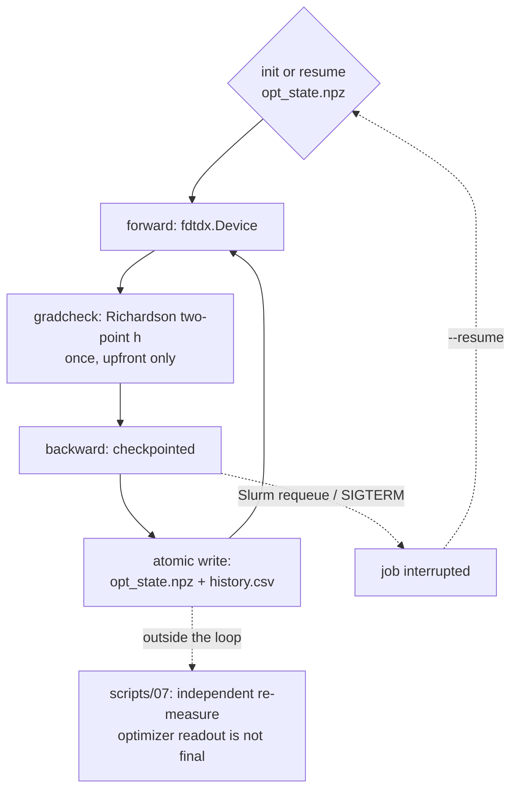

[← back to docs index](README.md)

# Inverse design on the grating coupler

`scripts/15_grating_coupler_optimize.py` is the production inverse-design driver in
invdx: it walks the grating profile of the `grating_coupler` problem (see the
[`grating_coupler` problem](../README.md#problems-srcinvdxproblems) for the problem
itself) with adjoint gradients instead of hand-picked geometry sweeps.

```bash
uv run python scripts/15_grating_coupler_optimize.py --tag opt --gradcheck   # ~13 h, 1 GPU
uv run python scripts/15_grating_coupler_optimize.py --tag smoke --iters 4 \
    --set sim_time_s=0.3e-12                                     # ~10 min
uv run python scripts/15_grating_coupler_optimize.py --resume runs/<dir>    # after a kill
sbatch -p <partition> -t 14:00:00 slurm/grating_coupler_opt.sbatch           # requeue-safe
```

## The optimization loop



## The differentiable Device path

`profile_teeth` binarizes and run-length-encodes a design into
`UniformMaterialObject` blocks — the right thing for *measuring* a finished
device, and a dead end for gradients (block boundaries aren't differentiable
w.r.t. their own position). The driver adds a second route: a single
`fdtdx.Device` over the design window, one voxel per design pixel, with
`ConicFilter1D(R = min_feature)` → `TanhProjection(beta)`, plus a jnp twin of
the CE chain, so one backward pass reaches all 500 design variables.

**The two routes must agree.** On a grid-aligned binary design both describe
the same device, so `ce_from_arrays` (Device path) and `characterize`
(block path) are compared before any optimization result is believed —
measured 2.5e-6 dB apart (20 nm grid, theta=10 deg, acceptance threshold
0.05 dB; recorded under the first-production-driver entry in
`docs/journal.md`). They are not interchangeable in grey: the Device
interpolates *inverse* permittivity linearly, a block fills whole cells.

**Rasterizing the starting design is physics, not formatting.** Rendering
the uniform grating onto 20 nm design pixels by pixel-centre inclusion lets
the tooth width alternate 14/15 pixels; that +/-3.5% duty jitter costs **more
than an order of magnitude** in coupling efficiency at the design wavelength
— a rendering choice that ends up simulating a different device.
`rasterize_teeth`
therefore rounds edge and width the way fdtdx rounds a placed block, which
reproduces the cross-validated grating exactly. Convention lesson 6 in the
main README (spectral ridges, not single-wavelength values) bites inside a
single engine too.

**The grid is not free.** The Device snaps its z voxel with
`round(t_si / spacing)`, so `spacing_um` must divide both `t_si` and the
design pixel — only 0.020 (design grid 50/25/10) and 0.010 (100/50/25/20)
are clean, and `assert_design_grid_snaps` refuses everything else rather
than silently optimizing a different device. The module default 0.0125
snaps 220 nm silicon to 225 nm.

## FOM and gradcheck

FOM is a jnp-traced twin of the TE0 coupling-efficiency overlap used
everywhere else in the grating_coupler problem, so the optimizer maximizes the same
quantity script 07 later re-measures independently (`loss = -FOM`,
`optimize.py`).

Gradcheck compares the fdtdx adjoint gradient against finite differences on
a small set of design voxels, gated at 5% relative error
(`GRADCHECK_TOL`), with only voxels at or above 5% of peak gradient eligible
(`GRADCHECK_MIN_REL_GRAD` — voxels below that floor are dominated by
tanh-saturation float32 noise regardless of the FD method, so loosening the
tolerance there would hide nothing informative). It runs **once, upfront**,
before the optimization loop proper starts, not every iteration.

**Why it's a two-point Richardson gradcheck, not a plain one-sided FD
check.** The first production run at full scale (0.8 ps, theta=10) failed
gradcheck at voxel 213 (6.29% relative error, deterministic under the fixed
seed) and was correctly stopped rather than silently retried
(`gradcheck_failed`). The original hypothesis — float32 cancellation noise —
was refuted by an h-scan: the residual scaled as h^3 (x0.126 per halving,
not flat as cancellation noise would be), sat 200x above the measured
float32 noise floor, and Richardson extrapolation from the same two h values
agreed with the adjoint to 0.0106%. The failing voxel was not low-signal
either (15% of peak gradient, 3x the eligibility floor). Root cause: FD
*truncation* error, not an adjoint defect — longer runs make the FOM more
oscillatory in the design parameters at the fixed step h=0.05, inflating the
third-derivative term the O(h^3) truncation error depends on. The original
"float32 cancellation" attribution is retracted in full in
`docs/RETRACTIONS.md`; the fix — `gradcheck()` now runs at two step sizes
and reports Richardson-extrapolated agreement plus an FD self-consistency
indicator, with tolerances and the signal floor unchanged — ships in both
`scripts/15_grating_coupler_optimize.py` and `src/invdx/gates/g2_gradcheck.py` Part C.

## Checkpoint and resume

A backward pass is roughly 20x the cost of a forward run at the default
recipe (`GradientConfig(method="checkpointed", num_checkpoints=20)`: 11.3 GB
peak, the measured sweet spot on a 24 GB card — 40 checkpoints OOMs that
card, and `"reversible"` is worse here because recording PML boundaries for
20k steps costs hundreds of GB). `invdx.optimize` writes `opt_state.npz`
atomically (write to `.tmp.npz`, then `os.replace`) after every single
iteration, together with `history.csv`, so `--resume` — and a requeued Slurm
job — loses at most one iteration of work.

`slurm/grating_coupler_opt.sbatch` is requeue-safe: `--requeue` plus deriving the run
directory from the job ID means a preempted job finds its own checkpoint
under the same run directory and a requeue continues from there with no
manual bookkeeping. This was drilled directly: an sbatch smoke run and a
scancel-mid-iteration requeue both passed, with `history.csv` iterations
continuous across the kill/resume boundary and no duplicate rows (source:
`docs/journal.md`, 2026-08-17 night entry).

## The optimizer's number is not the result

The loop runs at 0.8 ps for speed, which reads systematically LOW against the
1.5 ps converged value — an offset shared by every design, so it ranks
designs correctly but reports them wrong in absolute terms. The numbers that
get quoted come from re-measuring `design_rho.npy` with
`scripts/07_grating_coupler_verify_design.py` (finer grid, dense spectrum, reciprocity
check), which is why the run directory is written in exactly the layout
script 07 consumes. Treat the optimizer's own printed FOM as a ranking
signal during the run, never as a reportable result.
