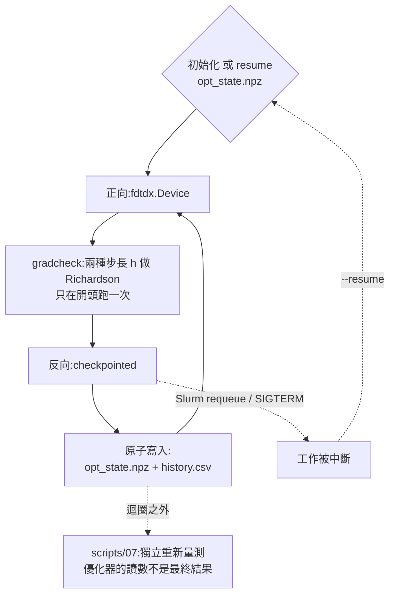

> [English](optimize.md) · **繁體中文**

[← back to docs index](README.md)

# 在 grating coupler 上做逆向設計

`scripts/15_grating_coupler_optimize.py` 是 invdx 正式運轉(production)在用
的那支逆向設計 driver:它用 adjoint 梯度直接挪動 `grating_coupler` 這個
problem 的光柵剖面,不必人工挑幾組幾何參數去掃(題目本身見
[`grating_coupler` problem](../README.md#problems-srcinvdxproblems))。

```bash
uv run python scripts/15_grating_coupler_optimize.py --tag opt --gradcheck   # ~13 h, 1 GPU
uv run python scripts/15_grating_coupler_optimize.py --tag smoke --iters 4 \
    --set sim_time_s=0.3e-12                                     # ~10 min
uv run python scripts/15_grating_coupler_optimize.py --resume runs/<dir>    # after a kill
sbatch -p <partition> -t 14:00:00 slurm/grating_coupler_opt.sbatch           # requeue-safe
```

實務上的順序是:先跑第二條(smoke 測試,約 10 分鐘)確認環境與設定沒問題,再
開第一條的正式 run(帶 `--gradcheck`,約 13 小時、1 張 GPU);要過夜就走第四
條的 sbatch,被砍掉之後用第三條的 `--resume` 接回去。

**先認幾個詞**(英文原詞就是 repo 程式碼、旗標和 log 裡會看到的那個字):

| 詞 | 這是什麼 |
|---|---|
| adjoint(伴隨法) | 一次正向加一次反向,就拿到全部設計參數的梯度。和線性代數的「伴隨矩陣」無關 |
| problem | invdx 裡一個完整的題目定義(幾何＋量測＋驗收),住在 `src/invdx/problems/`。`grating_coupler` 就是其中一個 |
| driver | 這裡指「把整條優化迴圈串起來跑的主程式」,**不是**裝置驅動程式(device driver) |
| FOM(figure of merit) | 優化要最大化的目標量,這裡是 TE0 耦合效率。**不譯成「品質因子」**——那個中文詞在光學裡已經被 Q factor 佔走了 |
| CE(coupling efficiency) | 耦合效率,也就是這裡的 FOM。程式碼和 log 裡寫 CE,中文行文寫「耦合效率」,兩者指同一個量 |
| gradcheck | 拿有限差分(finite difference, FD)去核對 adjoint 梯度算得對不對的那道檢查 |
| h | 有限差分的步長。下文說的「h 掃描」,就是換好幾個不同的 h 重算一次,看殘差怎麼變 |
| Device 路徑 | 指 `fdtdx.Device` 那條可微分的幾何表示。本文一律寫 Device,不譯「元件」,免得跟「被設計的那個元件」混在一起 |
| voxel | 三維的像素;設計變數就住在一個個 voxel 上 |
| rasterize | 把設計畫到設計像素網格上。⚠️ **中文側一律保留 rasterize 不譯**——這份文件通篇在講光柵(grating),任何照字面譯出來的中文名都會和它撞在一起,讀者一定會誤會 |
| requeue | Slurm 把被搶占(preempt)的工作重新排回佇列 |

> **命名陷阱(先讀這個)**:本文的 **checkpoint 有兩個互不相干的意思**,
> 英文原文同樣共用這個字,靠上下文分辨:
> 1. **梯度重算用的 checkpoint** —— `num_checkpoints=20`,反向傳播時只保留
>    20 個時間點的狀態,其餘的場靠重算補回來,拿時間換記憶體。
> 2. **斷點續跑用的 checkpoint** —— `opt_state.npz`,每次迭代寫一次,讓
>    `--resume` 和被 requeue 的 Slurm 工作接得回去。
>
> 兩者可以獨立調整,調錯邊的症狀完全不同:前者是記憶體爆掉(out of memory,
> log 裡寫 OOM),後者是續跑接不上。看到 checkpoint 先確認是哪一個。

## 優化迴圈



讀圖:實線是每次迭代都會走的路;兩條虛線是這份文件真正想講的兩件事——
**被砍掉之後怎麼接回來**,以及**迴圈跑完之後誰才有資格報數字**。

## 可微分的 Device 路徑

`profile_teeth` 會把設計二值化,再用 run-length encoding 壓成一串
`UniformMaterialObject` 方塊。要**量測**一個已經做好的元件,這是對的做法;
但要拿梯度,這條路是死的——方塊邊界對「自己的位置」不可微。所以 driver
另外開了第二條路:在設計視窗上放一個 `fdtdx.Device`,一個設計像素配一個
voxel,依序串上 `ConicFilter1D(R = min_feature)` 和 `TanhProjection(beta)`;
算耦合效率的那條計算鏈,另外再寫一份 jnp(jax.numpy)的可微分版本。兩者合
起來,**一次反向傳播就能一口氣算出全部 500 個設計變數的梯度**。

**兩條路必須對得起來。** 在格點對齊的二值設計上,兩者描述的是同一個元件,
所以在相信任何優化結果之前,先比對 `ce_from_arrays`(Device 路徑)與
`characterize`(方塊路徑)——實測兩者差 2.5e-6 dB(20 nm 網格、光纖入射角
theta=10 deg,驗收門檻 0.05 dB;記在 `docs/journal.md` 的
first-production-driver 那筆)。但兩者在灰階(介於 0 與 1 之間的中間值)時
**不能互換**:Device 是對介電常數的**倒數**(inverse permittivity)做線性
內插,方塊則是把整格填滿。

**把起始設計 rasterize 是物理,不是排版。** 用「像素中心落在裡面就算」的規則
把均勻光柵畫到 20 nm 的設計像素上,齒寬會在 14/15 像素之間交替跳動;這
±3.5% 的佔空比抖動(duty jitter)在設計波長上會讓耦合效率掉**超過一個
數量級**——只是「怎麼畫」的選擇,結果模擬到的卻是另一個元件。
`rasterize_teeth` 因此是照 fdtdx 擺放方塊時的取整方式去取邊界與寬度,這樣才
能一模一樣重現那個已經交叉驗證過的光柵。主 README 的 “Hard-won guardrails”
第 6 條——看整條頻譜峰形(spectral ridge),不看單一波長的值——在單一引擎
內部一樣會咬人。

**網格不是免費的。** Device 的 z 方向 voxel 是用 `round(t_si / spacing)` 吸附
(snap)出來的,所以 `spacing_um` 必須同時整除 `t_si` 和設計像素:

| `spacing_um` | 設計網格 | 結果 |
|---|---|---|
| 0.020 | 50/25/10 | 乾淨 |
| 0.010 | 100/50/25/20 | 乾淨 |
| 其他(含模組預設的 0.0125) | — | 被 `assert_design_grid_snaps` 擋下 |

擋下來而不是默默放行,理由就寫在那個預設值裡:0.0125 會把 220 nm 的矽吸附成
225 nm——不擋的話,你會安安靜靜地優化另一個元件。

## FOM 與 gradcheck

`grating_coupler` problem 其他地方在量 TE0 耦合效率,用的是同一條模態重疊
積分(mode overlap)計算鏈;FOM 就是那條計算鏈的 jnp 可微分版本。所以**優化
器最大化的量,和之後 script 07 獨立重新量到的是同一個量**(`loss = -FOM`,
`optimize.py`)。

gradcheck 拿 fdtdx 的 adjoint 梯度,去比對一小組設計 voxel 上的有限差分,相對
誤差門檻 5%(`GRADCHECK_TOL`),而且只有梯度達到峰值 5% 以上的 voxel 才有資格
入選(`GRADCHECK_MIN_REL_GRAD`,本文一律叫它**訊號下限**——低於這條線的
voxel,不管換哪種 FD 方法都被 tanh 飽和造成的 float32 雜訊主導,在那裡放寬
容差並不會掩蓋掉任何有意義的訊息)。它**只在開頭跑一次**,在優化迴圈正式
開始之前,不是每次迭代都跑。

**為什麼是兩點 Richardson gradcheck,不是單邊 FD 比一比就算了。**
第一次用正式規模(production-scale;0.8 ps、theta=10)跑的那個 run,在 voxel
213 上 gradcheck
沒過(相對誤差 6.29%,固定種子下可重現),腳本正確地停了下來
(`gradcheck_failed`),沒有默默重試。當時的假設是 float32 的相減抵消雜訊
(cancellation noise),而這個假設被一次 h 掃描推翻:

| 掃描看到的 | 它排除掉什麼 |
|---|---|
| 殘差隨 h 以 h³ 縮放(h 每減半 ×0.126) | 抵消雜訊不隨 h 縮放,它應該是平的 |
| 殘差比實測的 float32 雜訊底線高 200 倍 | 量級根本不是浮點雜訊 |
| 用同樣那兩個 h 做 Richardson 外推,與 adjoint 相符到 0.0106% | adjoint 本身沒有錯 |
| 出事那個 voxel 的梯度是峰值的 15%,比訊號下限高 3 倍 | 也不是「訊號太小」那一類 |

真正的成因是 FD 的**截斷誤差**,不是 adjoint 有缺陷:跑得越久,FOM 對設計參數
就越振盪,在固定步長 h=0.05 下,把 O(h³) 截斷誤差所倚賴的三階導數項放大了。
原本「float32 相減抵消」的歸因已在 `docs/RETRACTIONS.md` 全文撤回。修法是:
`gradcheck()` 現在跑兩種步長,報出 Richardson 外推後的一致程度,外加一個 FD
自洽性指標,容差與訊號下限則都維持不變;這個修法同時進了
`scripts/15_grating_coupler_optimize.py` 和 `src/invdx/gates/g2_gradcheck.py`
的 Part C。

## checkpoint 與 resume

在預設設定下,一次反向傳播大約是一次正向的 20 倍成本
(`GradientConfig(method="checkpointed", num_checkpoints=20)`:峰值 11.3 GB,
是 24 GB 卡上實測出來的最佳點)。開到 40 個 checkpoint,那張卡的記憶體就會爆
掉(OOM);換成 `"reversible"` 在這裡更糟——它得把 PML(perfectly matched
layer,FDTD 的吸收邊界)記錄 20k 步,要花掉好幾百 GB。
`invdx.optimize` 每跑完**一次**迭代就原子性地寫一次 `opt_state.npz`(先寫
`.tmp.npz`,再 `os.replace`),連同 `history.csv` 一起,所以 `--resume`——以及
一個被 requeue 的 Slurm 工作——最多只損失一次迭代的工作量。

`slurm/grating_coupler_opt.sbatch` 在被 requeue 之後可以安全接續,靠的是兩件
事合起來:一是 `--requeue`,二是 run 目錄由 job ID 推導出來。於是被搶占的工作
會在同一個 run 目錄底下找到自己的 checkpoint,requeue 之後就從那裡續跑,不
需要任何人工記帳。這件事有直接演練過:一次 sbatch smoke 測試、一次在迭代中途
scancel 再 requeue,兩次都過,`history.csv` 的迭代在被砍/續跑的交界處是連續
的,而且沒有重複的列(出處:`docs/journal.md`,2026-08-17 夜的那筆)。

## 優化器印出來的數字不是結果

迴圈為了速度跑在 0.8 ps,這個讀數相對於 1.5 ps 的收斂值系統性偏**低**——這個
偏差每個設計都一樣,所以它**排序**設計是對的,**報絕對值**是錯的。真正拿得
出去引用的數字,來自用 `scripts/07_grating_coupler_verify_design.py` 對
`design_rho.npy` 重新量測(更細的網格、更密的頻譜、互易性(reciprocity)檢查)。
run 目錄的擺法就是照 script 07 讀得懂的格式寫的,原因就在這裡。跑的過程中,
優化器自己印出來的 FOM 拿來比高下就好,永遠不要當成可以報出去的結果。

一句話:**優化器負責找設計,script 07 負責對外報數字。**
