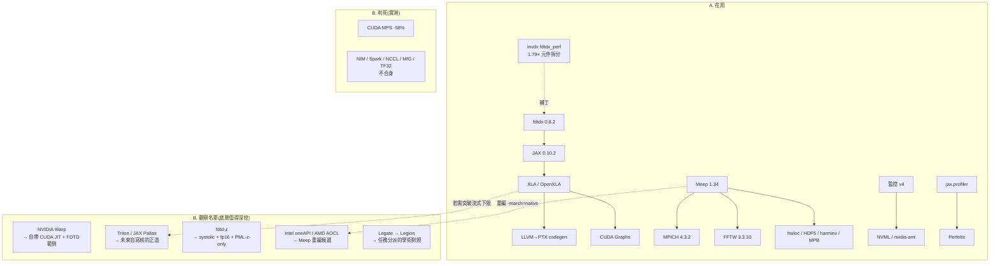

# 效能套件族譜 — 在用的、底下的庫、還沒用的

整理日期 2026-08-16。三層分類:**A 在用**(含其底層庫)、**B 評估過但未採用**(附原因與底層,供你自行深挖後再討論)、**C 建議親自深挖的閱讀順序**。標「⚠待驗」者為未經本艦隊直接驗證的描述。




## A. 正在使用的套件與它們的底層

### JAX(fdtdx 的地基)
```
fdtdx 0.6.2 ──> JAX 0.10.2 ──> XLA (OpenXLA) ──> LLVM → PTX(GPU 核心程式碼生成)
                                   ├─ CUDA Graphs(= --xla_gpu_enable_command_buffer)
                                   ├─ cuBLAS/cuDNN(僅 matmul/conv 路徑;我們的 stencil 完全不經過)
                                   └─ CUDA runtime / driver
```
- **值得讀的底層源碼**(我們引用過的):`openxla/xla` 的
  `while_loop_invariant_code_motion.h`(為何迴圈不變量不被吊出——hoist_size_inflation_ratio 上限)、
  fusion pass(為何 concatenate 多使用者時不融合——我們 34% 的病根,Snider & Liang arXiv:2301.13062 有完整分析)。
- 實測定論:旗標層 ≈0%;勝負在餵給 XLA 的程式結構(元件拆分 1.89× 即證)。

### Meep(驗證軍團)——本地實證的底層清單
| 底層庫 | 版本 | 角色 |
|---|---|---|
| MPICH (hydra) | 4.3.2 | MPI——兩台皆同(綁定旗標語法以它為準) |
| FFTW | 3.3.10 | MPB 模態解算與頻域處理 |
| HDF5/h5py | 1.14.6 | 場輸出 |
| harminv | 1.4.3 | 共振頻率萃取 |
| libctl | 4.7.1 | 場景描述層 |
| libhwloc | 2.12.2 | 拓撲/綁定(容器內失能的就是它讀不到 cgroup) |
| MPB | 1.12.0 | 本徵模態 |
- 重編候選:以 `-march=znver4`/`cascadelake` 源碼編 Meep + 替換 FFTW(見 B 的 Intel/AMD 節)。

### NVIDIA 官方(已用/已測)
- **NVML/nvidia-smi**:監控 v4 的資料源。
- **CUDA MPS**:實測 **-58%,判死**(底層= CUDA driver 的 server/client 排程服務)。
- **JAX-Toolbox**:旗標文檔——實測 ≈0%,其容器版 JAX 與我們同版,無增量。
- **jax.profiler → Perfetto**:剖析主力(nsys/ncu 未裝;若裝,apt `nsight-systems`/`nsight-compute`)。

### 其他
- **pyevtk**(VTK 輸出→ParaView)、**gdstk**(GDS)、**MPICH 綁定**(`-bind-to numa` 在 niu36 +8%)。

## B. 評估過、未採用——原因與「它底下的庫」

| 套件 | 判決 | 原因(實測/文獻) | 底下是什麼(你可深挖) |
|---|---|---|---|
| **NVIDIA Warp** | 緩議 | 瓶頸是 bytes 不是核品質;tape autodiff 撐不起 20k-80k 步 | 自帶 Python→CUDA codegen JIT、tape 反向、`warp.jax_experimental` FFI;**有第一方 3D FDTD 範例** `examples/core/example_fdtd_3d.py` |
| **CUDA MPS** | 判死 | -58%(同卡共享無肉:0.5M cells 已 80% 榨滿) | CUDA driver 排程服務;`CUDA_MPS_ACTIVE_THREAD_PERCENTAGE` 只能救回到 -13% |
| **cuPy / cuda-python** | 被 Warp 支配 | 同工作量、無 autodiff、無 FDTD 範例 | NVRTC 即時編譯 RawKernel、cuBLAS/cuSPARSE/cuTENSOR、thrust ⚠待驗細節 |
| **cuNumeric/Legate** | 不適用 | 分散式 NumPy 替身,重量級 | **Legion** 任務圖執行時——概念上是我們 remote dispatcher 的學術對照,值得讀概念論文 ⚠待驗版本現況 |
| **Triton / JAX Pallas** | 未動(將來首選) | 只有 temporal blocking(突破 ~100B/cell 流式下限)需要它 | Triton MLIR→PTX;Pallas 是 JAX 內建的 kernel DSL 前端——**若自寫核,這是正道**(留在 JAX 生態、可保 autodiff 接口) |
| **MIG** | 硬體不支援 | RTX 6000 Ada 無 MIG | 資料中心卡專屬 |
| **NCCL** | 不適用 | 無 NVLink、跨節點 1GbE | 集體通訊庫;多卡 transformer 的世界 |
| **TF32/Tensor Cores** | 不適用 | stencil 無 matmul | ——|
| **Intel oneAPI** | 排程中未實測 | 適用點=niu36 的 Meep 重編 | Intel MPI、**MKL 的 FFTW 介面**(直接替 FFTW)、VTune、icx 編譯器 |
| **AMD AOCC/AOCL** | 排程中未實測 | 適用點=本機 Meep 重編 | **AMD-FFTW**、BLIS、μProf 剖析器 |
| **Apache Spark** | 不合身 | JVM 大數據 shuffle;我們是少量大模擬+KB 載荷 | ——(輕量 ssh 分派器 + RADIX 帳本是正解) |
| **NVIDIA NIM** | 不合身 | AI 推論微服務包裝,與 FDTD 無關 | ——|
| **Devito / AN5D / Exo** | 技術不同 | stencil DSL 自動生成 C/CUDA,繞開 XLA | Devito=SymPy→C 代碼生成 ⚠待驗;若走自寫核可借鑑其 blocking 策略 |
| **fdtd-z (spinsphotonics)** | 未採用但高度相關 | JAX 皮 + 自帶 systolic CUDA 核,fp16,PML 只做 z 軸(白皮書已驗讀) | **值得你親自讀 kernel 源碼**——它是「離開 XLA 後能到哪」的活標本(~120 Mcells/s/GB/s @fp16) |
| **Tidy3D** | 閉源 | 只有白皮書/OPN 文章可讀(~100 B/cell/step 效率端標竿) | 內部實作不可見 |

## C. 建議親自深挖的順序(讀完我們討論)

1. **`openxla/xla` 的 fusion 與 LICM pass**——理解「為何旗標無效、為何程式結構決定一切」,這是我們 1.89× 的理論底。
2. **`spinsphotonics/fdtdz` 的 CUDA kernel**——systolic 多步更新 + fp16 + PML-z-only,三個激進選擇的完整實作;是 P1/P2 之後想再往下走的地圖。
3. **NVIDIA Warp 的 `example_fdtd_3d.py`**——看 NVIDIA 自己怎麼寫 Yee 更新。
4. **JAX Pallas 文檔**——未來自寫核心的正道(不離開 JAX 生態)。
5. **Legion/Legate 概念論文**——我們雙節點任務分派的學術對照(讀概念即可,不必採用)。

完整文獻(65 篇,附連結與相關性)見 [perf-references.md](perf-references.md)。
